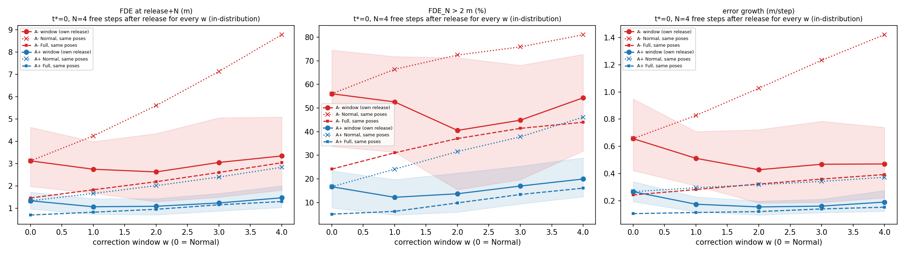
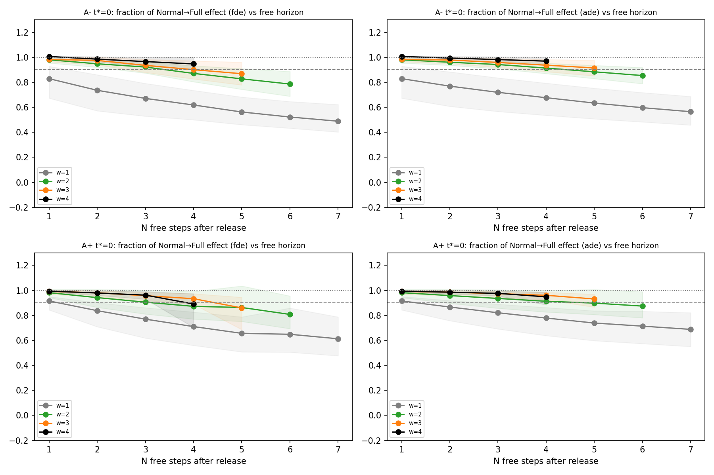
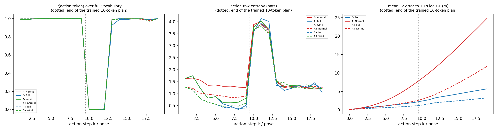
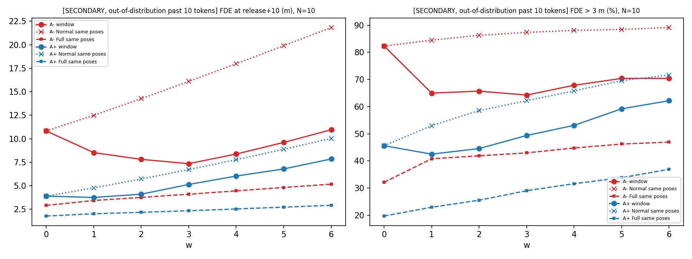

# AutoVLA Natural/Fast — Horizon-Controlled Critical Window

## 1. 결론

**답: horizon 교란만으로 생긴 효과는 아닙니다. 모든 window에 같은 free horizon을 줘도 첫 2–4 step 교정은 이후 발산의 대부분을 막습니다. 다만 교정을 멈춘 뒤 잔여 발산이 서서히 다시 쌓이므로, 이 window는 '안정 상태에 고정(lock-in)'이 아니라 '발산을 크게 늦추는' window입니다.**

### 한 표 요약 — 교정 종료 후 동일한 free step (주 분석: 학습된 10-token 계획 안)

증폭 = 교정 해제 후 N step 시점 FDE. 'Full 효과 대비'는 같은 pose 구간에서 (Normal − window) / (Normal − Full)입니다. [ ]는 log cluster bootstrap 95% CI.

| window | A− FDE 회복 (t*=0, N=4 = 2 s) | A− ADE 회복 | A− ΔFDE vs Full (m) | A− error growth (m/step) | A− 해제 후 재발산* | A+ FDE 회복 (t*=0, N=4) | A− FDE 회복 (t* ≤ 1, N=3) | A+ FDE 회복 (t* ≤ 1, N=3) | A− FDE 회복, free horizon 늘릴 때 (t*=0) |
|---|---|---|---|---|---|---|---|---|---|
| Normal AR | – | – | +1.66 [+1.15, +2.18] | 0.657 | 49.0% | – | – | – | – |
| 1-step | 62% [50, 74] | 68% | +0.92 [+0.57, +1.20] | 0.513 | 40.2% | 71% [56, 83] | 72% [62, 80] | 66% [47, 78] | 83% (N=1) → 49% (N=7) |
| 2-step | 87% [80, 93] | 91% | +0.44 [+0.20, +0.72] | 0.429 | 24.7% | 87% [77, 99] | 90% [82, 93] | 88% [82, 94] | 98% (N=1) → 79% (N=6) |
| 3-step | **90% [83, 97]** | 94% | +0.45 [+0.11, +0.87] | 0.469 | 25.0% | 93% [89, 97] | 95% [92, 98] | 94% [93, 97] | 98% (N=1) → 87% (N=5) |
| 4-step | **95% [90, 100]** | 97% | +0.30 [+0.00, +0.54] | 0.471 | 28.8% | 89% [70, 97] | 97% [94, 100] | 98% [96, 99] | 101% (N=1) → 95% (N=4) |
| Full GT-history | 100% | 100% | 0 | 0.394 | 12.1% | 100% | 100% | 100% | 100% |

*해제 시점 오차 ≤ 1 m였던 단위 중 N step 뒤 FDE > 2 m가 된 비율(t*=0, N=4). Normal 행은 자기 해제 시점 기준입니다.

### 핵심 질문에 대한 답

- **같은 free horizon에서도 효과는 유지됩니다.** t*=0 A−(116 단위, 17개 장면)에서 모든 window에 해제 후 정확히 4 step(2 s)을 주면, Full 효과 대비 FDE 회복은 1/2/3/4-step에서 62 / 87 / 90 / 95%입니다. 90% 최소 window는 FDE 기준 **3 step**(bootstrap 2: 20%, 3: 36%, 4: 43%), ADE 기준 2 step입니다. t* ≤ 1, N = 3에서도 A−·A+ 모두 3-step에서 94–95%입니다. 기존 10-token 결과의 '3–4 step'이 남은 시간이 없어서 생긴 착시가 아니라는 뜻입니다.
- **그러나 free horizon이 길어질수록 효과가 유의하게 줄어듭니다.** window를 고정하고 N을 늘리면 모든 window에서 회복 비율이 떨어집니다(A− t*=0, bootstrap 쌍대 차이):
  - 2-step: 98 → 79% (N 1→6), Δ −19%p [−31, −8]
  - 3-step: 98 → 87% (N 1→5), Δ −11%p [−19, −4]
  - 4-step: 101 → 95% (N 1→4), Δ −6%p [−10, −1]
  
  교정을 계속한 경우(Full)보다 커지는 오차도 해제 후 누적됩니다. 3-step 기준 N = 1 / 2 / 3 / 4 / 5에서 +0.03 / 0.06 / 0.22 / 0.45 / 0.75 m입니다. 그 결과 **90%를 달성하는 최소 window가 평가 horizon에 따라 길어집니다**: N ≤ 3(≤1.5 s)에서는 2 step, N = 4(2 s)에서는 3 step, N = 5(2.5 s)에서는 3-step도 87%로 부족합니다.
- **해제 후 재발산.** 해제 시점에 안정됐던(≤1 m) A− 단위 중 2 s 뒤 2 m를 넘는 비율은 3–4 step 교정에서 25–29%입니다. Normal(49%)보다 훨씬 낮지만 Full(12%)의 2배입니다. entropy(0.82–1.03 vs Full 0.49 nat)와 GT 재정렬(47–55% vs Full 86%)도 해제 후 Full 수준으로 돌아가지 않습니다.
- **5 s 이후 장기 안정성은 이 모델에서 분포 안으로 검증할 수 없습니다.** 10번째 action 이후 AutoVLA는 action 토큰에 확률을 거의 주지 않습니다(k = 10–12에서 P(action) ≈ 0.000, 최빈 비-action 토큰은 `\n` = `\n</answer>`의 시작, 1049/1049 단위). 따라서 20-token 확장 rollout은 모델의 계획이 아니며 보조 자료로만 보고합니다.

### Claim 평가

> *AutoVLA has a genuine short critical stabilization window after an action deviation, rather than an apparent effect caused by the finite 5-second horizon.*

**부분적으로 지지(수정 필요).**
- 'finite horizon 때문에 생긴 착시'라는 대안은 **기각**됩니다. free horizon을 같게 맞춰도 2–4 step 교정이 효과의 87–95%를 냅니다.
- 그러나 'stabilization window'를 '그 뒤로는 스스로 안정 상태를 유지한다'는 의미로 쓰면 **지지되지 않습니다**. 효과는 해제 후 유의하게 감쇠하고, 필요한 window 길이는 평가 horizon과 함께 늘어납니다. 5 s 이상에서의 유지는 모델 구조상 검증할 수 없습니다.
- 데이터가 지지하는 표현: **"AutoVLA has a genuine short early window (the first ~2–4 autoregressive transitions after a deviation) in which stabilizing the previous-action feedback removes most of the subsequent 1.5–2 s divergence even at an equal free-generation horizon; the benefit is not a horizon artefact, but it decays after release, so the window delays rather than permanently prevents re-divergence, and its required length grows with the evaluation horizon."**

## 2. 요약 표 — window 길이별, 교정 종료 후 free step 수 동일

**주 분석 (학습된 10-token 계획 안, t*=0, 모든 window에 N = 4 free step = 2 s).** 모든 window가 같은 단위 집합입니다. Normal/Full 값은 해당 window와 **같은 pose 구간**에서 잰 쌍대 기준값입니다. [ ]는 log cluster bootstrap 95% CI.

### A- (t*=0, 단위 116, 장면 17)

| window | FDE@release+4 (m) | 같은 구간 Normal | 같은 구간 Full | Full 효과 대비 (FDE) | ADE | Full 효과 대비 (ADE) | ΔFDE vs Full | FDE>2 m | 같은 구간 Normal / Full | error growth (m/step) | post-correction entropy | GT re-alignment | release 시 안정 (≤1 m) | 안정 후 재발산 (>2 m) |
|---|---|---|---|---|---|---|---|---|---|---|---|---|---|---|
| Normal AR | 3.12 [1.97, 4.63] | 3.12 [1.97, 4.63] | 1.46 [0.70, 2.47] | – | 1.93 [1.15, 3.02] | – | +1.66 [+1.15, +2.18] p=1.1e-17 | 56.0% [33.7, 74.5] | 56.0 / 24.1% | 0.657 [0.423, 0.949] | 1.538 [1.233, 1.820] | 13.1% [5.1, 22.5] | 86.2% [61.1, 100.0] | 49.0% [29.3, 64.5] |
| 1-step | 2.75 [1.67, 3.99] | 4.24 [2.70, 6.04] | 1.82 [0.89, 3.06] | 62% [50, 74] | 1.80 [1.09, 2.71] | 68% [53, 80] | +0.92 [+0.57, +1.20] p=8.9e-13 | 52.6% [31.3, 71.8] | 66.4 / 31.0% | 0.513 [0.311, 0.709] | 1.373 [1.093, 1.610] | 19.8% [9.9, 28.8] | 75.0% [46.8, 94.7] | 40.2% [14.3, 61.0] |
| 2-step | 2.62 [1.29, 4.34] | 5.60 [3.66, 7.65] | 2.18 [1.06, 3.61] | 87% [80, 93] | 1.84 [0.90, 3.08] | 91% [87, 95] | +0.44 [+0.20, +0.72] p=8.3e-07 | 40.5% [15.4, 71.3] | 72.4 / 37.1% | 0.429 [0.184, 0.723] | 1.156 [0.856, 1.490] | 36.0% [17.5, 52.1] | 73.3% [44.9, 94.2] | 24.7% [7.4, 56.1] |
| 3-step | 3.05 [1.49, 5.05] | 7.13 [4.63, 9.51] | 2.60 [1.26, 4.26] | 90% [83, 97] | 2.21 [1.08, 3.69] | 94% [88, 98] | +0.45 [+0.11, +0.87] p=1.6e-05 | 44.8% [19.7, 68.1] | 75.9 / 41.4% | 0.469 [0.190, 0.785] | 1.034 [0.736, 1.334] | 47.4% [32.5, 59.8] | 69.0% [42.7, 88.6] | 25.0% [2.1, 45.5] |
| 4-step | 3.34 [1.81, 5.09] | 8.77 [5.63, 11.56] | 3.04 [1.45, 4.95] | 95% [90, 100] | 2.53 [1.36, 4.01] | 97% [94, 100] | +0.30 [+0.00, +0.54] p=0.0011 | 54.3% [31.8, 72.7] | 81.0 / 44.0% | 0.471 [0.223, 0.740] | 0.821 [0.596, 1.026] | 55.4% [45.9, 66.6] | 56.9% [29.8, 79.1] | 28.8% [4.8, 44.2] |
| Full GT-history (w=4 구간) | 3.04 [1.45, 4.95] | | | 100% | 2.41 [1.17, 3.96] | 100% | | 44.0% [19.4, 67.2] | | 0.394 [0.158, 0.698] | 0.486 [0.322, 0.686] | 85.6% [79.3, 91.2] | 56.9% [29.8, 79.1] | 12.1% [0.0, 24.2] |

- Full 효과 90% 도달 최소 window (fde): **3** (bootstrap 중앙값 3, 95% [2, 4]; 2:20%, 3:36%, 4:43%)
- Full 효과 90% 도달 최소 window (ade): **2** (bootstrap 중앙값 2, 95% [2, 4]; 2:75%, 3:20%, 4:6%)
- Full 효과 90% 도달 최소 window (amp2): **2** (bootstrap 중앙값 2, 95% [2, 99]; 2:56%, 3:26%, >4:17%)

### A+ (t*=0, 단위 336, 장면 50)

| window | FDE@release+4 (m) | 같은 구간 Normal | 같은 구간 Full | Full 효과 대비 (FDE) | ADE | Full 효과 대비 (ADE) | ΔFDE vs Full | FDE>2 m | 같은 구간 Normal / Full | error growth (m/step) | post-correction entropy | GT re-alignment | release 시 안정 (≤1 m) | 안정 후 재발산 (>2 m) |
|---|---|---|---|---|---|---|---|---|---|---|---|---|---|---|
| Normal AR | 1.33 [0.96, 1.72] | 1.33 [0.96, 1.72] | 0.69 [0.47, 0.98] | – | 0.89 [0.63, 1.17] | – | +0.64 [+0.45, +0.82] p=5.7e-31 | 16.7% [7.7, 23.4] | 16.7 / 5.1% | 0.268 [0.194, 0.342] | 1.076 [0.903, 1.224] | 30.3% [23.3, 40.3] | 96.1% [88.0, 100.0] | 13.3% [5.2, 18.5] |
| 1-step | 1.06 [0.73, 1.42] | 1.66 [1.22, 2.10] | 0.82 [0.55, 1.15] | 71% [56, 83] | 0.76 [0.52, 1.04] | 78% [63, 86] | +0.24 [+0.14, +0.35] p=2.6e-12 | 12.2% [4.7, 19.7] | 24.1 / 6.2% | 0.176 [0.120, 0.230] | 0.861 [0.683, 0.991] | 45.9% [36.1, 57.0] | 94.6% [86.4, 100.0] | 8.5% [2.7, 14.8] |
| 2-step | 1.09 [0.70, 1.43] | 2.01 [1.50, 2.51] | 0.95 [0.63, 1.32] | 87% [77, 99] | 0.82 [0.54, 1.12] | 91% [83, 100] | +0.14 [+0.01, +0.23] p=1.5e-06 | 13.7% [5.9, 22.4] | 31.5 / 9.8% | 0.156 [0.097, 0.199] | 0.705 [0.550, 0.863] | 59.0% [47.9, 72.0] | 91.7% [83.4, 97.4] | 8.1% [2.7, 15.2] |
| 3-step | 1.23 [0.87, 1.66] | 2.40 [1.82, 2.95] | 1.15 [0.80, 1.59] | 93% [89, 97] | 0.94 [0.65, 1.30] | 96% [92, 99] | +0.08 [+0.03, +0.13] p=7.1e-05 | 17.0% [9.4, 25.3] | 37.8 / 13.4% | 0.162 [0.114, 0.212] | 0.653 [0.533, 0.778] | 64.8% [55.0, 76.1] | 88.1% [79.6, 94.5] | 7.8% [3.6, 12.4] |
| 4-step | 1.46 [1.03, 2.00] | 2.83 [2.19, 3.44] | 1.30 [0.89, 1.78] | 89% [70, 97] | 1.12 [0.79, 1.51] | 95% [88, 99] | +0.17 [+0.05, +0.36] p=1.1e-10 | 19.9% [12.4, 28.9] | 46.1 / 16.1% | 0.192 [0.124, 0.277] | 0.585 [0.467, 0.744] | 69.5% [56.5, 78.9] | 83.0% [74.0, 90.8] | 6.8% [2.9, 12.5] |
| Full GT-history (w=4 구간) | 1.30 [0.89, 1.78] | | | 100% | 1.05 [0.72, 1.46] | 100% | | 16.1% [9.6, 24.9] | | 0.154 [0.102, 0.218] | 0.433 [0.333, 0.590] | 88.3% [78.4, 94.0] | 83.0% [74.0, 90.8] | 2.9% [0.6, 7.3] |

- Full 효과 90% 도달 최소 window (fde): **3** (bootstrap 중앙값 3, 95% [2, 99]; 2:32%, 3:61%, >4:5%)
- Full 효과 90% 도달 최소 window (ade): **2** (bootstrap 중앙값 2, 95% [2, 3]; 2:66%, 3:34%)
- Full 효과 90% 도달 최소 window (amp2): **>4** (bootstrap 중앙값 4, 95% [1, 99]; 1:3%, 2:24%, 3:8%, 4:18%, >4:46%)

## 3. Horizon 교란 검정: window 고정, free horizon N 증가 (t*=0, 10-token 안)

짧은 remaining horizon 때문에 생긴 효과라면, 같은 window에서 N이 늘수록 Full 효과 대비 비율이 떨어져야 합니다. 셀: 비율 [95% CI] (win / Normal / Full FDE m).

### A-

| window | N=1 | N=2 | N=3 | N=4 | N=5 | N=6 | N=7 |
|---|---|---|---|---|---|---|---|
| 1-step | 83% [67, 93] (0.99 / 1.48 / 0.89) | 74% [57, 86] (1.44 / 2.20 / 1.16) | 67% [53, 79] (2.00 / 3.12 / 1.46) | 62% [50, 74] (2.75 / 4.24 / 1.82) | 56% [46, 68] (3.68 / 5.60 / 2.18) | 52% [43, 65] (4.76 / 7.13 / 2.60) | 49% [40, 62] (5.97 / 8.77 / 3.04) |
| 2-step | 98% [95, 100] (1.18 / 2.20 / 1.16) | 95% [92, 97] (1.54 / 3.12 / 1.46) | 92% [87, 96] (2.01 / 4.24 / 1.82) | 87% [80, 93] (2.62 / 5.60 / 2.18) | 83% [74, 91] (3.38 / 7.13 / 2.60) | 79% [69, 89] (4.26 / 8.77 / 3.04) | – |
| 3-step | 98% [96, 100] (1.49 / 3.12 / 1.46) | 98% [94, 100] (1.88 / 4.24 / 1.82) | 94% [88, 98] (2.40 / 5.60 / 2.18) | 90% [83, 97] (3.05 / 7.13 / 2.60) | 87% [78, 96] (3.79 / 8.77 / 3.04) | – | – |
| 4-step | 101% [100, 101] (1.81 / 4.24 / 1.82) | 99% [96, 100] (2.23 / 5.60 / 2.18) | 97% [93, 100] (2.76 / 7.13 / 2.60) | 95% [90, 100] (3.34 / 8.77 / 3.04) | – | – | – |

### A+

| window | N=1 | N=2 | N=3 | N=4 | N=5 | N=6 | N=7 |
|---|---|---|---|---|---|---|---|
| 1-step | 92% [84, 95] (0.49 / 0.73 / 0.47) | 84% [71, 90] (0.64 / 1.02 / 0.57) | 77% [62, 86] (0.84 / 1.33 / 0.69) | 71% [56, 83] (1.06 / 1.66 / 0.82) | 66% [51, 79] (1.31 / 2.01 / 0.95) | 65% [51, 86] (1.59 / 2.40 / 1.15) | 61% [48, 79] (1.89 / 2.83 / 1.30) |
| 2-step | 98% [94, 101] (0.58 / 1.02 / 0.57) | 94% [86, 101] (0.73 / 1.33 / 0.69) | 91% [81, 100] (0.90 / 1.66 / 0.82) | 87% [77, 99] (1.09 / 2.01 / 0.95) | 86% [75, 104] (1.32 / 2.40 / 1.15) | 81% [69, 96] (1.59 / 2.83 / 1.30) | – |
| 3-step | 99% [97, 100] (0.70 / 1.33 / 0.69) | 98% [95, 100] (0.84 / 1.66 / 0.82) | 96% [92, 98] (1.00 / 2.01 / 0.95) | 93% [89, 97] (1.23 / 2.40 / 1.15) | 86% [69, 94] (1.51 / 2.83 / 1.30) | – | – |
| 4-step | 99% [99, 100] (0.83 / 1.66 / 0.82) | 98% [96, 100] (0.97 / 2.01 / 0.95) | 96% [93, 99] (1.20 / 2.40 / 1.15) | 89% [70, 97] (1.46 / 2.83 / 1.30) | – | – | – |

## 4. 실험 설정

- 대상: equal-distance 실험에서 첫 mismatch가 이른 장면(t* ∈ {0, 1}), A− 39개 / 같은 t*의 A+ 116개(A+ 1개는 log의 미래 frame이 10개뿐이라 제외, `errors.jsonl`). 단위 = (장면, perturbation), A− 277 / A+ 772. 새 perturbation은 만들지 않았습니다.
- 확장 GT: navsim log pickle에서 현재 frame 이후 ego pose를 현재 ego 좌표계로 변환했습니다. 앞 10 pose는 장면 JSON GT와 최대 3.4e-6 m 차이입니다. 토큰화는 AutoVLA target builder(순차 codebook 매칭)를 그대로 썼고, 앞 10 토큰이 기존 GT 토큰과 206/206 일치합니다.
- 생성: 이전 실험과 같은 harness(prefix KV cache, span 재계산, action 토큰만 T = 0.01, seed 공식 동일)로 **20 action token**까지 생성합니다. 조건 9개를 한 batch로 계산합니다(normal, win1–6, win8, full). 교정은 context 위치 t*+1 … t*+w를 GT 토큰으로 두고, 실행 action은 항상 모델 출력입니다.
- **Release 정렬 평가**: window w는 a_{t*+w+1}까지 GT 조건화를 받으므로 해제 pose r_w = t*+w+1입니다. 모든 w를 r_w+1 … r_w+N의 **정확히 N free step**에서 평가합니다. Normal·Full은 각 w와 **같은 pose 구간**에서 잰 쌍대 기준값입니다. 인과 decoding이므로 20개까지 생성한 뒤 자르는 것은 일찍 멈춘 것과 같습니다.
  - 주 분석(분포 안): pose ≤ 9. t*=0은 w ≤ 4에서 N ≤ 4, t* ≤ 1은 N ≤ 3입니다. horizon 교란 검정은 t*=0에서 w를 고정하고 N = 1…8−w로 늘립니다.
  - 보조 분석(분포 밖): pose ≤ 19, N = 4–10.
- 지표: FDE(해제 후 N step 시점 L2), ADE, 증폭(FDE > 3 m, 짧은 구간 민감도 분석은 > 2 m / > 1 m), error growth(해제 시점부터의 L2 기울기), post-correction entropy, GT 재정렬, 해제 시점 안정(≤ 1 m) 및 그 뒤 재발산(> 2 m / > 3 m). 이전 실험의 P/R/A accept 규칙은 10-pose 5 s 궤적에서 정의되므로 짧은 free 구간에는 쓰지 않았습니다.

- 단위: A− 277 / A+ 772 (장면 39 / 116; t*=0 116 / 336, t*=1 161 / 436). 제외 1: 6df89719fce05527(A+): ValueError('insufficient future GT: 10 frames < 20')

## 5. 주 분석 상세: 쌍대 검정 (10-token 안)

### A-, t*=0, N = 4

| window | n | FDE | Normal / Full 같은 구간 | ΔFDE vs Normal | ΔFDE vs Full | ΔADE vs Full | Δgrowth vs Full | Δentropy vs Full | Δre-align vs Full | ΔFDE>2 m vs Full | Full 효과 대비 (FDE / ADE) |
|---|---|---|---|---|---|---|---|---|---|---|---|
| 1-step | 116 | 2.75 [1.67, 3.99] | 4.24 / 1.82 | -1.49 [-2.15, -0.97] p=6.3e-08 | +0.92 [+0.57, +1.20] p=8.9e-13 | +0.46 [+0.29, +0.61] p=2.2e-12 | +0.229 [+0.143, +0.297] p=1.1e-12 | +0.479 [+0.329, +0.600] p=2e-13 | -43.3%p [-50.2, -32.4] p=4.1e-16 | +21.6%p [+9.3, +32.0] p=6e-08 | 62% [50, 74] / 68% [53, 80] |
| 2-step | 116 | 2.62 [1.29, 4.34] | 5.60 / 2.18 | -2.97 [-3.64, -2.06] p=2.1e-16 | +0.44 [+0.20, +0.72] p=8.3e-07 | +0.18 [+0.09, +0.30] p=9.3e-06 | +0.105 [+0.047, +0.174] p=1.7e-06 | +0.392 [+0.258, +0.509] p=5.9e-14 | -35.3%p [-49.5, -21.7] p=4.2e-13 | +3.4%p [+0.8, +7.4] p=0.29 | 87% [80, 93] / 91% [87, 95] |
| 3-step | 116 | 3.05 [1.49, 5.05] | 7.13 / 2.60 | -4.08 [-4.97, -2.85] p=3.4e-17 | +0.45 [+0.11, +0.87] p=1.6e-05 | +0.19 [+0.04, +0.40] p=2.7e-05 | +0.109 [+0.025, +0.215] p=1.8e-05 | +0.373 [+0.260, +0.461] p=1.4e-12 | -32.3%p [-47.6, -20.2] p=3.5e-12 | +3.4%p [+0.0, +8.8] p=0.12 | 90% [83, 97] / 94% [88, 98] |
| 4-step | 116 | 3.34 [1.81, 5.09] | 8.77 / 3.04 | -5.43 [-6.77, -3.66] p=6.3e-18 | +0.30 [+0.00, +0.54] p=0.0011 | +0.12 [-0.01, +0.23] p=0.0063 | +0.078 [+0.001, +0.137] p=0.001 | +0.335 [+0.216, +0.420] p=2.1e-12 | -30.2%p [-36.9, -22.1] p=7e-12 | +10.3%p [+0.0, +18.5] p=0.00049 | 95% [90, 100] / 97% [94, 100] |

90% window: FDE 3, ADE 2 (같은 단위 집합)

### A+, t*=0, N = 4

| window | n | FDE | Normal / Full 같은 구간 | ΔFDE vs Normal | ΔFDE vs Full | ΔADE vs Full | Δgrowth vs Full | Δentropy vs Full | Δre-align vs Full | ΔFDE>2 m vs Full | Full 효과 대비 (FDE / ADE) |
|---|---|---|---|---|---|---|---|---|---|---|---|
| 1-step | 336 | 1.06 [0.73, 1.42] | 1.66 / 0.82 | -0.60 [-0.84, -0.38] p=1.2e-12 | +0.24 [+0.14, +0.35] p=2.6e-12 | +0.12 [+0.08, +0.18] p=1.9e-12 | +0.061 [+0.036, +0.088] p=5.2e-12 | +0.275 [+0.235, +0.328] p=1.3e-22 | -32.8%p [-37.4, -27.0] p=9.3e-35 | +6.0%p [+1.4, +12.0] p=1.1e-05 | 71% [56, 83] / 78% [63, 86] |
| 2-step | 336 | 1.09 [0.70, 1.43] | 2.01 / 0.95 | -0.92 [-1.24, -0.67] p=1.9e-21 | +0.14 [+0.01, +0.23] p=1.5e-06 | +0.07 [-0.00, +0.12] p=8.4e-06 | +0.034 [+0.001, +0.059] p=2.2e-06 | +0.194 [+0.139, +0.264] p=5.3e-18 | -25.9%p [-30.3, -18.2] p=2.6e-27 | +3.9%p [-1.0, +9.3] p=0.0044 | 87% [77, 99] / 91% [83, 100] |
| 3-step | 336 | 1.23 [0.87, 1.66] | 2.40 / 1.15 | -1.16 [-1.49, -0.77] p=2.1e-22 | +0.08 [+0.03, +0.13] p=7.1e-05 | +0.04 [+0.01, +0.07] p=0.00017 | +0.021 [+0.008, +0.032] p=8.7e-05 | +0.166 [+0.114, +0.229] p=5.4e-13 | -21.7%p [-26.1, -13.6] p=1.7e-21 | +3.6%p [+0.4, +6.1] p=0.0042 | 93% [89, 97] / 96% [92, 99] |
| 4-step | 336 | 1.46 [1.03, 2.00] | 2.83 / 1.30 | -1.37 [-1.78, -0.82] p=2.6e-24 | +0.17 [+0.05, +0.36] p=1.1e-10 | +0.06 [+0.02, +0.11] p=2.6e-09 | +0.038 [+0.011, +0.077] p=3.1e-10 | +0.152 [+0.095, +0.208] p=8.3e-16 | -18.8%p [-26.2, -12.7] p=5.8e-21 | +3.9%p [+0.7, +7.6] p=0.00098 | 89% [70, 97] / 95% [88, 99] |

90% window: FDE 3, ADE 2 (같은 단위 집합)

### A-, t*<=1, N = 3

| window | n | FDE | Normal / Full 같은 구간 | ΔFDE vs Normal | ΔFDE vs Full | ΔADE vs Full | Δgrowth vs Full | Δentropy vs Full | Δre-align vs Full | ΔFDE>2 m vs Full | Full 효과 대비 (FDE / ADE) |
|---|---|---|---|---|---|---|---|---|---|---|---|
| 1-step | 277 | 1.63 [1.32, 1.99] | 2.92 / 1.13 | -1.29 [-1.49, -0.94] p=1.1e-24 | +0.50 [+0.32, +0.68] p=3.2e-24 | +0.28 [+0.17, +0.38] p=1.1e-21 | +0.166 [+0.108, +0.226] p=3.4e-24 | +0.409 [+0.254, +0.530] p=3.7e-22 | -36.0%p [-43.5, -28.7] p=4.6e-30 | +18.8%p [+7.6, +27.5] p=4.4e-14 | 72% [62, 80] / 77% [68, 85] |
| 2-step | 277 | 1.61 [1.19, 2.20] | 3.91 / 1.35 | -2.30 [-2.66, -1.73] p=1.4e-37 | +0.26 [+0.17, +0.46] p=3.5e-09 | +0.14 [+0.08, +0.26] p=8.9e-08 | +0.086 [+0.056, +0.154] p=4.1e-09 | +0.433 [+0.335, +0.582] p=1.7e-23 | -34.7%p [-45.7, -26.8] p=2.5e-23 | +5.4%p [+1.5, +11.4] p=0.00027 | 90% [82, 93] / 92% [86, 95] |
| 3-step | 277 | 1.74 [1.22, 2.43] | 5.06 / 1.57 | -3.32 [-3.95, -2.47] p=6.4e-41 | +0.17 [+0.08, +0.25] p=2.3e-08 | +0.08 [+0.04, +0.13] p=3.6e-07 | +0.055 [+0.025, +0.082] p=3.6e-08 | +0.310 [+0.223, +0.413] p=1.9e-20 | -23.1%p [-30.1, -17.6] p=1.1e-19 | +2.5%p [-0.7, +4.9] p=0.039 | 95% [92, 98] / 97% [95, 98] |
| 4-step | 277 | 1.94 [1.40, 2.67] | 6.37 / 1.82 | -4.43 [-5.32, -3.24] p=1.3e-42 | +0.12 [+0.00, +0.23] p=0.001 | +0.06 [-0.00, +0.11] p=0.0091 | +0.042 [+0.001, +0.078] p=0.0008 | +0.198 [+0.104, +0.248] p=1.2e-13 | -17.7%p [-23.0, -10.8] p=5.9e-15 | +3.2%p [-1.1, +6.1] p=0.012 | 97% [94, 100] / 98% [97, 100] |

90% window: FDE 3, ADE 2 (같은 단위 집합)

### A+, t*<=1, N = 3

| window | n | FDE | Normal / Full 같은 구간 | ΔFDE vs Normal | ΔFDE vs Full | ΔADE vs Full | Δgrowth vs Full | Δentropy vs Full | Δre-align vs Full | ΔFDE>2 m vs Full | Full 효과 대비 (FDE / ADE) |
|---|---|---|---|---|---|---|---|---|---|---|---|
| 1-step | 772 | 0.82 [0.62, 1.02] | 1.21 / 0.63 | -0.38 [-0.51, -0.21] p=4.9e-32 | +0.20 [+0.13, +0.27] p=3.4e-23 | +0.12 [+0.07, +0.16] p=1.4e-23 | +0.065 [+0.042, +0.090] p=5.7e-23 | +0.248 [+0.217, +0.277] p=2.5e-41 | -25.9%p [-28.6, -22.9] p=3.3e-58 | +2.5%p [+0.7, +3.8] p=0.00055 | 66% [47, 78] / 71% [53, 82] |
| 2-step | 772 | 0.82 [0.60, 1.05] | 1.50 / 0.73 | -0.68 [-0.81, -0.50] p=4.8e-49 | +0.09 [+0.04, +0.14] p=4.8e-11 | +0.05 [+0.02, +0.08] p=2.6e-09 | +0.030 [+0.014, +0.048] p=5e-11 | +0.163 [+0.130, +0.200] p=2.6e-29 | -19.3%p [-22.7, -14.8] p=6.7e-45 | +2.7%p [+0.7, +5.4] p=0.0001 | 88% [82, 94] / 92% [86, 96] |
| 3-step | 772 | 0.89 [0.65, 1.11] | 1.81 / 0.84 | -0.91 [-1.09, -0.69] p=9e-54 | +0.06 [+0.03, +0.07] p=5.9e-07 | +0.03 [+0.01, +0.04] p=8.4e-06 | +0.018 [+0.010, +0.024] p=1.2e-06 | +0.151 [+0.079, +0.199] p=2.4e-26 | -17.3%p [-21.2, -12.0] p=4.5e-35 | +1.8%p [+0.7, +2.8] p=0.0066 | 94% [93, 97] / 96% [95, 98] |
| 4-step | 772 | 1.01 [0.76, 1.24] | 2.15 / 0.98 | -1.14 [-1.35, -0.85] p=1.1e-59 | +0.03 [+0.01, +0.05] p=1.2e-05 | +0.01 [+0.00, +0.02] p=5.5e-05 | +0.010 [+0.004, +0.015] p=7e-06 | +0.114 [+0.069, +0.153] p=4.5e-22 | -12.8%p [-17.5, -8.2] p=3e-29 | +0.6%p [+0.0, +1.3] p=0.18 | 98% [96, 99] / 98% [97, 100] |

90% window: FDE 3, ADE 2 (같은 단위 집합)

## 6. 보조 분석: 20-token 확장 horizon (N = 10, 학습 길이 초과 → 분포 밖)

| group | 조건 | P(action) k=9 | k=10 | k=11 | k=12 | k=13 | k=15 | entropy k=9 / 10 / 11 / 12 / 13 | 가장 높은 비-action 토큰 k=10 |
|---|---|---|---|---|---|---|---|---|---|
| A- | normal | 0.999 | 0.000 | 0.000 | 0.001 | 0.992 | 0.999 | 1.25 / 3.88 / 4.01 / 3.64 / 1.50 | (198, 277) |
| A- | full | 0.999 | 0.000 | 0.000 | 0.002 | 0.927 | 0.991 | 0.51 / 3.59 / 4.13 / 4.01 / 1.42 | (198, 277) |
| A- | win4 | 0.999 | 0.000 | 0.000 | 0.000 | 0.991 | 0.998 | 0.81 / 3.78 / 4.03 / 3.72 / 1.50 | (198, 277) |
| A+ | normal | 0.998 | 0.000 | 0.000 | 0.007 | 0.992 | 0.997 | 0.90 / 3.65 / 3.89 / 3.55 / 1.52 | (198, 772) |
| A+ | full | 1.000 | 0.000 | 0.000 | 0.004 | 0.993 | 0.998 | 0.36 / 3.61 / 3.94 / 3.61 / 1.34 | (198, 772) |
| A+ | win4 | 0.999 | 0.000 | 0.000 | 0.008 | 0.989 | 0.997 | 0.60 / 3.67 / 3.83 / 3.50 / 1.51 | (198, 772) |

### A- (확장, N = 10, 참고용)

| window | FDE@release+10 | Normal / Full 같은 구간 | Full 효과 대비 (FDE) | FDE>3 m | Normal / Full | ΔFDE vs Full |
|---|---|---|---|---|---|---|
| Normal | 10.83 [8.16, 12.89] | 10.83 / 2.91 | – | 82.3% [72.0, 89.4] | 82 / 32% | +7.91 [+5.50, +9.86] p=3.3e-44 |
| 1-step | 8.52 [5.81, 10.99] | 12.49 / 3.43 | 44% [35, 58] | 65.0% [52.3, 74.5] | 84 / 41% | +5.09 [+2.72, +7.08] p=3.1e-31 |
| 2-step | 7.81 [5.73, 9.91] | 14.26 / 3.76 | 61% [53, 71] | 65.7% [52.9, 72.6] | 86 / 42% | +4.05 [+2.38, +5.15] p=1.3e-27 |
| 3-step | 7.35 [4.82, 8.92] | 16.10 / 4.10 | 73% [66, 88] | 64.3% [45.6, 74.3] | 87 / 43% | +3.25 [+1.31, +4.38] p=2.4e-22 |
| 4-step | 8.37 [5.40, 10.38] | 17.98 / 4.46 | 71% [61, 90] | 67.9% [50.9, 77.9] | 88 / 45% | +3.92 [+1.32, +5.97] p=6.1e-22 |
| 5-step | 9.61 [5.91, 11.99] | 19.90 / 4.82 | 68% [59, 88] | 70.4% [53.7, 79.6] | 88 / 46% | +4.79 [+1.72, +7.12] p=7.4e-26 |
| 6-step | 10.96 [7.06, 13.43] | 21.83 / 5.17 | 65% [56, 86] | 70.4% [53.5, 79.6] | 89 / 47% | +5.79 [+2.33, +8.17] p=4.6e-27 |

### A+ (확장, N = 10, 참고용)

| window | FDE@release+10 | Normal / Full 같은 구간 | Full 효과 대비 (FDE) | FDE>3 m | Normal / Full | ΔFDE vs Full |
|---|---|---|---|---|---|---|
| Normal | 3.90 [3.22, 4.41] | 3.90 / 1.78 | – | 45.6% [37.4, 51.5] | 46 / 20% | +2.12 [+1.65, +2.45] p=4.5e-64 |
| 1-step | 3.76 [2.98, 4.26] | 4.77 / 2.02 | 37% [26, 53] | 42.5% [34.2, 47.6] | 53 / 23% | +1.74 [+1.14, +2.15] p=2.6e-41 |
| 2-step | 4.10 [3.27, 4.61] | 5.72 / 2.18 | 46% [36, 59] | 44.6% [35.1, 49.8] | 59 / 26% | +1.93 [+1.28, +2.36] p=2.9e-50 |
| 3-step | 5.14 [4.07, 5.81] | 6.72 / 2.34 | 36% [24, 52] | 49.4% [38.3, 55.3] | 62 / 29% | +2.79 [+1.88, +3.42] p=4.2e-63 |
| 4-step | 6.03 [4.98, 6.80] | 7.77 / 2.54 | 33% [17, 46] | 53.1% [41.7, 59.2] | 66 / 32% | +3.50 [+2.56, +4.31] p=5.6e-71 |
| 5-step | 6.79 [5.58, 7.81] | 8.88 / 2.72 | 34% [17, 46] | 59.2% [47.1, 66.1] | 70 / 34% | +4.07 [+3.01, +5.12] p=6.4e-78 |
| 6-step | 7.85 [6.51, 9.16] | 10.02 / 2.92 | 31% [12, 43] | 62.2% [51.4, 68.2] | 72 / 37% | +4.93 [+3.74, +6.26] p=1.4e-81 |

## 7. Sanity checks

| 검사 | 결과 |
|---|---|
| t*까지 모든 조건 토큰 동일 | 100.0% |
| a_{t*+1} 모든 조건 동일 | 100.0% |
| 확장 GT 토큰 앞 10개 = 기존 GT 토큰 | 100.0% |
| 확장 GT 궤적 앞 10 pose = 장면 JSON GT (<1e-4 m) | 100.0% |
| 10-token 안에서 포화된 window(w ≥ 8−t*) = Full (앞 10 토큰) | 100.0% |
| temporal_feedback_window Normal 앞 10 토큰 재현 (batch 9 vs 17 수치차) | 86.5% |
| … win1 | 88.7% |
| … win2 | 90.7% |
| … win3 | 90.8% |
| … win4 | 92.4% |
| … GT-history = Full | 93.5% |

## 8. 해석, claim 평가, 한계

### Horizon 교란 검정 상세 (A− / A+, t*=0, FDE 회복 비율의 쌍대 bootstrap 차이)

`decay_test.json`.

| window | A− 회복 비율 변화 (N=1 → 최대 N) | A− 교정 지속 대비 초과 오차 (m), N=1 → 최대 N | A+ 회복 비율 변화 | A+ 초과 오차 (m) |
|---|---|---|---|---|
| 1-step | 83 → 49% (N=7): −34%p [−41, −22] | 0.10 → 2.93 | 92 → 61%: −30%p [−41, −11] | 0.02 → 0.59 |
| 2-step | 98 → 79% (N=6): −19%p [−31, −8] | 0.02 → 1.23 | 98 → 81%: −17%p [−27, −4] | 0.01 → 0.30 |
| 3-step | 98 → 87% (N=5): −11%p [−19, −4] | 0.03 → 0.75 | 99 → 86%: −13%p [−31, −5] | 0.01 → 0.22 |
| 4-step | 101 → 95% (N=4): −6%p [−10, −1] | −0.02 → 0.30 | 99 → 89%: −10%p [−28, −3] | 0.01 → 0.17 |

### 해석

1. **'남은 시간이 없어서'가 아닙니다.** 1-step과 4-step에 같은 2 s를 줘도 차이가 큽니다(A− FDE 회복 62% vs 95%, 같은 116 단위). window 길이 자체가 결과를 결정합니다.
2. **감쇠형 안정화.** 해제 직후 1 step에서는 2-step 이상 모든 window가 Full과 거의 같습니다(98–101%). 이후 자기 토큰 feedback이 다시 돌면서 Full과의 차이가 가속적으로 벌어집니다. window가 길수록 감쇠가 느립니다(비율 감소 기울기: 2-step 약 −3.8%p/step, 3-step −2.8, 4-step −2.0). 이는 prev_action_state_patching에서 확인한 1-step feedback 기전과 맞습니다. 교정이 오차 상태와 조건화 토큰을 GT 쪽으로 옮기지만, 모델은 GT로 수렴하는 끌개를 갖지 않아 잔여 편차가 다시 증폭됩니다. 다만 증폭 속도는 Normal보다 훨씬 느립니다(error growth: 4-step 0.47 vs Normal 0.66 vs Full 0.39 m/step).
3. **A−와 A+.** 두 군 모두 같은 형태입니다(같은 free horizon에서 3-step 90–93%, N에 따라 감쇠). A−는 절대 초과 오차가 3–5배 크게 누적됩니다(3-step, N=5: A− 0.75 m vs A+ 0.22 m). A− 장면은 같은 잔여 편차를 더 크게 증폭하는 장면이라는 이전 결과(equal-distance, temporal window)와 부합합니다.
4. **이전 10-token 결과와의 관계.** temporal_feedback_window에서 t*=0 A−의 90% window는 증폭 기준 5 step, FDE 기준 4 step이었습니다(5 s 끝점, 해제 후 free step은 w에 따라 3–7개). 같은 free horizon(2 s)에서 FDE 3 step이 나오고, horizon이 길수록 필요한 window가 늘어나는 이번 결과와 일관됩니다. 즉 이전 추정은 horizon 교란으로 부풀려진 것이 아니라, 오히려 평가 구간 길이에 따라 달라지는 값이었습니다.

### 한계와 대안 설명

- **5 s 이후는 검증 불가(분포 밖).** AutoVLA는 10-token 계획을 학습했고, 10번째 토큰 뒤에는 `\n</answer>`로 답을 닫으려 합니다(P(action) ≈ 0, k = 10–12). 억지로 이어 생성한 3 step은 entropy 3.6–4.1 nat의 사실상 무정보 토큰이고, k ≥ 13에서 모델이 다시 확신 있게 action을 내더라도 이는 새 계획의 시작처럼 행동할 뿐입니다. 보조 분석의 N = 10 결과(A− FDE 회복 44–73%, A+ 31–46%, 비단조)는 이 오염을 포함하므로 claim 평가에서 제외했습니다. 더 긴 free horizon을 분포 안에서 보려면 closed-loop 재계획(미래 시점 관측으로 다시 10-token 계획 생성)이 필요하며, 이는 미래 frame의 센서 데이터와 다른 실험 설계가 필요합니다.
- **분포 안 free horizon이 짧습니다(최대 2–3.5 s).** 모든 window를 같은 단위로 비교할 수 있는 최대값은 t*=0에서 N = 4(2 s)입니다. 3-step은 N = 5, 2-step은 N = 6까지만 볼 수 있어, 감쇠가 어디서 멈추는지는 알 수 없습니다.
- **표본.** t*=0 A−는 17개 장면(116 단위)뿐이라 log cluster CI가 넓습니다(FDE > 2 m 같은 이진 지표는 특히 불안정). 결론은 연속 지표(FDE/ADE 회복 비율)와 쌍대 bootstrap 차이에 근거합니다.
- **해제 pose가 window마다 다릅니다.** free step 수를 맞추면 긴 window일수록 더 늦은 시점(속도·곡률이 다른 구간)에서 평가됩니다. 이를 줄이려고 Normal·Full을 같은 pose 구간에서 쌍대로 두고 비율로 비교했지만, 시간대에 따른 난이도 차이가 완전히 제거되지는 않습니다.
- **증폭 정의 변경.** 이전 실험의 증폭(P/R/A 5 s 규칙 ∧ FDE > 3 m)은 짧은 free 구간에 정의되지 않아 FDE 기반 threshold(3 m / 2 m)를 썼습니다. 2 s 구간에서는 3 m 기준 사건이 드물어 2 m 기준을 함께 보고했습니다.
- **수치 재현성.** batch 9 forward는 이전 실험(batch 17)과 수치 경로가 달라, 앞 10 토큰 재현율이 86.5–93.5%입니다. 모든 비교는 같은 batch 안의 쌍대 비교입니다.
- **교정 정의.** 조건화 context만 GT이고 실행 action은 모델 출력입니다(이전 실험과 동일).
