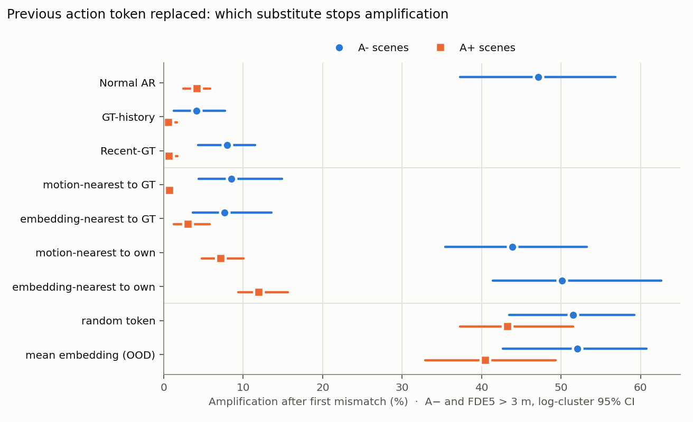
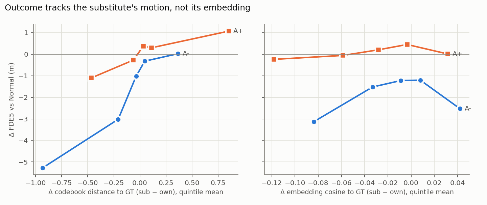

# 직전 action 토큰의 어떤 성분이 feedback을 운반하는가 — 기하(motion) vs embedding identity

**답: 토큰이 뜻하는 motion(codebook 기하)입니다. embedding 벡터의 근접성은 기하를 통제하면 독립적인 효과가 없습니다.**
직전 토큰을 "GT와 motion이 비슷한 다른 토큰"으로 바꾸면 Recent-GT와 같은 만큼(A− 증폭 효과의 99%) 발산이 멈추고,
"자기 토큰과 motion이 비슷한 다른 토큰"으로 바꾸면 identity가 바뀌어도 증폭이 그대로 남습니다(A− 43.8% vs Normal 47.1%, p = 0.18).
motion 정보를 없애면(무작위 토큰, 평균 embedding) 정상 장면(A+)에서도 증폭이 4.2% → 40–43%로 폭증합니다.

- 스크립트: `scripts/prev_action_identity_decomposition.py` (GPU 1), `scripts/analyze_prev_action_identity.py`, `scripts/make_identity_figures.py`
- 데이터: equal-distance perturbation 집합 (A− 52 장면 / 365 단위, A+ 156 장면 / 1043 단위) — action_history_causal, prev_action_state_patching과 동일
- 결과: `summary.json`, `units.jsonl`, `analysis_console.txt`, `figures/`
- 실행: 2026-09-27, RTX 5090, torch 2.8.0+cu128, T = 0.01, seed 0, 6분

---

## 1. 질문과 배경

prev_action_state_patching에서 증폭을 유지하는 정보는 **직전 action 토큰의 identity**이며 embedding에서 주입돼 residual로 운반된다는 것을 보였습니다(patch@emb ≡ Recent-GT, 효과의 93%).
그 실험의 한계 절이 남긴 질문은 "identity 중 무엇이 중요한가 — codebook 변위의 기하 정보인가, 토큰 고유 embedding인가"였습니다.

### 사전 분석 (CPU, 가중치만 사용)

| 확인 | 결과 |
|---|---|
| 입력 embedding과 `lm_head` | **완전히 동일 (tied, max 차이 0)**. 직전 토큰을 넣는 벡터가 곧 그 토큰을 출력할 때 점수 매기는 벡터 |
| embedding이 codebook 기하를 선형으로 담는가 | 거의 아님. ridge 5-fold CV R²: (dx, dy, yaw) 선형 0.026, 3차 다항 0.088, codebook 48-d 선형 −0.021, 2차 0.080 |
| embedding 거리 vs codebook 거리 순위상관 | Spearman 0.06 (200k 쌍) |
| embedding 최근접 이웃의 codebook 거리 순위 | 중앙값 21.5, top-10 안 39% (국소 구조는 일부 존재) |
| 거의 동일한 embedding 군집 | **378 + 32 토큰**이 사실상 같은 벡터(차이 ≤ 2.4e-4). tied이므로 모델이 서로 구분 못함 → 학습되지 않은 토큰으로 보고 대체 후보에서 제외 |

embedding이 기하를 선형으로 거의 담지 않으므로, "motion이 비슷한 토큰"과 "embedding이 비슷한 토큰"을 따로 골라 두 가설을 분리할 수 있습니다.

## 2. 설계

action_history_causal / prev_action_state_patching과 **같은 harness**입니다: prefix KV cache(prompt + fast stub + t* 이전 action), 첫 불일치 t*에 perturbation 토큰 강제, 이후 매 step 모든 조건을 한 batch forward로 계산하고 같은 seed로 action을 샘플링합니다.
k ≥ t*+2부터 **다음 action을 조건화하는 마지막 context 토큰 하나만** 조건별로 교체하고, 그 앞의 context와 실제 실행 action은 각 조건 자신의 출력입니다(Recent-GT와 같은 정의).
k = t*+1의 직전 토큰은 perturbation 자체이므로 교체하지 않습니다.

| 조건 | 직전 토큰 := | 분리하는 것 |
|---|---|---|
| Normal AR | 자기 토큰 | 기준 |
| GT-history | (context 전체 GT) | 기준 |
| Recent-GT | GT | 전체 효과 기준 |
| GT의 기하 최근접 (`geo_nn_gt`) | codebook 거리로 GT에 가장 가까운 다른 토큰 | motion만 GT |
| GT의 embedding 최근접 (`emb_nn_gt`) | embedding cosine으로 GT에 가장 가까운 다른 토큰 | embedding만 GT 근처 |
| 자기의 기하 최근접 (`geo_nn_self`) | 자기 토큰과 motion이 가장 비슷한 다른 토큰 | identity만 바꾸고 motion 유지 |
| 자기의 embedding 최근접 (`emb_nn_self`) | 자기 토큰과 embedding이 가장 가까운 다른 토큰 | 작은 embedding 변화 |
| 무작위 토큰 | 학습된 토큰 중 무작위 | motion 정보 파괴 |
| [OOD] 평균 embedding | 해당 위치 layer-0 입력 := 학습된 action embedding 평균 | identity 자체 제거 |

모든 대체는 GT, 자기 토큰, 미학습 군집을 후보에서 제외합니다. 지표 정의는 action_history와 동일합니다: 증폭 = A− ∧ FDE(5 s) > 3 m, recovery = P/R/A 5 s 판정. CI는 log cluster bootstrap 95%, 이진 지표 McNemar.

**기준 재현**: 같은 batch 안 기준 조건의 증폭률이 이전 실험과 일치합니다(A− Normal 47.1 vs 47.4%, GT-history 4.1 vs 4.1%, Recent-GT 7.9 vs 7.1%; A+ 4.2 / 0.6 / 0.7%로 동일). batch 크기(9행)가 action_history(7행)와 달라 토큰 재현율은 Normal 87.6%, GT-history 93.4%, Recent-GT 89.5%로 이전 보고서의 87–94% 범위입니다. 모든 비교는 같은 batch 안의 쌍대 비교입니다.

## 3. 결과



### A− (52 장면, 365 단위)

| 조건 | 증폭률 | FDE5 (m) | Recent-GT 효과 대비 (증폭) | vs Normal p |
|---|---:|---:|---:|---:|
| Normal AR | 47.1% [37.3, 56.9] | 6.51 | – | – |
| GT-history | 4.1% [1.3, 7.7] | 1.78 | 110% | 4.4e-46 |
| Recent-GT | 7.9% [4.3, 11.5] | 2.34 | 100% | 6.5e-42 |
| **GT의 기하 최근접** | **8.5% [4.4, 14.9]** | 2.45 | **99%** | 2.6e-41 |
| GT의 embedding 최근접 | 7.7% [3.7, 13.6] | 2.47 | 101% | 6.1e-38 |
| **자기의 기하 최근접** | **43.8% [35.4, 53.2]** | 6.39 | 8% | 0.18 |
| 자기의 embedding 최근접 | 50.1% [41.4, 62.6] | 7.04 | −8% | 0.27 |
| 무작위 토큰 | 51.5% [43.4, 59.2] | 9.05 | −11% | 0.23 |
| [OOD] 평균 embedding | 52.1% [42.7, 60.7] | 9.76 | −13% | 0.15 |

### A+ (156 장면, 1043 단위)

| 조건 | 증폭률 | FDE5 (m) | Recent-GT 효과 대비 (증폭) | vs Normal p |
|---|---:|---:|---:|---:|
| Normal AR | 4.2% [2.4, 5.8] | 2.21 | – | – |
| GT-history | 0.6% [0.0, 1.7] | 1.01 | 103% | 5.1e-09 |
| Recent-GT | 0.7% [0.1, 1.7] | 1.05 | 100% | 9.3e-09 |
| **GT의 기하 최근접** | **0.8% [0.3, 1.3]** | 1.31 | **97%** (vs Recent-GT p = 1.0) | 2.1e-07 |
| GT의 embedding 최근접 | 3.1% [1.3, 5.8] | 1.72 | 32% (vs Recent-GT +2.4%p, p = 4e-05) | 0.18 |
| 자기의 기하 최근접 | 7.2% [4.8, 10.0] | 2.74 | −84% | 4.5e-04 |
| 자기의 embedding 최근접 | 12.0% [9.4, 15.6] | 3.38 | −219% | 5.8e-14 |
| 무작위 토큰 | **43.2%** [37.3, 51.5] | 8.38 | – | 4.7e-99 |
| [OOD] 평균 embedding | **40.5%** [32.9, 49.3] | 9.05 | – | 6.8e-94 |

### 대체 토큰이 실제로 얼마나 옮겨졌나 (단위 평균)

| 조건 | A− codebook 거리 (대체→GT / 자기→GT / 대체→자기) | A− cos (대체,GT / 자기,GT) | A+ codebook 거리 | A+ cos |
|---|---|---|---|---|
| GT의 기하 최근접 | 0.22 / 0.78 / 0.84 | 0.779 / 0.811 | 0.19 / 0.45 / 0.53 | 0.780 / 0.839 |
| GT의 embedding 최근접 | 0.62 / 0.84 / 1.09 | 0.814 / 0.807 | 0.84 / 0.63 / 1.17 | 0.818 / 0.826 |
| 자기의 기하 최근접 | 1.94 / 1.92 / 0.20 | 0.731 / 0.765 | 0.92 / 0.88 / 0.20 | 0.747 / 0.803 |
| 자기의 embedding 최근접 | 2.39 / 2.22 / 0.55 | 0.758 / 0.760 | 1.48 / 1.10 / 0.66 | 0.776 / 0.794 |
| 무작위 토큰 | 6.95 / 3.79 / 7.03 | 0.708 / 0.740 | 7.08 / 3.74 / 7.04 | 0.708 / 0.751 |

**주의**: "embedding 최근접" 조건은 설계 의도만큼 embedding을 GT 쪽으로 옮기지 못했습니다. 자기 토큰이 이미 GT의 embedding 최근접인 경우가 많아(자기와 GT를 모두 제외하고 고르므로), 평균 cos(대체,GT)가 cos(자기,GT)와 거의 같습니다(A− 0.814 vs 0.807, A+ 0.818 vs 0.826). 또 A−에서는 이 토큰이 motion으로도 GT에 더 가까웠습니다(0.62 vs 0.84). 따라서 **조건별 표만으로는 embedding 가설을 판정하지 않고**, 아래 공동 회귀로 판정합니다.

### 기하 vs embedding 공동 회귀 (판정 근거)



네 개의 최근접 대체 조건(단위 × 조건)을 모아, 결과 변화(조건 − Normal)를 **대체 토큰이 GT에 대해 motion으로 얼마나 옮겨졌는지**(Δgeo = 거리(대체,GT) − 거리(자기,GT), + = 멀어짐)와 **embedding으로 얼마나 옮겨졌는지**(Δcos = cos(대체,GT) − cos(자기,GT), + = 가까워짐)에 동시에 회귀했습니다(표준화, log cluster bootstrap 1000회). 두 변수의 상관은 A− −0.16, A+ 0.02, 전체 −0.04로 거의 독립적으로 변합니다.

| 집단 | n | ΔFDE5, Δgeo 1 SD당 | ΔFDE5, Δcos 1 SD당 | Δ증폭, Δgeo 1 SD당 | Δ증폭, Δcos 1 SD당 |
|---|---:|---|---|---|---|
| A− | 1460 | **+1.99 m [+1.52, +2.70]** | +0.50 m [+0.04, +0.97] | **+16.1%p [+12.2, +21.5]** | +4.4%p [−0.4, +8.2] |
| A+ | 4172 | **+0.60 m [+0.35, +0.93]** | +0.12 m [−0.01, +0.30] | **+4.1%p [+2.8, +6.1]** | +0.9%p [−0.0, +2.3] |
| 전체 | 5632 | **+1.00 m [+0.73, +1.31]** | +0.03 m [−0.13, +0.19] | **+7.8%p [+5.9, +10.3]** | ≈ 0 |

- 대체 토큰의 motion이 GT에서 멀어질수록 FDE와 증폭이 크게, 단조적으로 늘어납니다.
- embedding이 GT에 가까워지는 것은 motion을 고정하면 **도움이 되지 않습니다**. 계수가 0이거나 오히려 양수(해로운 방향, A− FDE에서만 CI가 0을 겨우 배제)입니다.
- 조건별 Spearman만 보면 cos와 FDE가 음의 상관(−0.22 ~ −0.65)을 보이지만, 이는 cos가 motion 근접과 부분적으로 겹치기 때문이며 공동 회귀에서 사라집니다.

## 4. 해석

1. **feedback이 운반하는 것은 직전 토큰의 "motion 의미"입니다.** GT와 motion이 같은 토큰이면 identity가 달라도 Recent-GT와 똑같이 발산이 멈추고(A− 99%, A+ 97%, Recent-GT와 차이 없음 p = 0.85 / 1.0), 자기와 motion이 같은 토큰이면 identity가 달라도 증폭이 남습니다(A− 43.8 vs 47.1%, p = 0.18).
2. **이 motion 의미는 embedding에 선형으로 들어 있지 않습니다**(R² ≤ 0.09). 모델은 토큰 identity → motion을 이후 계산에서 비선형으로 복원해 사용합니다. prev_action_state_patching의 "identity가 embedding에서 주입되어 residual로 운반된다"와 합치면: 주입되는 것은 identity이지만, **결과를 결정하는 것은 그 identity가 가리키는 motion**입니다.
3. **motion 정보가 사라지면 정상 장면도 무너집니다.** 무작위 토큰이나 평균 embedding을 넣으면 A+ 증폭이 4.2% → 40–43%입니다. 모델은 직전 action의 motion을 강한 운동학적 prior(연속성 조건)로 쓰며, 이것이 오류를 증폭하는 경로이자 정상 주행을 유지하는 경로입니다. 따라서 직전 토큰 조건화를 "끊는" 방식(마스킹, 중립화)은 해결책이 될 수 없습니다(action_history의 attention mask 무효, embedding 중립화 OOD 악화와 일치).
4. **A−와 A+의 비대칭.** 자기와 motion이 비슷한 대체는 A−에서는 결과를 거의 바꾸지 않지만 A+에서는 증폭을 늘립니다(4.2 → 7.2%). A+ 장면에서는 자기 토큰이 이미 GT에 가까워(거리 0.88 vs A− 1.92), 0.2 크기의 무작위 방향 변위도 GT에서 멀어지는 쪽이 되기 쉽기 때문입니다(Δgeo 회귀와 일치).

### mitigation에 대한 함의

직전 토큰 안정화에 **정확한 GT 토큰이 필요하지 않습니다.** GT와 motion이 같은 어떤 토큰이든 같은 효과를 냅니다. 실제 주행에서는 GT가 없으므로, 외부 planner나 이전 계획의 궤적을 codebook에 **motion 기준으로 snap한 토큰**을 조건화에 넣는 방식이 실험 9–10의 2–4 step window 안정화를 구현하는 현실적 경로입니다. 반대로 embedding 공간에서의 보정(steering)은 motion을 통해 작용하지 않는 한 효과가 없을 것으로 예상됩니다.

## 5. 한계

- **motion 거리의 정의**: codebook 48-d(6 substep × 4 corner × xy) L2입니다. 모델이 내부적으로 쓰는 motion 표현(예: 최종 변위, heading)과 다를 수 있습니다.
- **embedding 조건의 조작 강도가 약함**: embedding 공간이 압축되어 있고(action embedding 간 평균 cos 0.72), 최근접 대체가 embedding을 GT 쪽으로 거의 옮기지 못했습니다. embedding 근접의 효과가 "없다"는 결론은 이 범위(Δcos 약 ±0.1) 안에서의 결론이며, 공동 회귀에 근거합니다.
- **최근접 대체의 변위 크기가 작음**: 자기 기하 최근접의 motion 변위는 0.2 수준입니다. identity만 바꾸는 조작으로는 충분하지만, 더 큰 identity 변화에서 같은 결론이 유지되는지는 이 실험 밖입니다.
- **평균 embedding은 분포 밖**입니다(OOD 표기). 무작위 토큰과 결과가 같아 결론에 영향은 없습니다.
- **표본과 decoding**: A− 52 장면, 단일 seed, T = 0.01, 5 s horizon, 교정은 조건화 context만(실행 action은 모델 출력) — 이전 실험과 동일한 제약입니다.

## 6. 재현

```bash
conda activate autovla
cd /root/VLA/autovla_misalignment_poc
# 선행: full_extract -> equal_distance_perturbation (-> action_history_causal, 재현 비교용)
CUDA_VISIBLE_DEVICES=1 python scripts/prev_action_identity_decomposition.py
python scripts/analyze_prev_action_identity.py
python scripts/make_identity_figures.py
```
