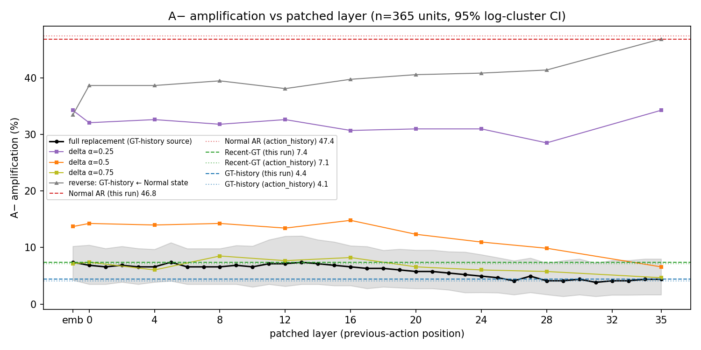
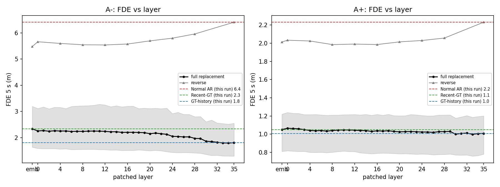
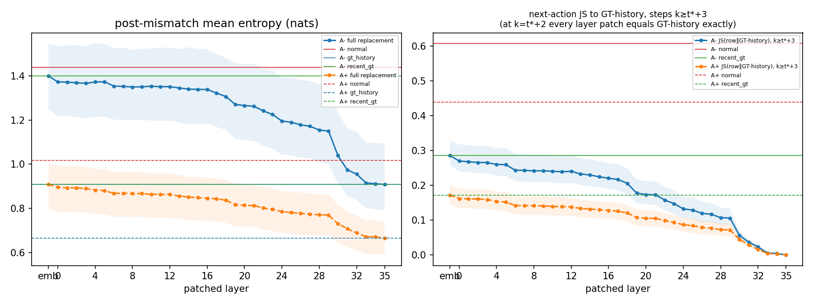

# AutoVLA Natural/Fast — Layer-wise Previous-Action State Patching

## 1. 결론

**답: 증폭을 막는 효과는 특정 layer에 있지 않습니다. embedding(layer 0 입력)에서부터 이미 거의 전부 존재하고, 모든 layer에서 유지됩니다.**

- **A− 증폭**: Normal AR 46.8% → 직전 action 위치의 residual state를 GT-history state로 바꾸면 **어떤 layer에서든 3.8–7.4%** (embedding 7.4%, L16 6.6%, L28 4.1%, L35 4.4%). GT-history 효과(−42.5%p) 대비 **93–101%**. A+ recovery도 모든 layer에서 94.2% → 98.2–98.7%.
- **구조적 주의**: 직전 action 토큰 위치는 곧 다음 action을 생성하는 위치입니다. 그래서 patch@embedding은 Recent-GT와, patch@L35는 GT-history와 **수학적으로 동일**합니다(1408/1408 단위에서 토큰 완전 일치, logits L1 = 0). 게다가 첫 유효 step(k = t*+2)에서는 모든 layer patch가 GT-history와 정확히 같습니다. 곡선의 양 끝과 첫 step은 설계상 결정되며, 정보는 내부 layer와 k ≥ t*+3에 있습니다.
- **따라서 layer sweep이 실제로 국소화하는 것**은 '직전 토큰 identity'가 아닙니다(이미 embedding에서 끝남). 그 위에 얹히는 **과거 GT 문맥 정보가 생성 위치로 읽혀 들어오는 layer**입니다. 이 추가분은 L0–L16에서 작고(Recent-GT→GT-history 간격의 ≤28%), **L17–L33에서 대부분 유입**되며 L19와 L30에서 계단식으로 증가합니다(50% 도달: A− re-alignment L22, entropy L29; A+ L23–L24). 다만 이 추가분은 GT re-alignment(+25%p)와 entropy(−0.49 nat)를 크게 바꾸지만 **증폭 자체는 3%p 정도만** 바꿉니다(L28–L35에서 유의, p < 0.005).
- **충분성(reverse patch)**: 전체 GT-history 문맥에 직전 위치의 Normal embedding(=모델이 생성한 직전 토큰 identity) 하나만 넣어도 A− 증폭이 4.4% → **33.4%**(+29.0%p, p = 7e-31)로 되돌아옵니다. 이는 Normal−GT 간격의 68%입니다. 나머지는 더 깊은 layer의 Normal state(=자기 과거 문맥을 읽은 정보)를 넣을수록 채워집니다(L0–L28 38–41%, L35 46.8%).
- **판정: Case B(late layer도 효과 있음)에 해당하지만, 그 이유는 residual 경로상 identity가 모든 layer로 전달되기 때문입니다.** 즉 '어느 layer가 효과를 운반하는가'에 대한 답은 '직전 토큰 identity가 embedding에서 주입되어 residual stream으로 끝까지 운반되며, 어떤 중간 layer도 이를 선택적으로 증폭·차단하지 않는다'입니다. Delta patch도 이를 뒷받침합니다: α = 0.25 / 0.5 / 0.75의 dose-response가 layer에 거의 무관합니다(A− 증폭 α=0.5: emb 13.7%, L16 14.8%, L28 9.9%, L35 6.6%).
- local AR feedback-loop 가설(직전 자기 토큰이 다음 action을 조건화해 오류가 증폭된다)은 **지지**됩니다. 기전은 attention을 통한 긴 history 참조가 아니라, 생성 위치 자신의 입력 토큰 identity가 residual로 전달되는 것입니다(action_history 실험의 attention mask 무효과와 일치).

## 2. 실험 설정

- 모델/decoding: AutoVLA natural fast 경로, action_history_causal과 동일한 harness(prefix KV cache + post-t* span 재계산, action 토큰만 T = 0.01 샘플링, seed = sha256(`0:token:perturbation:k`)). GPU1(RTX 5090).
- 조건 93개를 **한 batch의 row로 동시에** 계산합니다. 모든 조건이 같은 prefix, seed, 수치 경로를 공유하고, patch는 같은 forward 안에서 source row의 state를 target row로 복사합니다(같은 장면·perturbation·semantic action step·layer).
- 조건: Normal AR, GT-history, Recent-GT / **patch_full@{emb, L0–L35}** (37개, 전체 layer를 fine sweep으로 모두 실행) / **patch_delta α ∈ {0.25, 0.5, 0.75}** @ {emb, L0, 4, 8, 12, 16, 20, 24, 28, 35} / selfpatch(normal→normal) @ {emb, L16, L35} / identitysrc(source = Recent-GT) @ 대표 layer / **reverse**(GT-history rollout에 Normal state 삽입) @ 대표 layer.
- Layer key: emb = block 0 입력(embedding 출력), L{i} = decoder block i 출력.
- **시점과 위치**: step k의 span은 [a_t*, a_{t*+1}, …, a_{k−1}]이고, 마지막 위치의 logits가 a_k를 만듭니다. patch 대상은 이 마지막 위치(직전 action 토큰, 절대 위치 P + m − 1)이며 매 step 추적·기록됩니다(`records.jsonl`의 `steps`).
  - k = t*+1: 직전 토큰 = perturbation a_t*. 모든 조건에서 동일하므로 source = target, **patch는 no-op**입니다(1408/1408에서 확인).
  - k = t*+2: 직전 토큰 = 모델이 생성한 a_{t*+1}. **첫 유효 patch**입니다. 이 step에서는 두 rollout 사이에 다른 위치가 직전 토큰 하나뿐이어서, 어느 layer patch든 GT-history와 같습니다.
  - k ≥ t*+3: patch된 row의 이전 문맥(자기 생성 토큰)이 GT와 달라지므로 layer 선택이 결과를 바꿀 수 있는 구간입니다.
  - 요청의 'a_t가 a_{t+1}을 생성할 때 전달하는 representation을 patch'는 perturbation 토큰 자체에 대해서는 정의상 no-op입니다. 실질적인 patch 대상은 perturbation 이후 **모델이 자기 생성한 토큰**의 representation입니다.
- KV cache: prefix cache(t* 이전)는 patch하지 않으며, 매 step 끝에 prefix 길이로 crop합니다(prefix checksum 불변을 assert). post-t* span은 매 step 처음부터 다시 계산되므로 patch된 state는 같은 forward 안에서 이후 layer의 K/V와 logits에 반영됩니다. stale cache로 인한 거짓 음성은 발생할 수 없고, 수치로도 확인했습니다(6장).

- 단위: 장면 A− 52 / A+ 156, (장면, perturbation) 단위 A− 365 / A+ 1043 (equal-distance/action-history와 동일, 새 perturbation 없음). 실패 unit 0개.
- 실제 patch가 작동하는 step(k = t*+2)이 존재하는 단위: A− 365 / A+ 1043 (전부; t* ≤ 7). layer 선택이 결과를 바꿀 수 있는 step(k ≥ t*+3)이 존재하는 단위: A− 357 / A+ 1023 (t* = 7 제외; rollout 지표에는 모두 포함).
- CI: log 단위 cluster bootstrap 95% (2000회). p: McNemar(이진) / Wilcoxon(연속). 기준선: Normal AR (reverse 행은 GT-history).

## 3. 주요 결과

### A- (단위 365, 장면 52)

| 조건 | amplification | recovery | FDE (m) | GT re-alignment | error growth (m/step) | post-mismatch entropy | GT-history 효과 대비 비율 |
|---|---:|---:|---:|---:|---:|---:|---:|
| normal | 46.8% [36.8, 56.7] | 45.8% [37.5, 54.2] | 6.41 [5.24, 7.39] | 8.6% [6.0, 12.2] | 0.777 [0.635, 0.901] | 1.438 [1.302, 1.603] | – |
| recent_gt | 7.4% [4.2, 10.2] | 89.0% [84.8, 92.5] | 2.34 [1.64, 3.20] | 39.0% [31.8, 43.8] | 0.258 [0.180, 0.356] | 1.400 [1.249, 1.548] | 93% [89, 99] |
| gt_history | 4.4% [1.6, 8.0] | 92.9% [87.1, 96.9] | 1.81 [1.30, 2.55] | 63.9% [58.3, 67.4] | 0.194 [0.136, 0.282] | 0.908 [0.792, 1.093] | – |
| patch_full@emb | 7.4% [4.2, 10.2] | 89.0% [84.8, 92.5] | 2.34 [1.64, 3.20] | 39.0% [31.8, 43.8] | 0.258 [0.180, 0.356] | 1.400 [1.249, 1.548] | 93% [89, 99] |
| patch_full@L0 | 6.8% [3.5, 10.4] | 90.4% [85.2, 94.5] | 2.26 [1.59, 3.11] | 40.5% [33.1, 45.4] | 0.249 [0.173, 0.347] | 1.373 [1.220, 1.536] | 94% [88, 100] |
| patch_full@L4 | 6.6% [3.9, 9.7] | 91.0% [86.0, 94.6] | 2.25 [1.57, 3.16] | 41.0% [33.7, 46.0] | 0.248 [0.169, 0.350] | 1.373 [1.213, 1.548] | 95% [91, 100] |
| patch_full@L8 | 6.6% [3.5, 9.8] | 90.1% [84.7, 94.4] | 2.24 [1.55, 3.21] | 42.7% [35.2, 47.9] | 0.246 [0.171, 0.352] | 1.350 [1.200, 1.518] | 95% [91, 100] |
| patch_full@L12 | 7.1% [3.1, 12.0] | 90.1% [83.7, 95.2] | 2.24 [1.54, 3.25] | 43.0% [35.5, 48.5] | 0.246 [0.170, 0.354] | 1.352 [1.197, 1.528] | 94% [84, 100] |
| patch_full@L16 | 6.6% [3.3, 10.3] | 91.2% [86.1, 95.2] | 2.21 [1.51, 3.20] | 45.9% [38.3, 51.1] | 0.241 [0.167, 0.348] | 1.339 [1.184, 1.521] | 95% [89, 100] |
| patch_full@L20 | 5.8% [2.7, 9.5] | 91.5% [85.7, 95.8] | 2.15 [1.50, 3.11] | 50.5% [43.1, 55.4] | 0.237 [0.164, 0.342] | 1.266 [1.109, 1.455] | 97% [93, 100] |
| patch_full@L24 | 4.9% [2.1, 8.7] | 92.6% [86.7, 96.7] | 2.05 [1.44, 2.92] | 54.2% [46.9, 59.3] | 0.224 [0.157, 0.323] | 1.195 [1.043, 1.391] | 99% [95, 101] |
| patch_full@L28 | 4.1% [1.7, 7.2] | 93.2% [87.6, 96.6] | 1.97 [1.42, 2.80] | 55.9% [48.4, 60.6] | 0.214 [0.152, 0.312] | 1.155 [1.008, 1.364] | 101% [99, 104] |
| patch_full@L35 | 4.4% [1.6, 8.0] | 92.9% [87.1, 96.9] | 1.81 [1.30, 2.55] | 63.9% [58.3, 67.4] | 0.194 [0.136, 0.282] | 0.908 [0.792, 1.093] | 100% [100, 100] |

조건 − Normal AR (쌍대):

| 조건 | Δamplification | Δrecovery | ΔFDE (m) | Δre-alignment | Δerror growth | Δentropy |
|---|---|---|---|---|---|---|
| recent_gt | -39.5%p [-50.3, -28.4] p=3.3e-42 | +43.3%p [+34.3, +52.6] p=4.5e-45 | -4.07 [-4.75, -3.27] p=1.1e-51 | +30.3%p [+22.9, +35.4] p=3e-50 | -0.519 [-0.613, -0.409] p=1.6e-51 | -0.038 [-0.147, +0.048] p=0.075 |
| gt_history | -42.5%p [-53.3, -30.8] p=1.7e-45 | +47.1%p [+36.9, +56.3] p=1.5e-50 | -4.60 [-5.41, -3.61] p=3.5e-55 | +55.3%p [+48.9, +59.2] p=2.7e-59 | -0.583 [-0.688, -0.451] p=8.2e-55 | -0.530 [-0.596, -0.417] p=6.6e-50 |
| patch_full@emb | -39.5%p [-50.3, -28.4] p=3.3e-42 | +43.3%p [+34.3, +52.6] p=4.5e-45 | -4.07 [-4.75, -3.27] p=1.1e-51 | +30.3%p [+22.9, +35.4] p=3e-50 | -0.519 [-0.613, -0.409] p=1.6e-51 | -0.038 [-0.147, +0.048] p=0.075 |
| patch_full@L0 | -40.0%p [-51.7, -27.6] p=1.6e-41 | +44.7%p [+35.0, +54.7] p=7.1e-48 | -4.15 [-4.87, -3.31] p=3.9e-53 | +31.9%p [+24.0, +37.1] p=3.3e-51 | -0.528 [-0.626, -0.416] p=6.2e-53 | -0.065 [-0.161, +0.023] p=0.0072 |
| patch_full@L4 | -40.3%p [-51.3, -28.6] p=8e-42 | +45.2%p [+35.7, +54.6] p=1.8e-48 | -4.15 [-4.88, -3.29] p=4.7e-53 | +32.3%p [+24.6, +37.7] p=1.3e-51 | -0.529 [-0.629, -0.415] p=4.9e-53 | -0.066 [-0.164, +0.028] p=0.0051 |
| patch_full@L8 | -40.3%p [-51.5, -28.6] p=4.2e-43 | +44.4%p [+34.2, +54.3] p=1.4e-47 | -4.17 [-4.94, -3.25] p=1.3e-53 | +34.1%p [+26.2, +39.7] p=6e-53 | -0.531 [-0.633, -0.412] p=1.9e-53 | -0.088 [-0.182, +0.003] p=0.00034 |
| patch_full@L12 | -39.7%p [-51.8, -26.5] p=1.7e-42 | +44.4%p [+33.7, +54.3] p=1.4e-47 | -4.17 [-4.95, -3.25] p=2.4e-53 | +34.4%p [+26.6, +40.1] p=4.7e-54 | -0.530 [-0.635, -0.411] p=4.2e-53 | -0.087 [-0.181, +0.003] p=0.00078 |
| patch_full@L16 | -40.3%p [-51.8, -28.1] p=4.2e-43 | +45.5%p [+35.7, +55.0] p=9e-49 | -4.20 [-4.98, -3.28] p=4.7e-54 | +37.2%p [+29.2, +42.7] p=3e-54 | -0.535 [-0.639, -0.414] p=1.3e-53 | -0.099 [-0.193, +0.003] p=0.0001 |
| patch_full@L20 | -41.1%p [-51.9, -29.1] p=5.4e-44 | +45.8%p [+35.7, +54.8] p=4.5e-49 | -4.26 [-5.02, -3.33] p=3.6e-54 | +41.9%p [+34.3, +46.9] p=2.7e-56 | -0.540 [-0.641, -0.417] p=3.4e-54 | -0.173 [-0.251, -0.084] p=2.2e-10 |
| patch_full@L24 | -41.9%p [-52.7, -29.9] p=1.4e-43 | +46.8%p [+36.6, +55.8] p=6.4e-49 | -4.36 [-5.14, -3.40] p=2.4e-54 | +45.5%p [+38.0, +50.6] p=1.4e-57 | -0.552 [-0.655, -0.427] p=3.8e-54 | -0.243 [-0.323, -0.144] p=1.5e-16 |
| patch_full@L28 | -42.7%p [-53.4, -31.7] p=8.7e-46 | +47.4%p [+37.8, +56.2] p=7.4e-51 | -4.44 [-5.18, -3.50] p=1e-54 | +47.3%p [+39.8, +52.1] p=3.2e-58 | -0.563 [-0.662, -0.438] p=2.4e-54 | -0.283 [-0.362, -0.171] p=4.8e-21 |
| patch_full@L35 | -42.5%p [-53.3, -30.8] p=1.7e-45 | +47.1%p [+36.9, +56.3] p=1.5e-50 | -4.60 [-5.41, -3.61] p=3.5e-55 | +55.3%p [+48.9, +59.2] p=2.7e-59 | -0.583 [-0.688, -0.451] p=8.2e-55 | -0.530 [-0.596, -0.417] p=6.6e-50 |

### A+ (단위 1043, 장면 156)

| 조건 | amplification | recovery | FDE (m) | GT re-alignment | error growth (m/step) | post-mismatch entropy | GT-history 효과 대비 비율 |
|---|---:|---:|---:|---:|---:|---:|---:|
| normal | 4.5% [2.5, 6.3] | 94.2% [92.1, 96.6] | 2.23 [1.74, 2.58] | 29.0% [24.9, 34.1] | 0.267 [0.211, 0.306] | 1.016 [0.904, 1.098] | – |
| recent_gt | 0.7% [0.1, 1.7] | 98.4% [97.0, 99.3] | 1.05 [0.81, 1.22] | 56.1% [50.9, 60.8] | 0.114 [0.087, 0.134] | 0.908 [0.796, 1.007] | 103% [91, 127] |
| gt_history | 0.8% [0.1, 2.0] | 98.2% [96.7, 99.1] | 1.01 [0.78, 1.20] | 71.3% [66.9, 74.7] | 0.108 [0.083, 0.128] | 0.665 [0.588, 0.738] | – |
| patch_full@emb | 0.7% [0.1, 1.7] | 98.4% [97.0, 99.3] | 1.05 [0.81, 1.22] | 56.1% [50.9, 60.8] | 0.114 [0.087, 0.134] | 0.908 [0.796, 1.007] | 103% [91, 127] |
| patch_full@L0 | 0.7% [0.1, 1.7] | 98.5% [97.2, 99.3] | 1.06 [0.82, 1.24] | 56.9% [51.9, 61.6] | 0.115 [0.088, 0.136] | 0.895 [0.786, 0.993] | 103% [91, 127] |
| patch_full@L4 | 0.5% [0.1, 1.1] | 98.7% [97.7, 99.3] | 1.04 [0.80, 1.22] | 58.0% [52.7, 62.6] | 0.113 [0.086, 0.133] | 0.883 [0.774, 0.979] | 108% [92, 173] |
| patch_full@L8 | 0.5% [0.1, 1.1] | 98.5% [97.4, 99.2] | 1.04 [0.80, 1.21] | 59.1% [53.9, 63.6] | 0.113 [0.087, 0.133] | 0.867 [0.761, 0.964] | 108% [92, 173] |
| patch_full@L12 | 0.5% [0.1, 1.1] | 98.7% [97.8, 99.3] | 1.04 [0.81, 1.22] | 59.5% [54.5, 64.1] | 0.114 [0.088, 0.134] | 0.863 [0.757, 0.959] | 108% [92, 173] |
| patch_full@L16 | 0.5% [0.1, 1.0] | 98.4% [97.4, 99.0] | 1.04 [0.79, 1.22] | 60.4% [55.6, 64.8] | 0.113 [0.086, 0.133] | 0.845 [0.743, 0.938] | 108% [95, 175] |
| patch_full@L20 | 0.8% [0.2, 1.4] | 98.4% [97.5, 99.0] | 1.03 [0.78, 1.20] | 62.8% [58.1, 67.4] | 0.111 [0.085, 0.132] | 0.813 [0.715, 0.906] | 100% [90, 145] |
| patch_full@L24 | 0.8% [0.2, 1.4] | 98.3% [97.4, 99.0] | 1.02 [0.78, 1.21] | 64.7% [60.2, 69.0] | 0.111 [0.084, 0.131] | 0.785 [0.688, 0.878] | 100% [90, 145] |
| patch_full@L28 | 0.7% [0.1, 1.3] | 98.5% [97.5, 99.2] | 1.03 [0.78, 1.21] | 65.9% [61.3, 70.0] | 0.111 [0.083, 0.131] | 0.771 [0.678, 0.862] | 103% [92, 150] |
| patch_full@L35 | 0.8% [0.1, 2.0] | 98.2% [96.7, 99.1] | 1.01 [0.78, 1.20] | 71.3% [66.9, 74.7] | 0.108 [0.083, 0.128] | 0.665 [0.588, 0.738] | 100% [100, 100] |

조건 − Normal AR (쌍대):

| 조건 | Δamplification | Δrecovery | ΔFDE (m) | Δre-alignment | Δerror growth | Δentropy |
|---|---|---|---|---|---|---|
| recent_gt | -3.8%p [-5.9, -1.3] p=1.5e-09 | +4.2%p [+1.2, +6.6] p=2e-08 | -1.18 [-1.41, -0.87] p=1e-80 | +27.1%p [+24.1, +29.3] p=1.3e-112 | -0.153 [-0.181, -0.117] p=2.3e-82 | -0.108 [-0.133, -0.080] p=3.4e-16 |
| gt_history | -3.7%p [-5.9, -1.1] p=7.6e-09 | +4.0%p [+0.8, +6.5] p=1e-07 | -1.22 [-1.44, -0.90] p=6.5e-88 | +42.3%p [+37.9, +45.5] p=5.8e-138 | -0.159 [-0.186, -0.120] p=5.7e-89 | -0.352 [-0.378, -0.310] p=7.4e-118 |
| patch_full@emb | -3.8%p [-5.9, -1.3] p=1.5e-09 | +4.2%p [+1.2, +6.6] p=2e-08 | -1.18 [-1.41, -0.87] p=1e-80 | +27.1%p [+24.1, +29.3] p=1.3e-112 | -0.153 [-0.181, -0.117] p=2.3e-82 | -0.108 [-0.133, -0.080] p=3.4e-16 |
| patch_full@L0 | -3.8%p [-5.9, -1.3] p=1.5e-09 | +4.3%p [+1.3, +6.7] p=3e-09 | -1.17 [-1.39, -0.87] p=2.4e-78 | +27.9%p [+25.0, +30.1] p=1.7e-113 | -0.151 [-0.179, -0.115] p=4.7e-80 | -0.121 [-0.144, -0.092] p=1.2e-19 |
| patch_full@L4 | -4.0%p [-6.0, -1.8] p=3.1e-11 | +4.5%p [+1.7, +6.7] p=1.8e-10 | -1.19 [-1.42, -0.89] p=7.1e-81 | +28.9%p [+25.7, +31.3] p=1.4e-115 | -0.154 [-0.182, -0.118] p=5.3e-82 | -0.134 [-0.156, -0.107] p=8e-24 |
| patch_full@L8 | -4.0%p [-6.0, -1.8] p=3.1e-11 | +4.3%p [+1.4, +6.6] p=1.4e-09 | -1.19 [-1.42, -0.88] p=1.8e-80 | +30.1%p [+26.8, +32.5] p=1.2e-119 | -0.154 [-0.182, -0.116] p=2e-81 | -0.150 [-0.174, -0.119] p=8.9e-30 |
| patch_full@L12 | -4.0%p [-6.0, -1.8] p=3.1e-11 | +4.5%p [+1.7, +6.7] p=6.4e-11 | -1.19 [-1.41, -0.88] p=1.8e-81 | +30.5%p [+27.3, +33.0] p=6.2e-120 | -0.153 [-0.181, -0.116] p=2.8e-82 | -0.153 [-0.177, -0.124] p=2.1e-31 |
| patch_full@L16 | -4.0%p [-6.0, -1.9] p=3.1e-11 | +4.2%p [+1.4, +6.5] p=2.4e-09 | -1.19 [-1.42, -0.89] p=1.8e-82 | +31.4%p [+28.3, +33.7] p=3.7e-122 | -0.154 [-0.183, -0.118] p=9.4e-84 | -0.171 [-0.193, -0.143] p=3.2e-37 |
| patch_full@L20 | -3.7%p [-5.8, -1.5] p=2.8e-09 | +4.2%p [+1.4, +6.5] p=5.2e-09 | -1.21 [-1.43, -0.89] p=3.1e-84 | +33.8%p [+30.8, +36.1] p=1.9e-126 | -0.155 [-0.184, -0.119] p=7.4e-85 | -0.203 [-0.227, -0.171] p=2.9e-51 |
| patch_full@L24 | -3.7%p [-5.8, -1.5] p=2.8e-09 | +4.1%p [+1.4, +6.4] p=9.1e-09 | -1.21 [-1.43, -0.90] p=1.4e-83 | +35.7%p [+32.6, +38.2] p=6.6e-129 | -0.156 [-0.184, -0.119] p=2.2e-84 | -0.232 [-0.258, -0.197] p=3.9e-67 |
| patch_full@L28 | -3.8%p [-5.8, -1.6] p=1.5e-09 | +4.3%p [+1.6, +6.6] p=3e-09 | -1.20 [-1.42, -0.90] p=4.7e-84 | +36.9%p [+33.6, +39.4] p=5.8e-132 | -0.156 [-0.183, -0.121] p=1.2e-84 | -0.246 [-0.270, -0.210] p=1e-71 |
| patch_full@L35 | -3.7%p [-5.9, -1.1] p=7.6e-09 | +4.0%p [+0.8, +6.5] p=1e-07 | -1.22 [-1.44, -0.90] p=6.5e-88 | +42.3%p [+37.9, +45.5] p=5.8e-138 | -0.159 [-0.186, -0.120] p=5.7e-89 | -0.352 [-0.378, -0.310] p=7.4e-118 |

## 4. Layer별 효과

### A-: full replacement 전체 layer (+ 첫 유효 step의 next-action 분포)

k = t*+2 열: JS(row‖Normal), JS(row‖GT-hist), P(GT), P(Normal action) — 모든 layer에서 GT-history와 동일(구조적). k ≥ t*+3 열: layer 선택이 영향을 주는 구간의 평균.

| layer | amplification | recovery | FDE (m) | re-align | entropy | JS‖Normal @t*+2 | JS‖GT-hist @t*+2 | P(GT) @t*+2 | P(Normal act) @t*+2 | P(GT) k≥t*+3 | entropy k≥t*+3 | JS‖GT-hist k≥t*+3 |
|---|---:|---:|---:|---:|---:|---:|---:|---:|---:|---:|---:|---:|
| normal | 46.8% [36.8, 56.7] | 45.8% [37.5, 54.2] | 6.41 [5.24, 7.39] | 8.6% [6.0, 12.2] | 1.438 [1.302, 1.603] | 0.000 [0.000, 0.000] | 0.466 [0.404, 0.508] | 10.6% [7.4, 15.2] | 57.2% [52.6, 60.6] | 6.6% [4.4, 9.8] | 1.324 [1.192, 1.461] | 0.608 [0.578, 0.628] |
| recent_gt | 7.4% [4.2, 10.2] | 89.0% [84.8, 92.5] | 2.34 [1.64, 3.20] | 39.0% [31.8, 43.8] | 1.400 [1.249, 1.548] | 0.466 [0.404, 0.508] | 0.000 [0.000, 0.000] | 36.0% [29.3, 42.3] | 18.0% [13.4, 23.7] | 38.4% [30.5, 43.9] | 1.311 [1.127, 1.460] | 0.286 [0.257, 0.328] |
| gt_history | 4.4% [1.6, 8.0] | 92.9% [87.1, 96.9] | 1.81 [1.30, 2.55] | 63.9% [58.3, 67.4] | 0.908 [0.792, 1.093] | 0.466 [0.404, 0.508] | 0.000 [0.000, 0.000] | 36.0% [29.3, 42.3] | 18.0% [13.4, 23.7] | 71.6% [64.2, 76.6] | 0.631 [0.522, 0.799] | 0.000 [0.000, 0.000] |
| patch_full@emb | 7.4% [4.2, 10.2] | 89.0% [84.8, 92.5] | 2.34 [1.64, 3.20] | 39.0% [31.8, 43.8] | 1.400 [1.249, 1.548] | 0.466 [0.404, 0.508] | 0.000 [0.000, 0.000] | 36.0% [29.3, 42.3] | 18.0% [13.4, 23.7] | 38.4% [30.5, 43.9] | 1.311 [1.127, 1.460] | 0.286 [0.257, 0.328] |
| patch_full@L0 | 6.8% [3.5, 10.4] | 90.4% [85.2, 94.5] | 2.26 [1.59, 3.11] | 40.5% [33.1, 45.4] | 1.373 [1.220, 1.536] | 0.466 [0.404, 0.508] | 0.000 [0.000, 0.000] | 36.0% [29.3, 42.3] | 18.0% [13.4, 23.7] | 40.6% [32.2, 46.4] | 1.273 [1.093, 1.438] | 0.270 [0.239, 0.318] |
| patch_full@L1 | 6.6% [3.5, 9.8] | 90.7% [85.8, 94.6] | 2.27 [1.58, 3.17] | 40.6% [33.3, 45.6] | 1.372 [1.218, 1.538] | 0.466 [0.404, 0.508] | 0.000 [0.000, 0.000] | 36.0% [29.3, 42.3] | 18.0% [13.4, 23.7] | 40.7% [32.5, 46.5] | 1.272 [1.092, 1.439] | 0.268 [0.237, 0.315] |
| patch_full@L2 | 6.8% [3.9, 10.2] | 91.0% [86.0, 94.7] | 2.25 [1.58, 3.10] | 40.8% [33.6, 45.7] | 1.369 [1.213, 1.540] | 0.466 [0.404, 0.508] | 0.000 [0.000, 0.000] | 36.0% [29.3, 42.3] | 18.0% [13.4, 23.7] | 41.0% [32.8, 46.9] | 1.268 [1.085, 1.439] | 0.266 [0.235, 0.314] |
| patch_full@L3 | 6.6% [3.5, 9.8] | 91.2% [86.3, 95.2] | 2.26 [1.58, 3.16] | 40.6% [33.2, 45.5] | 1.366 [1.209, 1.534] | 0.466 [0.404, 0.508] | 0.000 [0.000, 0.000] | 36.0% [29.3, 42.3] | 18.0% [13.4, 23.7] | 41.0% [32.8, 46.9] | 1.264 [1.080, 1.437] | 0.265 [0.234, 0.313] |
| patch_full@L4 | 6.6% [3.9, 9.7] | 91.0% [86.0, 94.6] | 2.25 [1.57, 3.16] | 41.0% [33.7, 46.0] | 1.373 [1.213, 1.548] | 0.466 [0.404, 0.508] | 0.000 [0.000, 0.000] | 36.0% [29.3, 42.3] | 18.0% [13.4, 23.7] | 41.5% [33.3, 47.6] | 1.272 [1.083, 1.447] | 0.260 [0.228, 0.307] |
| patch_full@L5 | 7.4% [4.1, 10.9] | 90.7% [86.0, 94.4] | 2.26 [1.58, 3.11] | 40.9% [33.8, 46.0] | 1.374 [1.215, 1.545] | 0.466 [0.404, 0.508] | 0.000 [0.000, 0.000] | 36.0% [29.3, 42.3] | 18.0% [13.4, 23.7] | 41.5% [33.2, 47.7] | 1.274 [1.087, 1.444] | 0.259 [0.227, 0.307] |
| patch_full@L6 | 6.6% [3.5, 9.8] | 90.4% [84.9, 94.5] | 2.24 [1.54, 3.19] | 42.6% [35.1, 47.8] | 1.354 [1.202, 1.526] | 0.466 [0.404, 0.508] | 0.000 [0.000, 0.000] | 36.0% [29.3, 42.3] | 18.0% [13.4, 23.7] | 43.5% [34.8, 49.7] | 1.248 [1.069, 1.420] | 0.243 [0.211, 0.290] |
| patch_full@L7 | 6.6% [3.5, 9.8] | 90.1% [84.7, 94.4] | 2.24 [1.55, 3.21] | 42.6% [35.2, 47.8] | 1.353 [1.201, 1.527] | 0.466 [0.404, 0.508] | 0.000 [0.000, 0.000] | 36.0% [29.3, 42.3] | 18.0% [13.4, 23.7] | 43.6% [34.8, 49.8] | 1.247 [1.067, 1.420] | 0.243 [0.210, 0.290] |
| patch_full@L8 | 6.6% [3.5, 9.8] | 90.1% [84.7, 94.4] | 2.24 [1.55, 3.21] | 42.7% [35.2, 47.9] | 1.350 [1.200, 1.518] | 0.466 [0.404, 0.508] | 0.000 [0.000, 0.000] | 36.0% [29.3, 42.3] | 18.0% [13.4, 23.7] | 43.8% [35.2, 49.8] | 1.242 [1.068, 1.411] | 0.241 [0.210, 0.287] |
| patch_full@L9 | 6.8% [3.5, 10.4] | 90.1% [84.7, 94.4] | 2.25 [1.56, 3.22] | 43.0% [35.3, 48.3] | 1.351 [1.199, 1.522] | 0.466 [0.404, 0.508] | 0.000 [0.000, 0.000] | 36.0% [29.3, 42.3] | 18.0% [13.4, 23.7] | 43.8% [35.0, 49.9] | 1.244 [1.068, 1.414] | 0.242 [0.210, 0.289] |
| patch_full@L10 | 6.6% [3.0, 10.3] | 90.4% [84.9, 94.5] | 2.25 [1.56, 3.24] | 43.0% [35.7, 48.2] | 1.353 [1.199, 1.526] | 0.466 [0.404, 0.508] | 0.000 [0.000, 0.000] | 36.0% [29.3, 42.3] | 18.0% [13.4, 23.7] | 43.9% [35.1, 50.1] | 1.247 [1.066, 1.421] | 0.240 [0.208, 0.287] |
| patch_full@L11 | 7.1% [3.5, 11.4] | 90.1% [84.3, 94.7] | 2.25 [1.55, 3.27] | 43.5% [36.1, 48.8] | 1.351 [1.196, 1.528] | 0.466 [0.404, 0.508] | 0.000 [0.000, 0.000] | 36.0% [29.3, 42.3] | 18.0% [13.4, 23.7] | 44.1% [35.2, 50.3] | 1.244 [1.066, 1.422] | 0.239 [0.206, 0.287] |
| patch_full@L12 | 7.1% [3.1, 12.0] | 90.1% [83.7, 95.2] | 2.24 [1.54, 3.25] | 43.0% [35.5, 48.5] | 1.352 [1.197, 1.528] | 0.466 [0.404, 0.508] | 0.000 [0.000, 0.000] | 36.0% [29.3, 42.3] | 18.0% [13.4, 23.7] | 44.0% [35.0, 50.2] | 1.245 [1.064, 1.422] | 0.240 [0.207, 0.288] |
| patch_full@L13 | 7.4% [3.5, 12.1] | 90.1% [84.4, 94.8] | 2.22 [1.53, 3.18] | 44.2% [36.8, 49.3] | 1.345 [1.190, 1.522] | 0.466 [0.404, 0.508] | 0.000 [0.000, 0.000] | 36.0% [29.3, 42.3] | 18.0% [13.4, 23.7] | 44.9% [36.1, 51.1] | 1.236 [1.055, 1.416] | 0.232 [0.201, 0.277] |
| patch_full@L14 | 7.1% [3.5, 11.4] | 90.4% [84.9, 94.8] | 2.23 [1.53, 3.22] | 44.4% [36.7, 49.9] | 1.340 [1.180, 1.530] | 0.466 [0.404, 0.508] | 0.000 [0.000, 0.000] | 36.0% [29.3, 42.3] | 18.0% [13.4, 23.7] | 45.2% [36.3, 51.6] | 1.229 [1.042, 1.423] | 0.230 [0.198, 0.275] |
| patch_full@L15 | 6.8% [3.3, 11.0] | 91.0% [85.7, 95.2] | 2.20 [1.51, 3.18] | 45.3% [37.7, 50.7] | 1.339 [1.182, 1.522] | 0.466 [0.404, 0.508] | 0.000 [0.000, 0.000] | 36.0% [29.3, 42.3] | 18.0% [13.4, 23.7] | 45.9% [37.0, 52.1] | 1.227 [1.042, 1.412] | 0.224 [0.194, 0.269] |
| patch_full@L16 | 6.6% [3.3, 10.3] | 91.2% [86.1, 95.2] | 2.21 [1.51, 3.20] | 45.9% [38.3, 51.1] | 1.339 [1.184, 1.521] | 0.466 [0.404, 0.508] | 0.000 [0.000, 0.000] | 36.0% [29.3, 42.3] | 18.0% [13.4, 23.7] | 46.3% [37.5, 52.4] | 1.227 [1.043, 1.416] | 0.220 [0.190, 0.263] |
| patch_full@L17 | 6.3% [2.8, 10.2] | 90.7% [85.2, 95.0] | 2.20 [1.51, 3.20] | 46.1% [38.7, 51.3] | 1.322 [1.168, 1.501] | 0.466 [0.404, 0.508] | 0.000 [0.000, 0.000] | 36.0% [29.3, 42.3] | 18.0% [13.4, 23.7] | 47.0% [38.4, 53.2] | 1.205 [1.025, 1.386] | 0.217 [0.185, 0.261] |
| patch_full@L18 | 6.3% [3.0, 9.5] | 90.7% [85.3, 94.9] | 2.20 [1.53, 3.11] | 46.9% [39.3, 52.0] | 1.307 [1.156, 1.480] | 0.466 [0.404, 0.508] | 0.000 [0.000, 0.000] | 36.0% [29.3, 42.3] | 18.0% [13.4, 23.7] | 48.4% [39.4, 54.6] | 1.184 [1.011, 1.357] | 0.206 [0.174, 0.249] |
| patch_full@L19 | 6.0% [2.9, 9.7] | 91.5% [86.1, 95.6] | 2.19 [1.52, 3.13] | 49.8% [42.4, 54.8] | 1.271 [1.115, 1.457] | 0.466 [0.404, 0.508] | 0.000 [0.000, 0.000] | 36.0% [29.3, 42.3] | 18.0% [13.4, 23.7] | 51.7% [43.1, 57.9] | 1.133 [0.959, 1.320] | 0.178 [0.148, 0.217] |
| patch_full@L20 | 5.8% [2.7, 9.5] | 91.5% [85.7, 95.8] | 2.15 [1.50, 3.11] | 50.5% [43.1, 55.4] | 1.266 [1.109, 1.455] | 0.466 [0.404, 0.508] | 0.000 [0.000, 0.000] | 36.0% [29.3, 42.3] | 18.0% [13.4, 23.7] | 52.3% [43.8, 58.4] | 1.127 [0.953, 1.319] | 0.173 [0.145, 0.212] |
| patch_full@L21 | 5.8% [2.7, 9.5] | 91.5% [85.7, 95.8] | 2.17 [1.52, 3.12] | 50.4% [43.2, 55.2] | 1.263 [1.105, 1.456] | 0.466 [0.404, 0.508] | 0.000 [0.000, 0.000] | 36.0% [29.3, 42.3] | 18.0% [13.4, 23.7] | 52.4% [43.7, 58.6] | 1.123 [0.949, 1.317] | 0.173 [0.144, 0.210] |
| patch_full@L22 | 5.5% [2.5, 9.3] | 91.8% [86.1, 95.9] | 2.15 [1.50, 3.11] | 52.1% [44.3, 57.6] | 1.242 [1.084, 1.433] | 0.466 [0.404, 0.508] | 0.000 [0.000, 0.000] | 36.0% [29.3, 42.3] | 18.0% [13.4, 23.7] | 54.4% [45.6, 60.8] | 1.093 [0.920, 1.285] | 0.158 [0.128, 0.195] |
| patch_full@L23 | 5.2% [2.0, 9.2] | 92.1% [86.1, 96.3] | 2.13 [1.46, 3.13] | 52.5% [44.6, 58.0] | 1.225 [1.070, 1.425] | 0.466 [0.404, 0.508] | 0.000 [0.000, 0.000] | 36.0% [29.3, 42.3] | 18.0% [13.4, 23.7] | 55.6% [46.5, 62.0] | 1.071 [0.902, 1.269] | 0.147 [0.119, 0.186] |
| patch_full@L24 | 4.9% [2.1, 8.7] | 92.6% [86.7, 96.7] | 2.05 [1.44, 2.92] | 54.2% [46.9, 59.3] | 1.195 [1.043, 1.391] | 0.466 [0.404, 0.508] | 0.000 [0.000, 0.000] | 36.0% [29.3, 42.3] | 18.0% [13.4, 23.7] | 57.5% [48.7, 63.7] | 1.029 [0.864, 1.222] | 0.132 [0.105, 0.167] |
| patch_full@L25 | 4.7% [2.0, 8.2] | 92.9% [87.1, 96.7] | 2.04 [1.43, 2.97] | 54.4% [46.7, 59.8] | 1.190 [1.039, 1.391] | 0.466 [0.404, 0.508] | 0.000 [0.000, 0.000] | 36.0% [29.3, 42.3] | 18.0% [13.4, 23.7] | 57.7% [48.8, 64.0] | 1.022 [0.859, 1.221] | 0.129 [0.101, 0.166] |
| patch_full@L26 | 4.1% [1.7, 7.7] | 92.9% [87.1, 96.7] | 2.03 [1.43, 2.89] | 55.6% [47.9, 60.7] | 1.178 [1.030, 1.383] | 0.466 [0.404, 0.508] | 0.000 [0.000, 0.000] | 36.0% [29.3, 42.3] | 18.0% [13.4, 23.7] | 58.7% [49.8, 65.0] | 1.005 [0.848, 1.216] | 0.119 [0.094, 0.153] |
| patch_full@L27 | 4.9% [2.0, 8.1] | 92.3% [87.1, 96.1] | 2.03 [1.43, 2.89] | 55.6% [48.2, 60.6] | 1.172 [1.026, 1.377] | 0.466 [0.404, 0.508] | 0.000 [0.000, 0.000] | 36.0% [29.3, 42.3] | 18.0% [13.4, 23.7] | 59.1% [50.5, 65.1] | 0.996 [0.843, 1.205] | 0.117 [0.093, 0.149] |
| patch_full@L28 | 4.1% [1.7, 7.2] | 93.2% [87.6, 96.6] | 1.97 [1.42, 2.80] | 55.9% [48.4, 60.6] | 1.155 [1.008, 1.364] | 0.466 [0.404, 0.508] | 0.000 [0.000, 0.000] | 36.0% [29.3, 42.3] | 18.0% [13.4, 23.7] | 59.9% [51.4, 65.6] | 0.972 [0.814, 1.188] | 0.107 [0.087, 0.136] |
| patch_full@L29 | 4.1% [1.4, 7.7] | 93.2% [87.4, 97.0] | 1.96 [1.41, 2.81] | 56.2% [48.5, 61.1] | 1.150 [1.000, 1.364] | 0.466 [0.404, 0.508] | 0.000 [0.000, 0.000] | 36.0% [29.3, 42.3] | 18.0% [13.4, 23.7] | 60.2% [51.4, 66.0] | 0.965 [0.809, 1.186] | 0.106 [0.086, 0.134] |
| patch_full@L30 | 4.4% [1.6, 8.0] | 92.9% [87.1, 96.9] | 1.86 [1.36, 2.61] | 60.5% [54.8, 63.9] | 1.039 [0.914, 1.231] | 0.466 [0.404, 0.508] | 0.000 [0.000, 0.000] | 36.0% [29.3, 42.3] | 18.0% [13.4, 23.7] | 66.4% [59.7, 70.9] | 0.812 [0.690, 0.993] | 0.057 [0.048, 0.069] |
| patch_full@L31 | 3.8% [1.4, 7.2] | 92.9% [86.8, 96.9] | 1.85 [1.32, 2.67] | 61.9% [56.3, 65.2] | 0.974 [0.856, 1.164] | 0.466 [0.404, 0.508] | 0.000 [0.000, 0.000] | 36.0% [29.3, 42.3] | 18.0% [13.4, 23.7] | 68.7% [61.8, 73.4] | 0.723 [0.610, 0.903] | 0.037 [0.032, 0.045] |
| patch_full@L32 | 4.1% [1.6, 7.7] | 92.9% [86.8, 96.9] | 1.82 [1.33, 2.56] | 62.9% [57.2, 66.3] | 0.955 [0.836, 1.147] | 0.466 [0.404, 0.508] | 0.000 [0.000, 0.000] | 36.0% [29.3, 42.3] | 18.0% [13.4, 23.7] | 69.6% [62.4, 74.4] | 0.695 [0.587, 0.880] | 0.023 [0.020, 0.030] |
| patch_full@L33 | 4.1% [1.6, 7.7] | 93.2% [87.4, 97.0] | 1.80 [1.30, 2.54] | 63.6% [58.1, 67.0] | 0.916 [0.802, 1.099] | 0.466 [0.404, 0.508] | 0.000 [0.000, 0.000] | 36.0% [29.3, 42.3] | 18.0% [13.4, 23.7] | 71.1% [63.8, 76.0] | 0.641 [0.537, 0.807] | 0.006 [0.004, 0.007] |
| patch_full@L34 | 4.4% [1.6, 8.0] | 92.9% [87.1, 96.9] | 1.79 [1.30, 2.52] | 63.7% [58.1, 67.2] | 0.911 [0.796, 1.096] | 0.466 [0.404, 0.508] | 0.000 [0.000, 0.000] | 36.0% [29.3, 42.3] | 18.0% [13.4, 23.7] | 71.3% [64.0, 76.2] | 0.635 [0.528, 0.801] | 0.004 [0.003, 0.006] |
| patch_full@L35 | 4.4% [1.6, 8.0] | 92.9% [87.1, 96.9] | 1.81 [1.30, 2.55] | 63.9% [58.3, 67.4] | 0.908 [0.792, 1.093] | 0.466 [0.404, 0.508] | 0.000 [0.000, 0.000] | 36.0% [29.3, 42.3] | 18.0% [13.4, 23.7] | 71.6% [64.2, 76.6] | 0.631 [0.522, 0.799] | 0.000 [0.000, 0.000] |

### A+: full replacement 전체 layer (+ 첫 유효 step의 next-action 분포)

k = t*+2 열: JS(row‖Normal), JS(row‖GT-hist), P(GT), P(Normal action) — 모든 layer에서 GT-history와 동일(구조적). k ≥ t*+3 열: layer 선택이 영향을 주는 구간의 평균.

| layer | amplification | recovery | FDE (m) | re-align | entropy | JS‖Normal @t*+2 | JS‖GT-hist @t*+2 | P(GT) @t*+2 | P(Normal act) @t*+2 | P(GT) k≥t*+3 | entropy k≥t*+3 | JS‖GT-hist k≥t*+3 |
|---|---:|---:|---:|---:|---:|---:|---:|---:|---:|---:|---:|---:|
| normal | 4.5% [2.5, 6.3] | 94.2% [92.1, 96.6] | 2.23 [1.74, 2.58] | 29.0% [24.9, 34.1] | 1.016 [0.904, 1.098] | 0.000 [0.000, 0.000] | 0.334 [0.305, 0.364] | 25.7% [21.8, 29.7] | 68.0% [65.8, 70.7] | 27.2% [22.7, 33.1] | 0.961 [0.848, 1.047] | 0.438 [0.396, 0.470] |
| recent_gt | 0.7% [0.1, 1.7] | 98.4% [97.0, 99.3] | 1.05 [0.81, 1.22] | 56.1% [50.9, 60.8] | 0.908 [0.796, 1.007] | 0.334 [0.305, 0.364] | 0.000 [0.000, 0.000] | 50.6% [45.2, 55.4] | 34.5% [30.7, 38.7] | 56.3% [50.6, 61.6] | 0.846 [0.733, 0.946] | 0.172 [0.144, 0.201] |
| gt_history | 0.8% [0.1, 2.0] | 98.2% [96.7, 99.1] | 1.01 [0.78, 1.20] | 71.3% [66.9, 74.7] | 0.665 [0.588, 0.738] | 0.334 [0.305, 0.364] | 0.000 [0.000, 0.000] | 50.6% [45.2, 55.4] | 34.5% [30.7, 38.7] | 76.6% [72.1, 80.3] | 0.510 [0.438, 0.577] | 0.000 [0.000, 0.000] |
| patch_full@emb | 0.7% [0.1, 1.7] | 98.4% [97.0, 99.3] | 1.05 [0.81, 1.22] | 56.1% [50.9, 60.8] | 0.908 [0.796, 1.007] | 0.334 [0.305, 0.364] | 0.000 [0.000, 0.000] | 50.6% [45.2, 55.4] | 34.5% [30.7, 38.7] | 56.3% [50.6, 61.6] | 0.846 [0.733, 0.946] | 0.172 [0.144, 0.201] |
| patch_full@L0 | 0.7% [0.1, 1.7] | 98.5% [97.2, 99.3] | 1.06 [0.82, 1.24] | 56.9% [51.9, 61.6] | 0.895 [0.786, 0.993] | 0.334 [0.305, 0.364] | 0.000 [0.000, 0.000] | 50.6% [45.2, 55.4] | 34.5% [30.7, 38.7] | 57.5% [51.7, 63.0] | 0.828 [0.717, 0.925] | 0.162 [0.134, 0.190] |
| patch_full@L1 | 0.7% [0.1, 1.7] | 98.4% [97.1, 99.3] | 1.06 [0.81, 1.23] | 57.0% [52.0, 61.7] | 0.893 [0.782, 0.990] | 0.334 [0.305, 0.364] | 0.000 [0.000, 0.000] | 50.6% [45.2, 55.4] | 34.5% [30.7, 38.7] | 57.6% [51.9, 63.1] | 0.825 [0.714, 0.921] | 0.161 [0.134, 0.189] |
| patch_full@L2 | 0.7% [0.1, 1.7] | 98.4% [97.1, 99.3] | 1.06 [0.81, 1.23] | 56.9% [51.9, 61.7] | 0.892 [0.782, 0.991] | 0.334 [0.305, 0.364] | 0.000 [0.000, 0.000] | 50.6% [45.2, 55.4] | 34.5% [30.7, 38.7] | 57.7% [51.9, 63.2] | 0.823 [0.713, 0.921] | 0.161 [0.133, 0.189] |
| patch_full@L3 | 0.8% [0.2, 1.8] | 98.3% [97.0, 99.2] | 1.05 [0.81, 1.21] | 57.3% [52.1, 62.0] | 0.890 [0.781, 0.987] | 0.334 [0.305, 0.364] | 0.000 [0.000, 0.000] | 50.6% [45.2, 55.4] | 34.5% [30.7, 38.7] | 57.9% [52.1, 63.3] | 0.820 [0.713, 0.917] | 0.159 [0.132, 0.188] |
| patch_full@L4 | 0.5% [0.1, 1.1] | 98.7% [97.7, 99.3] | 1.04 [0.80, 1.22] | 58.0% [52.7, 62.6] | 0.883 [0.774, 0.979] | 0.334 [0.305, 0.364] | 0.000 [0.000, 0.000] | 50.6% [45.2, 55.4] | 34.5% [30.7, 38.7] | 58.6% [52.8, 63.9] | 0.811 [0.702, 0.907] | 0.154 [0.127, 0.182] |
| patch_full@L5 | 0.5% [0.1, 1.1] | 98.6% [97.6, 99.3] | 1.04 [0.80, 1.22] | 58.2% [53.1, 63.0] | 0.880 [0.772, 0.977] | 0.334 [0.305, 0.364] | 0.000 [0.000, 0.000] | 50.6% [45.2, 55.4] | 34.5% [30.7, 38.7] | 58.8% [53.1, 64.2] | 0.807 [0.699, 0.905] | 0.152 [0.125, 0.180] |
| patch_full@L6 | 0.5% [0.1, 1.1] | 98.6% [97.6, 99.3] | 1.04 [0.80, 1.21] | 59.0% [53.9, 63.6] | 0.867 [0.762, 0.963] | 0.334 [0.305, 0.364] | 0.000 [0.000, 0.000] | 50.6% [45.2, 55.4] | 34.5% [30.7, 38.7] | 60.1% [54.4, 65.4] | 0.790 [0.685, 0.884] | 0.142 [0.116, 0.169] |
| patch_full@L7 | 0.5% [0.1, 1.1] | 98.6% [97.6, 99.3] | 1.03 [0.80, 1.21] | 59.1% [54.0, 63.6] | 0.868 [0.761, 0.966] | 0.334 [0.305, 0.364] | 0.000 [0.000, 0.000] | 50.6% [45.2, 55.4] | 34.5% [30.7, 38.7] | 60.2% [54.5, 65.5] | 0.791 [0.684, 0.889] | 0.142 [0.115, 0.169] |
| patch_full@L8 | 0.5% [0.1, 1.1] | 98.5% [97.4, 99.2] | 1.04 [0.80, 1.21] | 59.1% [53.9, 63.6] | 0.867 [0.761, 0.964] | 0.334 [0.305, 0.364] | 0.000 [0.000, 0.000] | 50.6% [45.2, 55.4] | 34.5% [30.7, 38.7] | 60.2% [54.6, 65.5] | 0.789 [0.683, 0.885] | 0.141 [0.115, 0.168] |
| patch_full@L9 | 0.6% [0.1, 1.4] | 98.5% [97.3, 99.3] | 1.04 [0.81, 1.21] | 59.1% [54.0, 63.7] | 0.867 [0.761, 0.963] | 0.334 [0.305, 0.364] | 0.000 [0.000, 0.000] | 50.6% [45.2, 55.4] | 34.5% [30.7, 38.7] | 60.2% [54.6, 65.5] | 0.789 [0.683, 0.885] | 0.141 [0.115, 0.168] |
| patch_full@L10 | 0.7% [0.2, 1.4] | 98.4% [97.3, 99.1] | 1.05 [0.81, 1.21] | 59.3% [54.2, 63.8] | 0.863 [0.758, 0.960] | 0.334 [0.305, 0.364] | 0.000 [0.000, 0.000] | 50.6% [45.2, 55.4] | 34.5% [30.7, 38.7] | 60.5% [54.8, 65.8] | 0.784 [0.679, 0.881] | 0.139 [0.113, 0.166] |
| patch_full@L11 | 0.5% [0.0, 1.3] | 98.6% [97.4, 99.4] | 1.05 [0.81, 1.21] | 59.4% [54.3, 63.9] | 0.863 [0.758, 0.960] | 0.334 [0.305, 0.364] | 0.000 [0.000, 0.000] | 50.6% [45.2, 55.4] | 34.5% [30.7, 38.7] | 60.6% [54.9, 65.9] | 0.784 [0.680, 0.881] | 0.139 [0.113, 0.165] |
| patch_full@L12 | 0.5% [0.1, 1.1] | 98.7% [97.8, 99.3] | 1.04 [0.81, 1.22] | 59.5% [54.5, 64.1] | 0.863 [0.757, 0.959] | 0.334 [0.305, 0.364] | 0.000 [0.000, 0.000] | 50.6% [45.2, 55.4] | 34.5% [30.7, 38.7] | 60.6% [55.0, 65.9] | 0.784 [0.679, 0.881] | 0.138 [0.112, 0.164] |
| patch_full@L13 | 0.5% [0.1, 1.0] | 98.5% [97.6, 99.1] | 1.04 [0.79, 1.21] | 59.8% [55.1, 64.3] | 0.856 [0.751, 0.950] | 0.334 [0.305, 0.364] | 0.000 [0.000, 0.000] | 50.6% [45.2, 55.4] | 34.5% [30.7, 38.7] | 61.1% [55.7, 66.5] | 0.773 [0.669, 0.867] | 0.133 [0.108, 0.158] |
| patch_full@L14 | 0.5% [0.1, 1.0] | 98.5% [97.6, 99.1] | 1.04 [0.79, 1.22] | 59.9% [55.2, 64.5] | 0.851 [0.747, 0.943] | 0.334 [0.305, 0.364] | 0.000 [0.000, 0.000] | 50.6% [45.2, 55.4] | 34.5% [30.7, 38.7] | 61.4% [56.1, 66.8] | 0.767 [0.662, 0.858] | 0.132 [0.107, 0.156] |
| patch_full@L15 | 0.5% [0.1, 1.0] | 98.5% [97.6, 99.1] | 1.03 [0.78, 1.21] | 60.3% [55.5, 64.7] | 0.848 [0.744, 0.941] | 0.334 [0.305, 0.364] | 0.000 [0.000, 0.000] | 50.6% [45.2, 55.4] | 34.5% [30.7, 38.7] | 61.7% [56.3, 67.0] | 0.763 [0.659, 0.855] | 0.130 [0.105, 0.154] |
| patch_full@L16 | 0.5% [0.1, 1.0] | 98.4% [97.4, 99.0] | 1.04 [0.79, 1.22] | 60.4% [55.6, 64.8] | 0.845 [0.743, 0.938] | 0.334 [0.305, 0.364] | 0.000 [0.000, 0.000] | 50.6% [45.2, 55.4] | 34.5% [30.7, 38.7] | 61.9% [56.5, 67.1] | 0.759 [0.657, 0.851] | 0.128 [0.104, 0.153] |
| patch_full@L17 | 0.6% [0.1, 1.3] | 98.3% [97.2, 99.1] | 1.03 [0.79, 1.21] | 60.7% [55.9, 65.1] | 0.844 [0.741, 0.936] | 0.334 [0.305, 0.364] | 0.000 [0.000, 0.000] | 50.6% [45.2, 55.4] | 34.5% [30.7, 38.7] | 62.2% [56.9, 67.4] | 0.757 [0.654, 0.848] | 0.126 [0.102, 0.150] |
| patch_full@L18 | 0.5% [0.1, 1.0] | 98.4% [97.4, 99.0] | 1.04 [0.79, 1.22] | 61.1% [56.4, 65.7] | 0.836 [0.734, 0.928] | 0.334 [0.305, 0.364] | 0.000 [0.000, 0.000] | 50.6% [45.2, 55.4] | 34.5% [30.7, 38.7] | 62.9% [57.5, 68.1] | 0.747 [0.645, 0.838] | 0.121 [0.097, 0.144] |
| patch_full@L19 | 0.8% [0.2, 1.4] | 98.4% [97.5, 99.0] | 1.03 [0.79, 1.20] | 62.7% [58.0, 67.3] | 0.817 [0.717, 0.910] | 0.334 [0.305, 0.364] | 0.000 [0.000, 0.000] | 50.6% [45.2, 55.4] | 34.5% [30.7, 38.7] | 64.7% [59.5, 70.1] | 0.721 [0.622, 0.813] | 0.107 [0.083, 0.131] |
| patch_full@L20 | 0.8% [0.2, 1.4] | 98.4% [97.5, 99.0] | 1.03 [0.78, 1.20] | 62.8% [58.1, 67.4] | 0.813 [0.715, 0.906] | 0.334 [0.305, 0.364] | 0.000 [0.000, 0.000] | 50.6% [45.2, 55.4] | 34.5% [30.7, 38.7] | 65.0% [59.9, 70.4] | 0.715 [0.618, 0.807] | 0.105 [0.082, 0.128] |
| patch_full@L21 | 0.9% [0.4, 1.5] | 98.3% [97.4, 98.9] | 1.03 [0.79, 1.20] | 62.9% [58.3, 67.4] | 0.813 [0.715, 0.905] | 0.334 [0.305, 0.364] | 0.000 [0.000, 0.000] | 50.6% [45.2, 55.4] | 34.5% [30.7, 38.7] | 65.0% [59.9, 70.4] | 0.715 [0.617, 0.805] | 0.105 [0.082, 0.127] |
| patch_full@L22 | 0.8% [0.2, 1.4] | 98.4% [97.4, 99.0] | 1.03 [0.78, 1.22] | 63.4% [58.7, 68.0] | 0.801 [0.703, 0.895] | 0.334 [0.305, 0.364] | 0.000 [0.000, 0.000] | 50.6% [45.2, 55.4] | 34.5% [30.7, 38.7] | 65.8% [60.6, 71.2] | 0.699 [0.601, 0.793] | 0.099 [0.077, 0.120] |
| patch_full@L23 | 0.7% [0.1, 1.3] | 98.4% [97.4, 99.1] | 1.03 [0.78, 1.21] | 63.9% [59.4, 68.3] | 0.795 [0.697, 0.890] | 0.334 [0.305, 0.364] | 0.000 [0.000, 0.000] | 50.6% [45.2, 55.4] | 34.5% [30.7, 38.7] | 66.4% [61.4, 71.7] | 0.691 [0.594, 0.788] | 0.094 [0.073, 0.115] |
| patch_full@L24 | 0.8% [0.2, 1.4] | 98.3% [97.4, 99.0] | 1.02 [0.78, 1.21] | 64.7% [60.2, 69.0] | 0.785 [0.688, 0.878] | 0.334 [0.305, 0.364] | 0.000 [0.000, 0.000] | 50.6% [45.2, 55.4] | 34.5% [30.7, 38.7] | 67.3% [62.2, 72.5] | 0.676 [0.581, 0.769] | 0.087 [0.066, 0.107] |
| patch_full@L25 | 0.8% [0.2, 1.4] | 98.3% [97.4, 99.0] | 1.02 [0.78, 1.20] | 64.9% [60.1, 69.3] | 0.781 [0.684, 0.874] | 0.334 [0.305, 0.364] | 0.000 [0.000, 0.000] | 50.6% [45.2, 55.4] | 34.5% [30.7, 38.7] | 67.6% [62.4, 72.8] | 0.671 [0.576, 0.764] | 0.084 [0.063, 0.104] |
| patch_full@L26 | 0.7% [0.2, 1.1] | 98.4% [97.6, 99.0] | 1.02 [0.77, 1.20] | 65.4% [60.6, 69.8] | 0.777 [0.679, 0.872] | 0.334 [0.305, 0.364] | 0.000 [0.000, 0.000] | 50.6% [45.2, 55.4] | 34.5% [30.7, 38.7] | 68.2% [63.0, 73.4] | 0.665 [0.570, 0.762] | 0.079 [0.059, 0.099] |
| patch_full@L27 | 0.6% [0.1, 1.1] | 98.6% [97.8, 99.2] | 1.03 [0.78, 1.21] | 65.6% [60.9, 69.9] | 0.774 [0.678, 0.867] | 0.334 [0.305, 0.364] | 0.000 [0.000, 0.000] | 50.6% [45.2, 55.4] | 34.5% [30.7, 38.7] | 68.4% [63.2, 73.5] | 0.661 [0.567, 0.755] | 0.077 [0.058, 0.097] |
| patch_full@L28 | 0.7% [0.1, 1.3] | 98.5% [97.5, 99.2] | 1.03 [0.78, 1.21] | 65.9% [61.3, 70.0] | 0.771 [0.678, 0.862] | 0.334 [0.305, 0.364] | 0.000 [0.000, 0.000] | 50.6% [45.2, 55.4] | 34.5% [30.7, 38.7] | 68.9% [63.7, 73.8] | 0.656 [0.567, 0.747] | 0.073 [0.055, 0.091] |
| patch_full@L29 | 0.7% [0.1, 1.3] | 98.5% [97.5, 99.2] | 1.03 [0.78, 1.21] | 66.0% [61.4, 70.1] | 0.770 [0.677, 0.863] | 0.334 [0.305, 0.364] | 0.000 [0.000, 0.000] | 50.6% [45.2, 55.4] | 34.5% [30.7, 38.7] | 69.0% [63.8, 73.8] | 0.655 [0.565, 0.748] | 0.072 [0.054, 0.090] |
| patch_full@L30 | 0.7% [0.1, 1.3] | 98.4% [97.4, 99.2] | 1.00 [0.77, 1.18] | 68.1% [63.8, 72.0] | 0.730 [0.645, 0.816] | 0.334 [0.305, 0.364] | 0.000 [0.000, 0.000] | 50.6% [45.2, 55.4] | 34.5% [30.7, 38.7] | 72.1% [67.4, 76.4] | 0.599 [0.517, 0.681] | 0.045 [0.034, 0.057] |
| patch_full@L31 | 0.7% [0.1, 1.3] | 98.3% [97.1, 99.1] | 1.01 [0.77, 1.19] | 69.8% [65.7, 73.3] | 0.708 [0.624, 0.788] | 0.334 [0.305, 0.364] | 0.000 [0.000, 0.000] | 50.6% [45.2, 55.4] | 34.5% [30.7, 38.7] | 74.1% [69.5, 78.4] | 0.568 [0.488, 0.644] | 0.029 [0.023, 0.037] |
| patch_full@L32 | 0.9% [0.2, 1.8] | 98.0% [96.6, 99.0] | 1.01 [0.77, 1.20] | 70.6% [66.4, 74.2] | 0.688 [0.609, 0.766] | 0.334 [0.305, 0.364] | 0.000 [0.000, 0.000] | 50.6% [45.2, 55.4] | 34.5% [30.7, 38.7] | 75.3% [70.8, 79.2] | 0.542 [0.466, 0.616] | 0.016 [0.012, 0.020] |
| patch_full@L33 | 0.7% [0.1, 1.7] | 98.3% [97.0, 99.1] | 1.00 [0.76, 1.19] | 71.2% [66.9, 74.7] | 0.671 [0.593, 0.746] | 0.334 [0.305, 0.364] | 0.000 [0.000, 0.000] | 50.6% [45.2, 55.4] | 34.5% [30.7, 38.7] | 76.2% [71.8, 80.0] | 0.519 [0.445, 0.589] | 0.004 [0.003, 0.005] |
| patch_full@L34 | 0.7% [0.1, 1.7] | 98.3% [97.0, 99.1] | 1.01 [0.76, 1.19] | 71.1% [66.8, 74.6] | 0.670 [0.592, 0.745] | 0.334 [0.305, 0.364] | 0.000 [0.000, 0.000] | 50.6% [45.2, 55.4] | 34.5% [30.7, 38.7] | 76.3% [71.7, 80.0] | 0.517 [0.442, 0.587] | 0.003 [0.002, 0.004] |
| patch_full@L35 | 0.8% [0.1, 2.0] | 98.2% [96.7, 99.1] | 1.01 [0.78, 1.20] | 71.3% [66.9, 74.7] | 0.665 [0.588, 0.738] | 0.334 [0.305, 0.364] | 0.000 [0.000, 0.000] | 50.6% [45.2, 55.4] | 34.5% [30.7, 38.7] | 76.6% [72.1, 80.3] | 0.510 [0.438, 0.577] | 0.000 [0.000, 0.000] |

### 전이 구간: Recent-GT(=patch@emb) → GT-history(=patch@L35) 간격 중 patch@layer가 도달한 비율

f(l) = (m(patch@l) − m(Recent-GT)) / (m(GT-history) − m(Recent-GT)). 두 끝점은 구조적으로 0과 1. 간격이 작은 지표(amplification 3%p 등)는 잡음이 커서 연속 지표(re-alignment, entropy, P(GT) k≥t*+3)를 우선 봅니다.

**A-**

| layer | realign | entropy | pgt_late | ent_late | jsgt_late | fde5 | amplification |
|---|---:|---:|---:|---:|---:|---:|---:|
| emb | 0.00 | -0.00 | 0.00 | -0.00 | -0.00 | -0.00 | -0.00 |
| L0 | 0.06 | 0.06 | 0.07 | 0.06 | 0.06 | 0.15 | 0.18 |
| L1 | 0.07 | 0.06 | 0.07 | 0.06 | 0.06 | 0.13 | 0.27 |
| L2 | 0.08 | 0.06 | 0.08 | 0.06 | 0.07 | 0.17 | 0.18 |
| L3 | 0.07 | 0.07 | 0.08 | 0.07 | 0.07 | 0.14 | 0.27 |
| L4 | 0.08 | 0.06 | 0.09 | 0.06 | 0.09 | 0.16 | 0.27 |
| L5 | 0.08 | 0.05 | 0.09 | 0.05 | 0.09 | 0.15 | -0.00 |
| L6 | 0.14 | 0.09 | 0.15 | 0.09 | 0.15 | 0.19 | 0.27 |
| L7 | 0.15 | 0.10 | 0.16 | 0.09 | 0.15 | 0.18 | 0.27 |
| L8 | 0.15 | 0.10 | 0.16 | 0.10 | 0.16 | 0.19 | 0.27 |
| L9 | 0.16 | 0.10 | 0.16 | 0.10 | 0.15 | 0.16 | 0.18 |
| L10 | 0.16 | 0.10 | 0.17 | 0.09 | 0.16 | 0.16 | 0.27 |
| L11 | 0.18 | 0.10 | 0.17 | 0.10 | 0.16 | 0.17 | 0.09 |
| L12 | 0.16 | 0.10 | 0.17 | 0.10 | 0.16 | 0.18 | 0.09 |
| L13 | 0.21 | 0.11 | 0.20 | 0.11 | 0.19 | 0.21 | -0.00 |
| L14 | 0.22 | 0.12 | 0.21 | 0.12 | 0.20 | 0.21 | 0.09 |
| L15 | 0.26 | 0.12 | 0.23 | 0.12 | 0.22 | 0.26 | 0.18 |
| L16 | 0.28 | 0.12 | 0.24 | 0.12 | 0.23 | 0.25 | 0.27 |
| L17 | 0.29 | 0.16 | 0.26 | 0.16 | 0.24 | 0.25 | 0.36 |
| L18 | 0.32 | 0.19 | 0.30 | 0.19 | 0.28 | 0.26 | 0.36 |
| L19 | 0.43 | 0.26 | 0.40 | 0.26 | 0.38 | 0.28 | 0.45 |
| L20 | 0.46 | 0.27 | 0.42 | 0.27 | 0.39 | 0.35 | 0.55 |
| L21 | 0.46 | 0.28 | 0.42 | 0.28 | 0.40 | 0.31 | 0.55 |
| L22 | 0.53 | 0.32 | 0.48 | 0.32 | 0.45 | 0.35 | 0.64 |
| L23 | 0.54 | 0.36 | 0.52 | 0.35 | 0.48 | 0.39 | 0.73 |
| L24 | 0.61 | 0.42 | 0.58 | 0.41 | 0.54 | 0.54 | 0.82 |
| L25 | 0.62 | 0.43 | 0.58 | 0.42 | 0.55 | 0.55 | 0.91 |
| L26 | 0.67 | 0.45 | 0.61 | 0.45 | 0.58 | 0.58 | 1.09 |
| L27 | 0.67 | 0.46 | 0.62 | 0.46 | 0.59 | 0.58 | 0.82 |
| L28 | 0.68 | 0.50 | 0.65 | 0.50 | 0.63 | 0.69 | 1.09 |
| L29 | 0.69 | 0.51 | 0.66 | 0.51 | 0.63 | 0.70 | 1.09 |
| L30 | 0.87 | 0.73 | 0.84 | 0.73 | 0.80 | 0.89 | 1.00 |
| L31 | 0.92 | 0.86 | 0.91 | 0.86 | 0.87 | 0.92 | 1.18 |
| L32 | 0.96 | 0.91 | 0.94 | 0.90 | 0.92 | 0.97 | 1.09 |
| L33 | 0.99 | 0.98 | 0.98 | 0.98 | 0.98 | 1.02 | 1.09 |
| L34 | 0.99 | 0.99 | 0.99 | 0.99 | 0.99 | 1.03 | 1.00 |
| L35 | 1.00 | 1.00 | 1.00 | 1.00 | 1.00 | 1.00 | 1.00 |

50% 도달 layer (A-): realign → L22, entropy → L29, pgt_late → L23, ent_late → L29, jsgt_late → L24, fde5 → L24, amplification → L20

**A+**

| layer | realign | entropy | pgt_late | ent_late | jsgt_late | fde5 | recovery |
|---|---:|---:|---:|---:|---:|---:|---:|
| emb | 0.00 | -0.00 | 0.00 | -0.00 | -0.00 | -0.00 | -0.00 |
| L0 | 0.05 | 0.05 | 0.06 | 0.05 | 0.06 | -0.35 | -0.50 |
| L1 | 0.06 | 0.06 | 0.07 | 0.06 | 0.06 | -0.28 | -0.00 |
| L2 | 0.06 | 0.07 | 0.07 | 0.07 | 0.07 | -0.21 | -0.00 |
| L3 | 0.08 | 0.08 | 0.08 | 0.08 | 0.07 | 0.01 | 0.50 |
| L4 | 0.12 | 0.11 | 0.11 | 0.11 | 0.10 | 0.23 | -1.50 |
| L5 | 0.14 | 0.12 | 0.13 | 0.11 | 0.12 | 0.31 | -1.00 |
| L6 | 0.19 | 0.17 | 0.19 | 0.17 | 0.18 | 0.26 | -1.00 |
| L7 | 0.20 | 0.16 | 0.19 | 0.16 | 0.17 | 0.40 | -1.00 |
| L8 | 0.20 | 0.17 | 0.20 | 0.17 | 0.18 | 0.26 | -0.50 |
| L9 | 0.20 | 0.17 | 0.20 | 0.17 | 0.18 | 0.13 | -0.50 |
| L10 | 0.21 | 0.18 | 0.21 | 0.18 | 0.19 | 0.09 | -0.00 |
| L11 | 0.21 | 0.18 | 0.21 | 0.18 | 0.19 | 0.10 | -1.00 |
| L12 | 0.22 | 0.19 | 0.21 | 0.19 | 0.20 | 0.16 | -1.50 |
| L13 | 0.24 | 0.22 | 0.24 | 0.22 | 0.22 | 0.25 | -0.50 |
| L14 | 0.25 | 0.24 | 0.25 | 0.24 | 0.23 | 0.27 | -0.50 |
| L15 | 0.28 | 0.25 | 0.27 | 0.25 | 0.24 | 0.47 | -0.50 |
| L16 | 0.28 | 0.26 | 0.28 | 0.26 | 0.26 | 0.32 | -0.00 |
| L17 | 0.30 | 0.27 | 0.29 | 0.27 | 0.27 | 0.40 | 0.50 |
| L18 | 0.33 | 0.30 | 0.33 | 0.29 | 0.30 | 0.30 | -0.00 |
| L19 | 0.43 | 0.37 | 0.41 | 0.37 | 0.38 | 0.49 | -0.00 |
| L20 | 0.44 | 0.39 | 0.43 | 0.39 | 0.39 | 0.59 | -0.00 |
| L21 | 0.45 | 0.39 | 0.43 | 0.39 | 0.39 | 0.55 | 0.50 |
| L22 | 0.48 | 0.44 | 0.47 | 0.44 | 0.43 | 0.50 | -0.00 |
| L23 | 0.52 | 0.46 | 0.50 | 0.46 | 0.45 | 0.58 | -0.00 |
| L24 | 0.57 | 0.51 | 0.54 | 0.51 | 0.50 | 0.64 | 0.50 |
| L25 | 0.58 | 0.52 | 0.56 | 0.52 | 0.51 | 0.65 | 0.50 |
| L26 | 0.61 | 0.54 | 0.59 | 0.54 | 0.54 | 0.73 | -0.00 |
| L27 | 0.63 | 0.55 | 0.60 | 0.55 | 0.55 | 0.55 | -1.00 |
| L28 | 0.64 | 0.57 | 0.62 | 0.56 | 0.58 | 0.54 | -0.50 |
| L29 | 0.65 | 0.57 | 0.62 | 0.57 | 0.58 | 0.48 | -0.50 |
| L30 | 0.79 | 0.73 | 0.78 | 0.73 | 0.74 | 1.21 | -0.00 |
| L31 | 0.90 | 0.82 | 0.88 | 0.83 | 0.83 | 1.01 | 0.50 |
| L32 | 0.96 | 0.90 | 0.94 | 0.90 | 0.91 | 0.93 | 2.00 |
| L33 | 0.99 | 0.97 | 0.98 | 0.97 | 0.98 | 1.23 | 0.50 |
| L34 | 0.99 | 0.98 | 0.98 | 0.98 | 0.98 | 1.07 | 0.50 |
| L35 | 1.00 | 1.00 | 1.00 | 1.00 | 1.00 | 1.00 | 1.00 |

50% 도달 layer (A+): realign → L23, entropy → L24, pgt_late → L23, ent_late → L24, jsgt_late → L25, fde5 → L20, recovery → L3

### Delta patch h' = h + α(h_GT − h) (대표 layer)

**A-** — amplification (A−) / recovery (A+), FDE

| layer | α=0.25 | α=0.5 | α=0.75 | α=1.0 |
|---|---|---|---|---|
| emb | 34.2% [26.0, 42.6], FDE 5.30 | 13.7% [7.2, 18.6], FDE 3.23 | 7.1% [3.1, 10.6], FDE 2.48 | 7.4% [4.2, 10.2], FDE 2.34 |
| L0 | 32.1% [24.2, 40.1], FDE 5.19 | 14.2% [9.1, 18.3], FDE 3.20 | 7.4% [3.5, 12.7], FDE 2.45 | 6.8% [3.5, 10.4], FDE 2.26 |
| L4 | 32.6% [24.4, 41.2], FDE 5.23 | 14.0% [8.2, 19.2], FDE 3.28 | 6.0% [2.0, 11.1], FDE 2.41 | 6.6% [3.9, 9.7], FDE 2.25 |
| L8 | 31.8% [23.6, 40.5], FDE 5.13 | 14.2% [7.3, 19.7], FDE 3.31 | 8.5% [3.9, 13.9], FDE 2.43 | 6.6% [3.5, 9.8], FDE 2.24 |
| L12 | 32.6% [24.4, 40.7], FDE 5.14 | 13.4% [7.7, 17.7], FDE 3.22 | 7.7% [3.5, 12.4], FDE 2.41 | 7.1% [3.1, 12.0], FDE 2.24 |
| L16 | 30.7% [22.6, 38.7], FDE 5.05 | 14.8% [7.6, 18.9], FDE 3.29 | 8.2% [4.2, 12.4], FDE 2.50 | 6.6% [3.3, 10.3], FDE 2.21 |
| L20 | 31.0% [23.3, 39.0], FDE 5.09 | 12.3% [7.2, 16.7], FDE 3.12 | 6.6% [3.1, 10.7], FDE 2.33 | 5.8% [2.7, 9.5], FDE 2.15 |
| L24 | 31.0% [22.8, 38.2], FDE 5.07 | 11.0% [6.1, 15.2], FDE 3.02 | 6.0% [2.7, 8.8], FDE 2.29 | 4.9% [2.1, 8.7], FDE 2.05 |
| L28 | 28.5% [20.6, 36.2], FDE 4.77 | 9.9% [5.4, 14.9], FDE 2.94 | 5.8% [2.5, 9.5], FDE 2.14 | 4.1% [1.7, 7.2], FDE 1.97 |
| L35 | 34.2% [28.7, 42.0], FDE 5.25 | 6.6% [3.3, 10.6], FDE 2.40 | 4.7% [1.6, 8.3], FDE 1.89 | 4.4% [1.6, 8.0], FDE 1.81 |

**A+** — amplification (A−) / recovery (A+), FDE

| layer | α=0.25 | α=0.5 | α=0.75 | α=1.0 |
|---|---|---|---|---|
| emb | 96.2% [93.8, 98.1], FDE 1.74 | 98.3% [97.6, 99.1], FDE 1.27 | 98.5% [97.3, 99.3], FDE 1.09 | 98.4% [97.0, 99.3], FDE 1.05 |
| L0 | 96.8% [95.5, 98.4], FDE 1.71 | 98.3% [97.7, 99.0], FDE 1.25 | 98.7% [97.5, 99.4], FDE 1.09 | 98.5% [97.2, 99.3], FDE 1.06 |
| L4 | 96.8% [95.5, 98.2], FDE 1.70 | 98.6% [98.0, 99.0], FDE 1.25 | 98.8% [97.7, 99.4], FDE 1.08 | 98.7% [97.7, 99.3], FDE 1.04 |
| L8 | 96.7% [95.4, 98.3], FDE 1.69 | 98.3% [97.7, 99.0], FDE 1.26 | 98.8% [97.9, 99.3], FDE 1.08 | 98.5% [97.4, 99.2], FDE 1.04 |
| L12 | 96.5% [95.3, 98.0], FDE 1.70 | 98.4% [97.8, 99.0], FDE 1.27 | 98.8% [98.1, 99.4], FDE 1.09 | 98.7% [97.8, 99.3], FDE 1.04 |
| L16 | 96.8% [95.3, 98.4], FDE 1.68 | 98.3% [97.4, 99.2], FDE 1.25 | 98.9% [98.3, 99.4], FDE 1.08 | 98.4% [97.4, 99.0], FDE 1.04 |
| L20 | 96.5% [95.5, 98.0], FDE 1.73 | 98.0% [97.1, 99.0], FDE 1.25 | 98.4% [97.6, 99.1], FDE 1.09 | 98.4% [97.5, 99.0], FDE 1.03 |
| L24 | 96.8% [96.0, 97.9], FDE 1.73 | 98.2% [97.5, 98.9], FDE 1.27 | 98.7% [97.8, 99.2], FDE 1.08 | 98.3% [97.4, 99.0], FDE 1.02 |
| L28 | 97.2% [96.2, 98.5], FDE 1.75 | 98.3% [97.6, 99.0], FDE 1.24 | 98.8% [98.0, 99.4], FDE 1.06 | 98.5% [97.5, 99.2], FDE 1.03 |
| L35 | 97.1% [95.7, 98.8], FDE 1.66 | 98.6% [97.7, 99.3], FDE 1.12 | 98.5% [97.3, 99.2], FDE 1.02 | 98.2% [96.7, 99.1], FDE 1.01 |

### Reverse patch (GT-history rollout의 직전-action 위치에 Normal state 삽입) — 충분성 검사

| layer | A− amplification | A− Δ vs GT-history | A+ recovery | A+ Δ vs GT-history | A− FDE |
|---|---|---|---|---|---|
| emb | 33.4% [26.3, 43.2] | +29.0%p [+21.1, +38.0] p=6.7e-31 | 94.2% [92.1, 96.4] | -4.0%p [-6.4, -1.4] p=3.1e-08 | 5.48 [4.56, 6.28] |
| L0 | 38.6% [31.4, 48.1] | +34.2%p [+26.1, +43.4] p=1.5e-36 | 94.2% [92.2, 96.3] | -4.0%p [-6.3, -1.4] p=3.1e-08 | 5.66 [4.69, 6.55] |
| L4 | 38.6% [31.2, 48.9] | +34.2%p [+25.6, +44.2] p=1.5e-36 | 94.3% [92.5, 96.5] | -3.8%p [-6.0, -1.2] p=9e-08 | 5.60 [4.66, 6.47] |
| L8 | 39.5% [31.6, 49.2] | +35.1%p [+26.0, +44.9] p=1.9e-37 | 94.9% [93.4, 96.6] | -3.3%p [-5.1, -1.0] p=2e-06 | 5.55 [4.61, 6.44] |
| L12 | 38.1% [29.6, 48.6] | +33.7%p [+24.1, +44.3] p=5.9e-36 | 94.7% [93.2, 96.6] | -3.5%p [-5.2, -1.1] p=7.3e-07 | 5.54 [4.61, 6.42] |
| L16 | 39.7% [30.9, 50.0] | +35.3%p [+25.3, +45.8] p=9.7e-38 | 94.9% [93.4, 96.6] | -3.3%p [-5.1, -1.0] p=3.4e-06 | 5.57 [4.56, 6.44] |
| L20 | 40.5% [31.8, 50.6] | +36.2%p [+25.7, +46.6] p=1.2e-38 | 94.8% [93.4, 96.6] | -3.4%p [-5.2, -1.0] p=2.1e-06 | 5.70 [4.68, 6.58] |
| L24 | 40.8% [31.2, 50.9] | +36.4%p [+25.3, +47.4] p=6.2e-39 | 94.9% [93.2, 97.0] | -3.3%p [-5.2, -0.9] p=2e-06 | 5.80 [4.72, 6.69] |
| L28 | 41.4% [32.2, 50.2] | +37.0%p [+26.3, +46.4] p=1.6e-39 | 94.6% [92.9, 96.9] | -3.5%p [-5.7, -0.8] p=7.5e-07 | 5.96 [4.86, 6.86] |
| L35 | 46.8% [36.8, 56.7] | +42.5%p [+30.8, +53.3] p=1.7e-45 | 94.2% [92.1, 96.6] | -4.0%p [-6.5, -0.8] p=1e-07 | 6.41 [5.24, 7.39] |

## 5. 통계 검정

Full replacement 각 layer − Normal AR (쌍대, 전체 단위). A− amplification은 scene-cluster CI도 함께 표기.

### A-

| layer | Δamplification (log CI) | Δamplification scene CI | Δrecovery | ΔFDE | Δre-alignment | Δerror growth | Δentropy | ΔP(GT) k≥t*+3 |
|---|---|---|---|---|---|---|---|---|
| recent_gt | -39.5%p [-50.3, -28.4] p=3.3e-42 | [-47.4, -31.7] | +43.3%p [+34.3, +52.6] p=4.5e-45 | -4.07 [-4.75, -3.27] p=1.1e-51 | +30.3%p [+22.9, +35.4] p=3e-50 | -0.519 [-0.613, -0.409] p=1.6e-51 | -0.038 [-0.147, +0.048] p=0.075 | +31.8%p [+24.3, +37.1] p=8e-58 |
| gt_history | -42.5%p [-53.3, -30.8] p=1.7e-45 | [-51.5, -33.9] | +47.1%p [+36.9, +56.3] p=1.5e-50 | -4.60 [-5.41, -3.61] p=3.5e-55 | +55.3%p [+48.9, +59.2] p=2.7e-59 | -0.583 [-0.688, -0.451] p=8.2e-55 | -0.530 [-0.596, -0.417] p=6.6e-50 | +65.0%p [+57.7, +70.0] p=9.3e-60 |
| patch_full@emb | -39.5%p [-50.3, -28.4] p=3.3e-42 | [-47.4, -31.7] | +43.3%p [+34.3, +52.6] p=4.5e-45 | -4.07 [-4.75, -3.27] p=1.1e-51 | +30.3%p [+22.9, +35.4] p=3e-50 | -0.519 [-0.613, -0.409] p=1.6e-51 | -0.038 [-0.147, +0.048] p=0.075 | +31.8%p [+24.3, +37.1] p=8e-58 |
| patch_full@L0 | -40.0%p [-51.7, -27.6] p=1.6e-41 | [-48.4, -31.7] | +44.7%p [+35.0, +54.7] p=7.1e-48 | -4.15 [-4.87, -3.31] p=3.9e-53 | +31.9%p [+24.0, +37.1] p=3.3e-51 | -0.528 [-0.626, -0.416] p=6.2e-53 | -0.065 [-0.161, +0.023] p=0.0072 | +33.9%p [+25.7, +39.6] p=2.9e-58 |
| patch_full@L1 | -40.3%p [-51.7, -28.2] p=8e-42 | [-48.9, -32.0] | +44.9%p [+35.5, +54.8] p=3.6e-48 | -4.14 [-4.86, -3.27] p=1.3e-52 | +32.0%p [+24.2, +37.3] p=2.9e-51 | -0.527 [-0.625, -0.413] p=1.3e-52 | -0.066 [-0.161, +0.026] p=0.0053 | +34.1%p [+26.0, +39.8] p=1.2e-58 |
| patch_full@L2 | -40.0%p [-51.3, -27.9] p=1.6e-41 | [-48.2, -31.9] | +45.2%p [+35.7, +54.9] p=1.8e-48 | -4.16 [-4.86, -3.34] p=1.1e-52 | +32.2%p [+24.4, +37.4] p=2.9e-51 | -0.530 [-0.628, -0.420] p=1.1e-52 | -0.069 [-0.162, +0.021] p=0.0042 | +34.4%p [+26.2, +40.2] p=1.2e-58 |
| patch_full@L3 | -40.3%p [-51.7, -28.2] p=8e-42 | [-48.9, -32.0] | +45.5%p [+35.8, +55.3] p=9e-49 | -4.14 [-4.87, -3.30] p=6.9e-53 | +32.0%p [+24.2, +37.1] p=5.4e-51 | -0.528 [-0.627, -0.416] p=8.4e-53 | -0.072 [-0.169, +0.019] p=0.0036 | +34.4%p [+26.2, +40.1] p=9.1e-59 |
| patch_full@L4 | -40.3%p [-51.3, -28.6] p=8e-42 | [-48.6, -32.2] | +45.2%p [+35.7, +54.6] p=1.8e-48 | -4.15 [-4.88, -3.29] p=4.7e-53 | +32.3%p [+24.6, +37.7] p=1.3e-51 | -0.529 [-0.629, -0.415] p=4.9e-53 | -0.066 [-0.164, +0.028] p=0.0051 | +34.8%p [+26.6, +40.9] p=4.5e-59 |
| patch_full@L5 | -39.5%p [-50.8, -27.5] p=7.9e-40 | [-47.6, -31.1] | +44.9%p [+35.7, +54.6] p=7.6e-47 | -4.15 [-4.85, -3.33] p=2.1e-52 | +32.3%p [+24.7, +37.6] p=2.7e-51 | -0.528 [-0.627, -0.419] p=2.4e-52 | -0.064 [-0.165, +0.027] p=0.0074 | +34.9%p [+26.5, +40.9] p=4.7e-59 |
| patch_full@L6 | -40.3%p [-51.5, -28.6] p=4.2e-43 | [-48.7, -32.1] | +44.7%p [+34.8, +54.3] p=7.1e-48 | -4.17 [-4.93, -3.27] p=7.6e-54 | +33.9%p [+26.2, +39.5] p=2.8e-53 | -0.531 [-0.633, -0.414] p=1.2e-53 | -0.084 [-0.178, +0.001] p=0.00073 | +36.9%p [+28.1, +43.0] p=6e-59 |
| patch_full@L7 | -40.3%p [-51.5, -28.6] p=4.2e-43 | [-48.7, -32.1] | +44.4%p [+34.2, +54.3] p=1.4e-47 | -4.17 [-4.92, -3.26] p=6.9e-54 | +34.0%p [+26.4, +39.5] p=2.7e-53 | -0.530 [-0.632, -0.414] p=9.3e-54 | -0.085 [-0.181, +0.006] p=0.00071 | +37.0%p [+28.1, +43.2] p=5.9e-59 |
| patch_full@L8 | -40.3%p [-51.5, -28.6] p=4.2e-43 | [-48.7, -32.1] | +44.4%p [+34.2, +54.3] p=1.4e-47 | -4.17 [-4.94, -3.25] p=1.3e-53 | +34.1%p [+26.2, +39.7] p=6e-53 | -0.531 [-0.633, -0.412] p=1.9e-53 | -0.088 [-0.182, +0.003] p=0.00034 | +37.2%p [+28.5, +43.1] p=5.9e-59 |
| patch_full@L9 | -40.0%p [-51.5, -28.1] p=8.4e-43 | [-48.4, -31.9] | +44.4%p [+34.2, +54.3] p=1.4e-47 | -4.16 [-4.94, -3.25] p=1.8e-53 | +34.4%p [+26.4, +40.1] p=4e-53 | -0.530 [-0.634, -0.411] p=2.6e-53 | -0.087 [-0.180, -0.002] p=0.00052 | +37.1%p [+28.4, +43.3] p=3.9e-59 |
| patch_full@L10 | -40.3%p [-51.8, -28.4] p=4.2e-43 | [-48.9, -32.2] | +44.7%p [+34.8, +54.3] p=7.1e-48 | -4.16 [-4.92, -3.25] p=9.9e-54 | +34.4%p [+26.6, +39.9] p=1.4e-53 | -0.529 [-0.632, -0.410] p=3.7e-53 | -0.085 [-0.178, -0.000] p=0.00078 | +37.3%p [+28.5, +43.5] p=3.4e-59 |
| patch_full@L11 | -39.7%p [-51.3, -27.2] p=1.7e-42 | [-48.2, -31.5] | +44.4%p [+34.2, +54.0] p=1.4e-47 | -4.16 [-4.95, -3.24] p=2.3e-53 | +34.9%p [+27.0, +40.4] p=1.3e-53 | -0.530 [-0.635, -0.409] p=5.5e-53 | -0.087 [-0.181, +0.004] p=0.0006 | +37.5%p [+28.6, +43.7] p=3.2e-59 |
| patch_full@L12 | -39.7%p [-51.8, -26.5] p=1.7e-42 | [-48.3, -31.5] | +44.4%p [+33.7, +54.3] p=1.4e-47 | -4.17 [-4.95, -3.25] p=2.4e-53 | +34.4%p [+26.6, +40.1] p=4.7e-54 | -0.530 [-0.635, -0.411] p=4.2e-53 | -0.087 [-0.181, +0.003] p=0.00078 | +37.4%p [+28.4, +43.7] p=3.7e-59 |
| patch_full@L13 | -39.5%p [-51.3, -26.5] p=3.3e-42 | [-47.9, -31.2] | +44.4%p [+34.1, +54.3] p=1.4e-47 | -4.18 [-4.95, -3.29] p=5.6e-54 | +35.5%p [+27.8, +40.9] p=9.2e-54 | -0.533 [-0.637, -0.415] p=1.7e-53 | -0.093 [-0.184, -0.004] p=0.0004 | +38.3%p [+29.5, +44.4] p=2.8e-59 |
| patch_full@L14 | -39.7%p [-51.3, -27.2] p=1.7e-42 | [-48.2, -31.5] | +44.7%p [+34.6, +54.3] p=7.1e-48 | -4.18 [-4.95, -3.26] p=6.3e-54 | +35.8%p [+28.0, +41.4] p=4.4e-54 | -0.533 [-0.637, -0.412] p=2.1e-53 | -0.098 [-0.190, -0.002] p=0.00011 | +38.6%p [+29.7, +44.8] p=2.7e-59 |
| patch_full@L15 | -40.0%p [-51.8, -27.4] p=8.4e-43 | [-48.5, -31.7] | +45.2%p [+35.3, +55.0] p=1.8e-48 | -4.21 [-4.98, -3.29] p=4.4e-54 | +36.7%p [+28.6, +42.4] p=4.9e-54 | -0.536 [-0.639, -0.415] p=1.3e-53 | -0.100 [-0.192, -0.005] p=0.00012 | +39.2%p [+30.5, +45.3] p=3.5e-59 |
| patch_full@L16 | -40.3%p [-51.8, -28.1] p=4.2e-43 | [-48.9, -31.9] | +45.5%p [+35.7, +55.0] p=9e-49 | -4.20 [-4.98, -3.28] p=4.7e-54 | +37.2%p [+29.2, +42.7] p=3e-54 | -0.535 [-0.639, -0.414] p=1.3e-53 | -0.099 [-0.193, +0.003] p=0.0001 | +39.7%p [+30.9, +45.6] p=2.1e-59 |
| patch_full@L17 | -40.5%p [-52.2, -28.2] p=2.1e-43 | [-49.0, -32.4] | +44.9%p [+34.8, +54.8] p=3.6e-48 | -4.20 [-4.98, -3.27] p=4.4e-54 | +37.5%p [+29.5, +42.8] p=5.1e-55 | -0.536 [-0.639, -0.413] p=1.3e-53 | -0.116 [-0.206, -0.025] p=1.3e-05 | +40.4%p [+31.7, +46.4] p=2.8e-59 |
| patch_full@L18 | -40.5%p [-52.1, -28.7] p=2.1e-43 | [-48.8, -32.5] | +44.9%p [+34.9, +54.8] p=3.6e-48 | -4.21 [-4.96, -3.32] p=9.2e-54 | +38.3%p [+30.2, +43.6] p=1e-54 | -0.536 [-0.637, -0.419] p=1.3e-53 | -0.131 [-0.219, -0.044] p=1e-06 | +41.7%p [+33.0, +47.7] p=2.5e-59 |
| patch_full@L19 | -40.8%p [-52.1, -28.5] p=1.1e-43 | [-49.5, -32.5] | +45.8%p [+36.0, +55.2] p=4.5e-49 | -4.22 [-4.98, -3.33] p=7.7e-54 | +41.1%p [+33.4, +46.1] p=6.5e-56 | -0.537 [-0.639, -0.417] p=4.3e-54 | -0.167 [-0.249, -0.079] p=5.8e-10 | +45.1%p [+36.8, +50.8] p=4e-59 |
| patch_full@L20 | -41.1%p [-51.9, -29.1] p=5.4e-44 | [-49.7, -32.8] | +45.8%p [+35.7, +54.8] p=4.5e-49 | -4.26 [-5.02, -3.33] p=3.6e-54 | +41.9%p [+34.3, +46.9] p=2.7e-56 | -0.540 [-0.641, -0.417] p=3.4e-54 | -0.173 [-0.251, -0.084] p=2.2e-10 | +45.7%p [+37.4, +51.3] p=3e-59 |
| patch_full@L21 | -41.1%p [-51.9, -29.1] p=5.4e-44 | [-49.7, -32.8] | +45.8%p [+35.7, +54.8] p=4.5e-49 | -4.23 [-4.99, -3.32] p=5.4e-54 | +41.7%p [+34.2, +46.6] p=4e-56 | -0.538 [-0.638, -0.417] p=4.7e-54 | -0.176 [-0.254, -0.086] p=1e-10 | +45.8%p [+37.5, +51.4] p=3.5e-59 |
| patch_full@L22 | -41.4%p [-52.1, -29.4] p=2.7e-44 | [-50.3, -32.9] | +46.0%p [+35.8, +54.9] p=2.3e-49 | -4.26 [-5.01, -3.34] p=2.7e-54 | +43.5%p [+35.6, +48.8] p=1.6e-56 | -0.541 [-0.640, -0.418] p=4.4e-54 | -0.197 [-0.283, -0.103] p=3.2e-12 | +47.8%p [+39.4, +53.5] p=2.5e-59 |
| patch_full@L23 | -41.6%p [-53.0, -29.2] p=1.4e-44 | [-50.5, -33.1] | +46.3%p [+35.5, +55.6] p=2.5e-48 | -4.28 [-5.08, -3.30] p=1.9e-54 | +43.9%p [+35.7, +49.3] p=1.2e-56 | -0.544 [-0.649, -0.418] p=2.8e-54 | -0.213 [-0.296, -0.112] p=8.5e-14 | +49.0%p [+40.3, +54.9] p=2.7e-59 |
| patch_full@L24 | -41.9%p [-52.7, -29.9] p=1.4e-43 | [-51.1, -33.3] | +46.8%p [+36.6, +55.8] p=6.4e-49 | -4.36 [-5.14, -3.40] p=2.4e-54 | +45.5%p [+38.0, +50.6] p=1.4e-57 | -0.552 [-0.655, -0.427] p=3.8e-54 | -0.243 [-0.323, -0.144] p=1.5e-16 | +50.9%p [+42.5, +56.6] p=2.3e-59 |
| patch_full@L25 | -42.2%p [-52.7, -30.6] p=6.9e-44 | [-51.3, -33.6] | +47.1%p [+37.1, +55.9] p=3.3e-49 | -4.36 [-5.16, -3.38] p=5.2e-54 | +45.8%p [+37.8, +51.1] p=1.4e-57 | -0.554 [-0.658, -0.423] p=6.6e-54 | -0.248 [-0.329, -0.145] p=2.4e-17 | +51.1%p [+42.7, +56.9] p=2.3e-59 |
| patch_full@L26 | -42.7%p [-53.0, -31.6] p=1.8e-44 | [-51.8, -34.2] | +47.1%p [+37.1, +55.9] p=3.3e-49 | -4.38 [-5.16, -3.43] p=5.8e-55 | +47.0%p [+39.0, +52.1] p=6.2e-58 | -0.555 [-0.658, -0.429] p=1.4e-54 | -0.260 [-0.338, -0.149] p=8.1e-19 | +52.1%p [+43.5, +57.8] p=2e-59 |
| patch_full@L27 | -41.9%p [-53.1, -30.3] p=6.8e-45 | [-50.7, -33.6] | +46.6%p [+36.9, +55.8] p=5.8e-50 | -4.38 [-5.15, -3.43] p=1.4e-54 | +47.0%p [+39.4, +51.9] p=1.3e-57 | -0.555 [-0.658, -0.431] p=3.6e-54 | -0.266 [-0.345, -0.156] p=1.4e-19 | +52.5%p [+44.1, +58.1] p=2.1e-59 |
| patch_full@L28 | -42.7%p [-53.4, -31.7] p=8.7e-46 | [-51.7, -34.3] | +47.4%p [+37.8, +56.2] p=7.4e-51 | -4.44 [-5.18, -3.50] p=1e-54 | +47.3%p [+39.8, +52.1] p=3.2e-58 | -0.563 [-0.662, -0.438] p=2.4e-54 | -0.283 [-0.362, -0.171] p=4.8e-21 | +53.3%p [+44.8, +58.7] p=1.9e-59 |
| patch_full@L29 | -42.7%p [-53.6, -31.0] p=8.7e-46 | [-51.6, -34.2] | +47.4%p [+37.3, +56.4] p=7.4e-51 | -4.44 [-5.21, -3.49] p=1.2e-54 | +47.6%p [+39.8, +52.7] p=3.2e-58 | -0.563 [-0.664, -0.437] p=2.4e-54 | -0.288 [-0.366, -0.170] p=2e-21 | +53.6%p [+44.9, +59.2] p=1.9e-59 |
| patch_full@L30 | -42.5%p [-53.3, -30.8] p=1.7e-45 | [-51.5, -33.9] | +47.1%p [+36.9, +56.3] p=1.5e-50 | -4.54 [-5.33, -3.56] p=1.7e-54 | +51.9%p [+45.3, +55.7] p=2.4e-59 | -0.575 [-0.677, -0.447] p=3.1e-54 | -0.399 [-0.470, -0.288] p=9.8e-35 | +59.8%p [+53.2, +64.4] p=9.5e-60 |
| patch_full@L31 | -43.0%p [-53.6, -31.7] p=4.4e-46 | [-52.2, -34.3] | +47.1%p [+36.9, +56.2] p=1.5e-50 | -4.56 [-5.37, -3.54] p=1.8e-54 | +53.2%p [+46.9, +57.2] p=3.1e-59 | -0.578 [-0.684, -0.443] p=3.7e-54 | -0.464 [-0.534, -0.348] p=4.3e-43 | +62.1%p [+55.1, +67.0] p=9.1e-60 |
| patch_full@L32 | -42.7%p [-53.3, -31.4] p=8.7e-46 | [-51.9, -34.1] | +47.1%p [+36.9, +56.2] p=1.5e-50 | -4.59 [-5.38, -3.60] p=6.5e-55 | +54.3%p [+47.9, +58.3] p=4.2e-59 | -0.581 [-0.684, -0.450] p=1.6e-54 | -0.484 [-0.554, -0.367] p=1.9e-45 | +62.9%p [+55.7, +67.9] p=9.4e-60 |
| patch_full@L33 | -42.7%p [-53.3, -31.4] p=8.7e-46 | [-51.9, -34.1] | +47.4%p [+37.3, +56.4] p=7.4e-51 | -4.61 [-5.41, -3.62] p=4.4e-55 | +55.0%p [+48.6, +58.9] p=4.1e-59 | -0.584 [-0.688, -0.452] p=9e-55 | -0.523 [-0.588, -0.408] p=1.6e-49 | +64.5%p [+57.1, +69.4] p=9.2e-60 |
| patch_full@L34 | -42.5%p [-53.3, -30.8] p=1.7e-45 | [-51.5, -33.9] | +47.1%p [+36.9, +56.3] p=1.5e-50 | -4.61 [-5.42, -3.62] p=4e-55 | +55.1%p [+48.7, +59.1] p=4.1e-59 | -0.585 [-0.689, -0.453] p=8.3e-55 | -0.527 [-0.592, -0.411] p=7.9e-50 | +64.7%p [+57.3, +69.6] p=9.3e-60 |
| patch_full@L35 | -42.5%p [-53.3, -30.8] p=1.7e-45 | [-51.5, -33.9] | +47.1%p [+36.9, +56.3] p=1.5e-50 | -4.60 [-5.41, -3.61] p=3.5e-55 | +55.3%p [+48.9, +59.2] p=2.7e-59 | -0.583 [-0.688, -0.451] p=8.2e-55 | -0.530 [-0.596, -0.417] p=6.6e-50 | +65.0%p [+57.7, +70.0] p=9.3e-60 |

### A+

| layer | Δamplification (log CI) | Δamplification scene CI | Δrecovery | ΔFDE | Δre-alignment | Δerror growth | Δentropy | ΔP(GT) k≥t*+3 |
|---|---|---|---|---|---|---|---|---|
| recent_gt | -3.8%p [-5.9, -1.3] p=1.5e-09 | [-5.5, -2.2] | +4.2%p [+1.2, +6.6] p=2e-08 | -1.18 [-1.41, -0.87] p=1e-80 | +27.1%p [+24.1, +29.3] p=1.3e-112 | -0.153 [-0.181, -0.117] p=2.3e-82 | -0.108 [-0.133, -0.080] p=3.4e-16 | +29.1%p [+26.2, +31.3] p=2.3e-126 |
| gt_history | -3.7%p [-5.9, -1.1] p=7.6e-09 | [-5.5, -1.9] | +4.0%p [+0.8, +6.5] p=1e-07 | -1.22 [-1.44, -0.90] p=6.5e-88 | +42.3%p [+37.9, +45.5] p=5.8e-138 | -0.159 [-0.186, -0.120] p=5.7e-89 | -0.352 [-0.378, -0.310] p=7.4e-118 | +49.4%p [+45.2, +52.4] p=4.1e-148 |
| patch_full@emb | -3.8%p [-5.9, -1.3] p=1.5e-09 | [-5.5, -2.2] | +4.2%p [+1.2, +6.6] p=2e-08 | -1.18 [-1.41, -0.87] p=1e-80 | +27.1%p [+24.1, +29.3] p=1.3e-112 | -0.153 [-0.181, -0.117] p=2.3e-82 | -0.108 [-0.133, -0.080] p=3.4e-16 | +29.1%p [+26.2, +31.3] p=2.3e-126 |
| patch_full@L0 | -3.8%p [-5.9, -1.3] p=1.5e-09 | [-5.5, -2.2] | +4.3%p [+1.3, +6.7] p=3e-09 | -1.17 [-1.39, -0.87] p=2.4e-78 | +27.9%p [+25.0, +30.1] p=1.7e-113 | -0.151 [-0.179, -0.115] p=4.7e-80 | -0.121 [-0.144, -0.092] p=1.2e-19 | +30.4%p [+27.4, +32.6] p=1.9e-130 |
| patch_full@L1 | -3.8%p [-5.9, -1.3] p=1.5e-09 | [-5.5, -2.2] | +4.2%p [+1.2, +6.6] p=1.1e-08 | -1.17 [-1.40, -0.87] p=3.1e-78 | +27.9%p [+25.0, +30.2] p=6.4e-113 | -0.152 [-0.180, -0.115] p=6.8e-80 | -0.123 [-0.147, -0.095] p=3.8e-21 | +30.4%p [+27.4, +32.7] p=2e-130 |
| patch_full@L2 | -3.8%p [-5.9, -1.3] p=1.5e-09 | [-5.5, -2.2] | +4.2%p [+1.2, +6.6] p=1.1e-08 | -1.17 [-1.40, -0.87] p=7.8e-79 | +27.9%p [+24.9, +30.2] p=1.3e-113 | -0.152 [-0.181, -0.116] p=1.6e-80 | -0.124 [-0.148, -0.096] p=6.6e-21 | +30.5%p [+27.5, +32.8] p=8.1e-131 |
| patch_full@L3 | -3.7%p [-5.7, -1.3] p=7.6e-09 | [-5.4, -2.1] | +4.1%p [+1.1, +6.5] p=3.4e-08 | -1.18 [-1.41, -0.87] p=1.9e-79 | +28.3%p [+25.1, +30.7] p=7.2e-115 | -0.153 [-0.182, -0.117] p=2.2e-81 | -0.127 [-0.149, -0.098] p=2.5e-21 | +30.7%p [+27.7, +33.1] p=5.5e-131 |
| patch_full@L4 | -4.0%p [-6.0, -1.8] p=3.1e-11 | [-5.7, -2.5] | +4.5%p [+1.7, +6.7] p=1.8e-10 | -1.19 [-1.42, -0.89] p=7.1e-81 | +28.9%p [+25.7, +31.3] p=1.4e-115 | -0.154 [-0.182, -0.118] p=5.3e-82 | -0.134 [-0.156, -0.107] p=8e-24 | +31.4%p [+28.3, +33.7] p=5.5e-132 |
| patch_full@L5 | -4.0%p [-6.0, -1.8] p=3.1e-11 | [-5.7, -2.5] | +4.4%p [+1.5, +6.7] p=7.7e-10 | -1.19 [-1.42, -0.89] p=1e-81 | +29.2%p [+26.1, +31.6] p=5.2e-117 | -0.154 [-0.182, -0.118] p=1.1e-82 | -0.136 [-0.160, -0.108] p=1.3e-24 | +31.7%p [+28.6, +33.9] p=4.6e-133 |
| patch_full@L6 | -4.0%p [-6.0, -1.8] p=3.1e-11 | [-5.7, -2.5] | +4.4%p [+1.6, +6.6] p=3.2e-10 | -1.19 [-1.42, -0.89] p=1.7e-80 | +30.0%p [+26.8, +32.4] p=6.9e-119 | -0.154 [-0.182, -0.117] p=1.8e-81 | -0.149 [-0.173, -0.120] p=6.2e-30 | +32.9%p [+29.9, +35.2] p=1.1e-135 |
| patch_full@L7 | -4.0%p [-6.0, -1.8] p=3.1e-11 | [-5.7, -2.5] | +4.4%p [+1.6, +6.6] p=3.2e-10 | -1.20 [-1.43, -0.89] p=3e-81 | +30.1%p [+26.9, +32.5] p=1.4e-119 | -0.154 [-0.183, -0.117] p=2.2e-82 | -0.148 [-0.173, -0.117] p=2.5e-29 | +33.0%p [+29.9, +35.2] p=2.8e-136 |
| patch_full@L8 | -4.0%p [-6.0, -1.8] p=3.1e-11 | [-5.7, -2.5] | +4.3%p [+1.4, +6.6] p=1.4e-09 | -1.19 [-1.42, -0.88] p=1.8e-80 | +30.1%p [+26.8, +32.5] p=1.2e-119 | -0.154 [-0.182, -0.116] p=2e-81 | -0.150 [-0.174, -0.119] p=8.9e-30 | +33.1%p [+30.0, +35.4] p=3.4e-136 |
| patch_full@L9 | -3.9%p [-5.9, -1.6] p=2.5e-10 | [-5.6, -2.4] | +4.3%p [+1.4, +6.6] p=1.4e-09 | -1.19 [-1.42, -0.87] p=6.7e-81 | +30.1%p [+26.9, +32.5] p=1.7e-119 | -0.153 [-0.182, -0.116] p=6.7e-82 | -0.149 [-0.174, -0.120] p=3.1e-30 | +33.1%p [+30.0, +35.4] p=1.7e-136 |
| patch_full@L10 | -3.8%p [-5.8, -1.6] p=4.6e-10 | [-5.4, -2.3] | +4.2%p [+1.4, +6.5] p=2.4e-09 | -1.18 [-1.41, -0.88] p=1.4e-81 | +30.3%p [+27.0, +32.7] p=2.4e-119 | -0.153 [-0.181, -0.116] p=2.2e-82 | -0.153 [-0.177, -0.123] p=2.5e-31 | +33.3%p [+30.3, +35.6] p=2.3e-136 |
| patch_full@L11 | -4.0%p [-6.0, -1.6] p=1.3e-10 | [-5.8, -2.4] | +4.4%p [+1.5, +6.7] p=7.7e-10 | -1.18 [-1.41, -0.88] p=9.7e-82 | +30.3%p [+27.1, +32.8] p=2.3e-119 | -0.153 [-0.181, -0.116] p=1.4e-82 | -0.153 [-0.178, -0.122] p=3.3e-31 | +33.4%p [+30.4, +35.7] p=2e-136 |
| patch_full@L12 | -4.0%p [-6.0, -1.8] p=3.1e-11 | [-5.7, -2.5] | +4.5%p [+1.7, +6.7] p=6.4e-11 | -1.19 [-1.41, -0.88] p=1.8e-81 | +30.5%p [+27.3, +33.0] p=6.2e-120 | -0.153 [-0.181, -0.116] p=2.8e-82 | -0.153 [-0.177, -0.124] p=2.1e-31 | +33.4%p [+30.4, +35.7] p=2e-136 |
| patch_full@L13 | -4.0%p [-6.0, -1.9] p=3.1e-11 | [-5.7, -2.6] | +4.3%p [+1.6, +6.5] p=5.7e-10 | -1.19 [-1.42, -0.89] p=7.3e-82 | +30.8%p [+27.7, +33.2] p=3.7e-121 | -0.154 [-0.182, -0.117] p=1.7e-82 | -0.161 [-0.183, -0.133] p=1.5e-33 | +34.0%p [+31.1, +36.2] p=9.5e-138 |
| patch_full@L14 | -4.0%p [-6.0, -1.9] p=3.1e-11 | [-5.7, -2.6] | +4.3%p [+1.6, +6.5] p=5.7e-10 | -1.19 [-1.41, -0.89] p=7.1e-83 | +30.9%p [+27.8, +33.2] p=6.6e-122 | -0.154 [-0.182, -0.118] p=4.6e-84 | -0.166 [-0.187, -0.138] p=4.1e-35 | +34.3%p [+31.5, +36.4] p=2.3e-138 |
| patch_full@L15 | -4.0%p [-6.0, -1.9] p=3.1e-11 | [-5.7, -2.6] | +4.3%p [+1.6, +6.5] p=5.7e-10 | -1.20 [-1.43, -0.90] p=5.8e-84 | +31.3%p [+28.3, +33.5] p=5.3e-122 | -0.155 [-0.183, -0.119] p=7.4e-85 | -0.168 [-0.190, -0.140] p=3.8e-36 | +34.5%p [+31.6, +36.7] p=1.1e-138 |
| patch_full@L16 | -4.0%p [-6.0, -1.9] p=3.1e-11 | [-5.7, -2.6] | +4.2%p [+1.4, +6.5] p=2.4e-09 | -1.19 [-1.42, -0.89] p=1.8e-82 | +31.4%p [+28.3, +33.7] p=3.7e-122 | -0.154 [-0.183, -0.118] p=9.4e-84 | -0.171 [-0.193, -0.143] p=3.2e-37 | +34.7%p [+31.8, +36.9] p=7.6e-139 |
| patch_full@L17 | -3.9%p [-6.0, -1.6] p=2.5e-10 | [-5.6, -2.4] | +4.1%p [+1.3, +6.4] p=4.2e-09 | -1.20 [-1.42, -0.89] p=1.9e-82 | +31.6%p [+28.6, +33.9] p=8e-123 | -0.155 [-0.183, -0.118] p=1.6e-83 | -0.173 [-0.194, -0.145] p=2.5e-38 | +35.0%p [+32.1, +37.2] p=1.7e-139 |
| patch_full@L18 | -4.0%p [-6.0, -1.9] p=3.1e-11 | [-5.7, -2.6] | +4.2%p [+1.4, +6.5] p=2.4e-09 | -1.19 [-1.42, -0.89] p=2.2e-82 | +32.1%p [+29.1, +34.5] p=3e-123 | -0.154 [-0.182, -0.118] p=1.7e-83 | -0.180 [-0.202, -0.151] p=2.2e-41 | +35.7%p [+32.8, +37.9] p=4.9e-140 |
| patch_full@L19 | -3.7%p [-5.8, -1.5] p=2.8e-09 | [-5.3, -2.2] | +4.2%p [+1.4, +6.5] p=5.2e-09 | -1.20 [-1.43, -0.89] p=2.7e-83 | +33.7%p [+30.7, +36.0] p=2e-126 | -0.155 [-0.183, -0.119] p=4.7e-84 | -0.199 [-0.224, -0.168] p=6.5e-50 | +37.5%p [+34.6, +39.6] p=3.1e-142 |
| patch_full@L20 | -3.7%p [-5.8, -1.5] p=2.8e-09 | [-5.3, -2.2] | +4.2%p [+1.4, +6.5] p=5.2e-09 | -1.21 [-1.43, -0.89] p=3.1e-84 | +33.8%p [+30.8, +36.1] p=1.9e-126 | -0.155 [-0.184, -0.119] p=7.4e-85 | -0.203 [-0.227, -0.171] p=2.9e-51 | +37.8%p [+35.0, +39.9] p=1.1e-142 |
| patch_full@L21 | -3.6%p [-5.6, -1.5] p=1.4e-08 | [-5.3, -2.1] | +4.1%p [+1.4, +6.3] p=1.8e-08 | -1.20 [-1.43, -0.89] p=5e-85 | +33.9%p [+30.9, +36.1] p=2.4e-126 | -0.155 [-0.183, -0.119] p=1.6e-85 | -0.204 [-0.228, -0.172] p=7.7e-52 | +37.8%p [+35.0, +39.9] p=8.5e-143 |
| patch_full@L22 | -3.7%p [-5.7, -1.6] p=7.6e-09 | [-5.4, -2.2] | +4.2%p [+1.5, +6.3] p=1.1e-08 | -1.20 [-1.42, -0.89] p=6.7e-84 | +34.4%p [+31.3, +36.8] p=1.4e-126 | -0.155 [-0.183, -0.118] p=1.2e-84 | -0.215 [-0.240, -0.182] p=6.6e-57 | +38.6%p [+35.6, +40.8] p=8.1e-144 |
| patch_full@L23 | -3.8%p [-5.8, -1.6] p=1.5e-09 | [-5.5, -2.3] | +4.2%p [+1.4, +6.5] p=5.2e-09 | -1.20 [-1.43, -0.90] p=8.3e-84 | +34.9%p [+31.9, +37.4] p=1.4e-127 | -0.155 [-0.183, -0.119] p=1.3e-84 | -0.221 [-0.247, -0.187] p=9.9e-61 | +39.3%p [+36.3, +41.4] p=3.4e-144 |
| patch_full@L24 | -3.7%p [-5.8, -1.5] p=2.8e-09 | [-5.3, -2.2] | +4.1%p [+1.4, +6.4] p=9.1e-09 | -1.21 [-1.43, -0.90] p=1.4e-83 | +35.7%p [+32.6, +38.2] p=6.6e-129 | -0.156 [-0.184, -0.119] p=2.2e-84 | -0.232 [-0.258, -0.197] p=3.9e-67 | +40.2%p [+37.2, +42.4] p=1.3e-144 |
| patch_full@L25 | -3.7%p [-5.8, -1.5] p=2.8e-09 | [-5.3, -2.2] | +4.1%p [+1.4, +6.4] p=9.1e-09 | -1.21 [-1.43, -0.90] p=2e-83 | +35.9%p [+32.7, +38.4] p=1.5e-129 | -0.156 [-0.184, -0.120] p=3.2e-84 | -0.236 [-0.261, -0.201] p=5.7e-68 | +40.4%p [+37.4, +42.6] p=8e-145 |
| patch_full@L26 | -3.8%p [-5.8, -1.7] p=4.6e-10 | [-5.4, -2.4] | +4.2%p [+1.5, +6.5] p=2.4e-09 | -1.21 [-1.43, -0.91] p=4.3e-85 | +36.4%p [+33.1, +39.0] p=1.1e-130 | -0.156 [-0.184, -0.120] p=1.8e-85 | -0.239 [-0.266, -0.203] p=4.5e-69 | +41.0%p [+37.9, +43.4] p=1.6e-145 |
| patch_full@L27 | -3.9%p [-5.9, -1.8] p=2.5e-10 | [-5.6, -2.4] | +4.4%p [+1.7, +6.6] p=3.2e-10 | -1.20 [-1.42, -0.90] p=1.7e-83 | +36.6%p [+33.3, +39.2] p=1e-131 | -0.156 [-0.182, -0.120] p=3.9e-84 | -0.243 [-0.268, -0.208] p=5.2e-71 | +41.3%p [+38.1, +43.6] p=9.3e-146 |
| patch_full@L28 | -3.8%p [-5.8, -1.6] p=1.5e-09 | [-5.5, -2.3] | +4.3%p [+1.6, +6.6] p=3e-09 | -1.20 [-1.42, -0.90] p=4.7e-84 | +36.9%p [+33.6, +39.4] p=5.8e-132 | -0.156 [-0.183, -0.121] p=1.2e-84 | -0.246 [-0.270, -0.210] p=1e-71 | +41.7%p [+38.5, +44.0] p=9.3e-146 |
| patch_full@L29 | -3.8%p [-5.8, -1.6] p=1.5e-09 | [-5.5, -2.3] | +4.3%p [+1.6, +6.6] p=3e-09 | -1.20 [-1.42, -0.90] p=4.8e-83 | +37.0%p [+33.5, +39.7] p=7.9e-132 | -0.156 [-0.183, -0.120] p=1.6e-83 | -0.247 [-0.272, -0.210] p=4.8e-72 | +41.8%p [+38.4, +44.2] p=1.1e-145 |
| patch_full@L30 | -3.8%p [-5.8, -1.6] p=1.5e-09 | [-5.5, -2.3] | +4.2%p [+1.5, +6.5] p=1.1e-08 | -1.23 [-1.45, -0.91] p=2.1e-88 | +39.1%p [+35.4, +41.9] p=1.6e-135 | -0.160 [-0.187, -0.121] p=6.5e-89 | -0.287 [-0.313, -0.248] p=2.8e-90 | +45.0%p [+41.4, +47.5] p=5.7e-147 |
| patch_full@L31 | -3.8%p [-5.8, -1.6] p=1.5e-09 | [-5.5, -2.3] | +4.1%p [+1.2, +6.4] p=3.4e-08 | -1.22 [-1.44, -0.92] p=1e-89 | +40.8%p [+36.9, +43.6] p=6.2e-137 | -0.159 [-0.186, -0.122] p=1e-89 | -0.309 [-0.334, -0.269] p=6.7e-102 | +47.0%p [+43.3, +49.6] p=3e-148 |
| patch_full@L32 | -3.6%p [-5.7, -1.2] p=1.4e-08 | [-5.4, -1.9] | +3.8%p [+0.8, +6.3] p=4.6e-07 | -1.22 [-1.43, -0.92] p=5.6e-90 | +41.6%p [+37.4, +44.8] p=4.2e-137 | -0.159 [-0.185, -0.122] p=3.9e-90 | -0.328 [-0.351, -0.292] p=1.8e-110 | +48.1%p [+44.2, +50.9] p=3.1e-148 |
| patch_full@L33 | -3.8%p [-5.9, -1.4] p=1.5e-09 | [-5.6, -2.1] | +4.1%p [+1.1, +6.5] p=3.4e-08 | -1.23 [-1.44, -0.92] p=1.4e-89 | +42.2%p [+38.0, +45.4] p=9.1e-138 | -0.160 [-0.187, -0.123] p=4.6e-90 | -0.345 [-0.371, -0.304] p=4.6e-116 | +49.1%p [+44.9, +52.1] p=4.1e-148 |
| patch_full@L34 | -3.8%p [-5.9, -1.4] p=1.5e-09 | [-5.6, -2.1] | +4.1%p [+1.1, +6.5] p=3.4e-08 | -1.23 [-1.44, -0.92] p=2.1e-88 | +42.1%p [+37.8, +45.4] p=1.3e-137 | -0.159 [-0.186, -0.122] p=4.7e-89 | -0.347 [-0.372, -0.305] p=1.1e-116 | +49.1%p [+44.9, +52.1] p=4.4e-148 |
| patch_full@L35 | -3.7%p [-5.9, -1.1] p=7.6e-09 | [-5.5, -1.9] | +4.0%p [+0.8, +6.5] p=1e-07 | -1.22 [-1.44, -0.90] p=6.5e-88 | +42.3%p [+37.9, +45.5] p=5.8e-138 | -0.159 [-0.186, -0.120] p=5.7e-89 | -0.352 [-0.378, -0.310] p=7.4e-118 | +49.4%p [+45.2, +52.4] p=4.1e-148 |

### 내부 layer − Recent-GT (쌍대; patch@emb와 동일한 기준선)

잔차 patch가 토큰 identity(Recent-GT) 이상을 전달하는지 검정합니다. 차이는 unit별 `patch@l − recent_gt`.

**A-**

| layer | Δamplification | Δrecovery | ΔFDE (m) | Δre-alignment | Δentropy |
|---|---|---|---|---|---|
| L4 | -0.8%p [-1.7, +0.6] p=0.38 | +1.9%p [+0.4, +3.1] p=0.016 | -0.08 [-0.15, -0.01] p=0.22 | +2.0%p [+0.8, +2.9] p=0.00024 | -0.028 [-0.056, +0.010] p=0.0041 |
| L12 | -0.3%p [-2.6, +2.5] p=1 | +1.1%p [-2.0, +3.8] p=0.39 | -0.10 [-0.23, +0.08] p=0.1 | +4.1%p [+2.5, +5.8] p=3.4e-09 | -0.049 [-0.082, -0.007] p=2.8e-05 |
| L16 | -0.8%p [-2.1, +0.6] p=0.55 | +2.2%p [+0.3, +3.9] p=0.077 | -0.13 [-0.26, +0.04] p=0.0024 | +6.9%p [+5.2, +8.4] p=2.9e-16 | -0.061 [-0.101, -0.007] p=7e-07 |
| L20 | -1.6%p [-3.2, +0.7] p=0.21 | +2.5%p [-0.4, +4.8] p=0.064 | -0.18 [-0.34, -0.03] p=0.00025 | +11.5%p [+10.3, +13.4] p=2.2e-28 | -0.135 [-0.178, -0.078] p=4.1e-19 |
| L24 | -2.5%p [-4.2, +0.4] p=0.012 | +3.6%p [+0.3, +5.7] p=0.00098 | -0.29 [-0.47, -0.07] p=2.3e-05 | +15.2%p [+13.6, +17.2] p=1.1e-34 | -0.205 [-0.255, -0.134] p=9.5e-30 |
| L28 | -3.3%p [-4.6, -0.8] p=0.00049 | +4.1%p [+1.2, +5.6] p=6.1e-05 | -0.36 [-0.53, -0.10] p=2e-08 | +17.0%p [+14.8, +19.0] p=1.7e-38 | -0.245 [-0.306, -0.156] p=9.9e-35 |
| L31 | -3.6%p [-4.9, -0.8] p=0.00024 | +3.8%p [+0.4, +5.9] p=0.00052 | -0.49 [-0.76, -0.12] p=2.2e-09 | +22.9%p [+20.3, +25.7] p=1.4e-46 | -0.426 [-0.506, -0.292] p=1e-54 |
| L35 | -3.0%p [-4.6, +0.0] p=0.0034 | +3.8%p [+1.1, +5.8] p=0.00012 | -0.53 [-0.82, -0.15] p=1.4e-12 | +24.9%p [+21.8, +28.3] p=1.8e-47 | -0.492 [-0.580, -0.347] p=1.2e-56 |

**A+**

| layer | Δamplification | Δrecovery | ΔFDE (m) | Δre-alignment | Δentropy |
|---|---|---|---|---|---|
| L4 | -0.2%p [-0.7, +0.0] p=0.5 | +0.3%p [+0.0, +0.8] p=0.45 | -0.01 [-0.03, +0.01] p=0.14 | +1.8%p [+1.3, +2.5] p=5.7e-11 | -0.026 [-0.032, -0.019] p=2.7e-17 |
| L12 | -0.2%p [-0.7, +0.0] p=0.5 | +0.3%p [+0.0, +0.8] p=0.45 | -0.01 [-0.02, +0.01] p=0.2 | +3.4%p [+2.7, +4.2] p=2e-22 | -0.045 [-0.052, -0.037] p=1.7e-25 |
| L16 | -0.2%p [-0.8, +0.2] p=0.62 | +0.0%p [-0.4, +0.6] p=1 | -0.01 [-0.04, +0.01] p=0.45 | +4.3%p [+3.5, +5.4] p=1e-28 | -0.063 [-0.072, -0.052] p=4.7e-35 |
| L20 | +0.1%p [-0.3, +0.4] p=1 | +0.0%p [-0.5, +0.6] p=1 | -0.02 [-0.04, -0.00] p=0.014 | +6.7%p [+5.7, +8.2] p=3.8e-46 | -0.095 [-0.108, -0.078] p=5e-56 |
| L24 | +0.1%p [-0.3, +0.4] p=1 | -0.1%p [-0.5, +0.4] p=1 | -0.03 [-0.05, +0.00] p=0.11 | +8.6%p [+7.4, +10.2] p=7.6e-61 | -0.124 [-0.138, -0.104] p=7.7e-70 |
| L28 | +0.0%p [-0.5, +0.4] p=1 | +0.1%p [-0.4, +0.7] p=1 | -0.02 [-0.05, +0.01] p=0.033 | +9.8%p [+8.5, +11.2] p=3.8e-68 | -0.138 [-0.156, -0.114] p=2.3e-75 |
| L31 | +0.0%p [-0.5, +0.4] p=1 | -0.1%p [-0.6, +0.5] p=1 | -0.04 [-0.08, -0.00] p=0.0037 | +13.7%p [+11.9, +15.4] p=6.3e-90 | -0.200 [-0.228, -0.167] p=7.3e-103 |
| L35 | +0.1%p [-0.4, +0.5] p=1 | -0.2%p [-0.5, +0.2] p=0.75 | -0.04 [-0.08, +0.02] p=0.00038 | +15.2%p [+13.0, +17.1] p=1.1e-94 | -0.243 [-0.274, -0.205] p=3.3e-116 |

### A− 중 이 run의 Normal AR이 증폭된 단위 (n=171, 장면 43)

| 조건 | amplification | FDE (m) |
|---|---:|---:|
| normal | 100.0% [100.0, 100.0] | 10.23 [8.90, 11.48] |
| recent_gt | 15.2% [7.5, 24.0] | 3.53 [2.28, 5.04] |
| gt_history | 8.8% [2.5, 17.8] | 2.66 [1.69, 4.15] |
| patch_full@emb | 15.2% [7.5, 24.0] | 3.53 [2.28, 5.04] |
| patch_full@L0 | 13.5% [5.1, 24.8] | 3.41 [2.20, 4.98] |
| patch_full@L1 | 12.9% [5.1, 22.8] | 3.45 [2.20, 5.05] |
| patch_full@L2 | 13.5% [5.9, 23.2] | 3.39 [2.21, 4.87] |
| patch_full@L3 | 12.9% [5.1, 22.8] | 3.42 [2.18, 5.00] |
| patch_full@L4 | 12.9% [5.9, 21.5] | 3.40 [2.16, 5.02] |
| patch_full@L5 | 14.0% [5.9, 25.3] | 3.38 [2.16, 4.93] |
| patch_full@L6 | 13.5% [5.9, 23.2] | 3.39 [2.18, 5.07] |
| patch_full@L7 | 13.5% [5.9, 23.2] | 3.41 [2.19, 5.12] |
| patch_full@L8 | 13.5% [5.9, 23.2] | 3.41 [2.20, 5.13] |
| patch_full@L9 | 14.0% [5.9, 25.3] | 3.42 [2.18, 5.17] |
| patch_full@L10 | 13.5% [5.0, 24.6] | 3.44 [2.20, 5.16] |
| patch_full@L11 | 14.6% [6.0, 27.5] | 3.45 [2.18, 5.25] |
| patch_full@L12 | 14.6% [5.3, 29.3] | 3.42 [2.17, 5.19] |
| patch_full@L13 | 15.2% [6.0, 29.3] | 3.42 [2.15, 5.21] |
| patch_full@L14 | 14.6% [6.0, 27.5] | 3.41 [2.14, 5.22] |
| patch_full@L15 | 14.0% [5.5, 27.1] | 3.39 [2.13, 5.18] |
| patch_full@L16 | 13.5% [5.5, 25.2] | 3.40 [2.13, 5.23] |
| patch_full@L17 | 12.9% [4.6, 24.6] | 3.39 [2.11, 5.20] |
| patch_full@L18 | 12.9% [5.1, 22.8] | 3.38 [2.14, 5.07] |
| patch_full@L19 | 12.3% [4.9, 23.5] | 3.36 [2.12, 5.10] |
| patch_full@L20 | 11.7% [4.9, 21.9] | 3.29 [2.09, 5.07] |
| patch_full@L21 | 11.7% [4.9, 21.9] | 3.33 [2.12, 5.09] |
| patch_full@L22 | 11.1% [4.2, 21.3] | 3.27 [2.06, 5.04] |
| patch_full@L23 | 10.5% [3.3, 21.2] | 3.21 [2.02, 5.05] |
| patch_full@L24 | 9.4% [2.8, 19.1] | 3.09 [1.96, 4.79] |
| patch_full@L25 | 8.8% [2.8, 18.0] | 3.07 [1.94, 4.80] |
| patch_full@L26 | 7.6% [1.9, 16.1] | 3.07 [1.98, 4.76] |
| patch_full@L27 | 9.9% [3.4, 18.5] | 3.08 [1.98, 4.77] |
| patch_full@L28 | 8.2% [2.8, 16.1] | 2.96 [1.94, 4.58] |
| patch_full@L29 | 8.2% [1.9, 17.3] | 2.94 [1.89, 4.60] |
| patch_full@L30 | 8.8% [2.5, 17.8] | 2.72 [1.76, 4.22] |
| patch_full@L31 | 7.6% [1.9, 16.1] | 2.71 [1.71, 4.31] |
| patch_full@L32 | 8.2% [2.5, 16.9] | 2.67 [1.73, 4.11] |
| patch_full@L33 | 8.2% [2.5, 16.9] | 2.64 [1.69, 4.09] |
| patch_full@L34 | 8.8% [2.5, 17.8] | 2.63 [1.69, 4.08] |
| patch_full@L35 | 8.8% [2.5, 17.8] | 2.66 [1.69, 4.15] |

## 6. Sanity checks

| 검사 | 결과 |
|---|---|
| (1) normal→normal patch(emb/L16/L35) 행동 토큰 = Normal AR | 100.0% (n=1408) |
| (5) 첫 mismatch까지(t* 포함) 모든 조건의 궤적 토큰 동일 | 100.0% (n=1408) |
| 시점 검증: k=t*+1(직전 토큰=perturbation, 모든 조건 동일)에서 patch 행 = Normal | 100.0% (n=1408) |
| 구조적 동치: patch@emb 행동 = Recent-GT | 100.0% (n=1408) |
| 구조적 동치: patch@L35 행동 = GT-history | 100.0% (n=1408) |
| 구조적 동치: source=Recent-GT patch(모든 layer) = Recent-GT | 100.0% (n=1408) |
| reverse@L35 = Normal AR (역방향 끝점) | 100.0% (n=1408) |
| 이전 action_history 실험 Normal AR 토큰 재현율 (batch 93 vs 1 수치차) | 88.6% (n=1408) |
| 이전 GT-history 토큰 재현율 | 92.9% (n=1408) |
| 이전 Recent-GT 토큰 재현율 | 88.6% (n=1408) |
| (2) patched activation = GT activation: max|h_patched − h_source| (α=1, 모든 patch layer) | 0 (cosine=1) |
| (3) 다른 위치 덮어쓰기: patch 대상 외 위치 최대 변화 / patch 대상 외 row 최대 변화 | 0 / 0 |
| KV: patch layer 이하 K/V 차이 (0이어야 함) | 0 |
| KV: patch layer 이후 K / V 차이 (0보다 커야 함; 최소값) | 3.81 / 17 |
| logits: Normal 대비 L1 차이 (최소값) | 2.37e+03 |
| self-patch JS vs Normal (최대) | 0 |
| logits L1: patch@emb vs Recent-GT / patch@L35 vs GT-history | 0 / 0 |

디버그 샘플 4개 (k = t*+2, perturbation=original)에서 측정. 상세: `sanity/debug_checks.json`.

## 7. Mechanistic interpretation

**1) 효과는 identity 주입 시점(embedding)에 이미 완성됩니다.** patch@emb는 직전 위치의 embedding만 GT 토큰으로 바꾸는 것이고, 곧 Recent-GT입니다. 이것만으로 A− 증폭이 46.8% → 7.4%(GT-history 효과의 93%)로 줄어듭니다. 내부 layer 어디서 patch해도 이 수준에서 벗어나지 않고 오히려 약간 더 좋아지기만 합니다. 따라서 오류 증폭을 유지하는 정보는 '직전에 생성한 action이 무엇인가'라는 토큰 identity이며, 이는 생성 위치 자신의 residual stream에 들어 있습니다.

**2) 충분성도 identity가 대부분을 설명합니다.** reverse@emb(GT 문맥 + 자기 생성 직전 토큰)는 증폭을 33.4%로 되돌리며(간격의 68%), 이는 A− 장면 52개 중 47개에서 FDE > 3 m 단위를 다시 만듭니다(GT-history에서는 23개).

**3) 중간 layer는 identity 신호를 선택적으로 증폭·차단하지 않습니다.** Delta patch의 α-반응이 layer에 거의 무관하고(α=0.25에서 모든 layer 28–34%, α=0.5에서 7–15%), full replacement 곡선에도 급격한 전이가 없습니다. 특정 layer 블록이 feedback을 '만드는' 구조라면 그 layer 전후로 patch 효과가 달라져야 하는데, 관찰되지 않았습니다.

**4) layer에 따라 달라지는 부분은 과거 문맥 통합이며, 이는 증폭보다 GT 재정렬과 관련됩니다.** Recent-GT와 GT-history의 차이(= 직전 토큰 외의 과거 GT action들)는 re-alignment 39.0% → 63.9%, entropy 1.40 → 0.91로 크지만, 증폭은 7.4% → 4.4%로 작습니다. patch@l이 이 간격을 얼마나 채우는지는 생성 위치가 layer l까지 과거 action 위치들로부터 읽어온 정보량을 뜻합니다. 그 곡선은 L0–L5 약 6–9%, L6에서 1차 증가(약 15%), L17–L23에서 2차 증가(약 30% → 50%), L29–L31에서 3차 증가(약 67% → 90%)입니다. 과거 action 문맥은 주로 **중후반 layer(L17–L33)의 attention**을 통해 생성 위치로 통합되며, 그 역할은 궤적을 GT에 더 정확히 맞추고 분포를 날카롭게 하는 것입니다. 발산을 멈추는 1차 기능은 identity가 담당합니다.

**5) 가설 평가.** local AR feedback loop — 자기 생성한 직전 action의 identity가 다음 action을 조건화해 오류를 스스로 강화한다 — 는 필요성(patch@emb로 93% 제거)과 충분성(reverse@emb로 68% 재현) 양쪽에서 지지됩니다. 반면 '긴 action history를 attention으로 참조해 오류가 누적된다'는 해석은 지지되지 않습니다. 과거 문맥의 추가 기여는 증폭 기준 약 3%p이고, action_history 실험의 attention mask도 효과가 없었습니다. 이 결과는 'self-generated previous action → 다음 action 생성'이라는 1-step 피드백이 residual로 직접 연결된 구조와 부합합니다.

## 8. 대안 설명과 한계

- **KV-cache artifact**: 배제했습니다. span을 매 step 재계산하고, patch 이하 layer의 K/V 차이는 0, 이후 layer의 K/V 차이는 최소 3.8(K) / 17(V), logits L1 차이는 최소 2.4e3임을 확인했습니다. 다만 이 설계는 **한 위치만** patch하므로, 이전 위치들(자기 생성 문맥)의 K/V는 Normal 그대로입니다. multi-position patch(post-t* 전 위치를 layer l까지 GT state로 교체)는 수행하지 않았고, 과거 문맥이 어느 layer에서 통합되는지를 더 직접 보려면 필요합니다.
- **GT-state 분포 불일치**: 내부 layer patch에서 이후 layer는 'GT 문맥을 본 state'와 '자기 문맥의 K/V'라는 서로 맞지 않는 조합을 받습니다. 그러나 entropy가 layer에 따라 단조 감소하고(OOD라면 증가가 예상됨), selfpatch는 정확히 Normal과 같으며, delta patch도 매끄러운 dose-response를 보여 심한 OOD 징후는 없습니다. 내부 layer 결과는 '불일치 조합에서도 identity 신호가 우세하다'로 읽는 것이 안전합니다.
- **구조적 동치 때문에 layer 국소화 해상도가 제한됩니다**: 직전 토큰 위치가 곧 생성 위치라서 residual patch는 embedding부터 identity를 포함합니다. 따라서 이 설계로는 'identity가 몇 번째 layer에서 결정적이 되는가'를 분리할 수 없습니다. identitysrc 대조군(source = Recent-GT)도 같은 이유로 모든 layer에서 Recent-GT와 동일(1408/1408)해 정보가 없으며, 정확성 점검으로만 보고합니다.
- **token identity vs representation**: embedding은 identity만으로 결정되므로 patch@emb의 효과는 identity 효과입니다. identity 중 무엇(codebook 변위의 기하 정보인지, 토큰 고유 embedding인지)이 중요한지는 이 실험으로 알 수 없습니다. codebook 변위 방향 steering, 또는 같은 변위를 갖는 다른 토큰으로의 교체가 필요합니다.
- **장면 의존성**: 모든 조건에서 증폭이 남는 장면이 있습니다(A− 52개 장면 중 FDE > 3 m 단위가 남는 장면: Recent-GT 29, patch@L20 26, GT-history 23; FDE 기준 근사). Normal에서 증폭된 A− 단위(171개, 43개 장면)에 한정해도 patch@emb/L0–L16 12.9–15.2%, L24–L35 7.6–9.9%로 결론은 같지만 CI가 넓습니다. log cluster bootstrap CI는 보수적입니다.
- **수치 재현성**: 93-row batch forward는 이전 실험(batch 1)과 부동소수 경로가 달라, 이전 Normal / GT-history / Recent-GT 토큰 재현율은 88.6 / 92.9 / 88.6%입니다. 모든 비교는 같은 batch 안의 쌍대 비교라 내부 타당성에는 영향이 없고, 기준값도 이전 실험과 일치합니다(Normal 46.8 vs 47.4%, Recent-GT 7.4 vs 7.1%, GT-history 4.4 vs 4.1%).
- **범위**: 단일 seed(T = 0.01로 거의 greedy), AutoVLA natural/fast 경로, equal-distance perturbation 집합에 한정합니다. 증폭 지표는 이진이고 A− 표본이 365개라, 1–3%p 수준의 layer 간 차이는 검출력이 낮습니다.
- **다음 실험 제안**: (1) multi-position layer patch로 과거 문맥 통합 layer(L17–L33, 특히 L19·L30)를 직접 확인. (2) 해당 layer의 attention head path patching(생성 위치 → 과거 action 위치). (3) embedding 수준에서 codebook 기하 방향 steering으로 identity의 어떤 성분이 feedback을 만드는지 분리.
