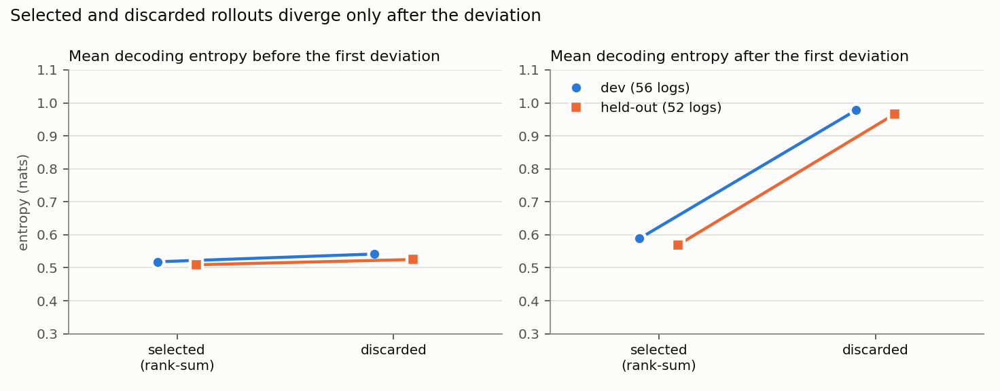
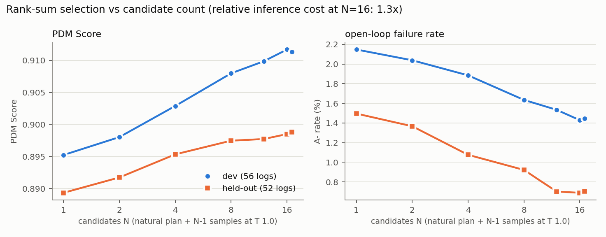

# 확신도 기반 선택의 검증: PDM Score, 기전 연결, 후보 수, 안전 필터 (실험 21–24)

**결론: 사전 등록한 판정 기준을 held-out에서 모두 충족했습니다.**

- **실제 주행 지표도 개선됩니다(실험 21).** rank-sum 선택은 NAVSIM PDM Score를 개발 셋에서 +0.016, held-out에서 +0.0095 올리고, at-fault 충돌을 절반 이하로 줄입니다.
- **확신도는 feedback으로 불안정해지는 rollout을 걸러냅니다(실험 22).** 선택된 후보와 버려진 후보는 첫 이탈 **전**의 엔트로피가 같고(차이 −0.02) 이탈 **후**에만 갈라집니다(−0.40). 버려진 후보는 오차가 빨리 커지고 GT로 돌아오지 못하며 증폭률이 3–6배 높습니다.
- **후보는 8–16개가 적정입니다(실험 23).** N = 8에서 이득의 대부분을 얻고 12–16에서 포화에 가까우며, 추론 비용은 N = 16에서 1.3배입니다.
- **현재 frame 기반 안전 필터를 더하면 PDMS 이득이 2–3배가 됩니다(실험 24).** 개발 셋 +0.035, held-out +0.032이고, 충돌은 0.56 → 0.10%, 주행 가능 영역 이탈은 4.36 → 1.23%입니다(held-out).

> Autoregressive driving failures emerge from unstable feedback amplification, and inference-time confidence can identify and reject these unstable rollouts before they become large trajectory errors — **open-loop 5 s 평가와 NAVSIM 비반응형(non-reactive) PDM Score에서 지지됩니다. 진짜 closed-loop는 아직 검증하지 않았습니다.**

## 데이터와 절차

| | 개발 셋 | held-out |
|---|---|---|
| 출처 | navtest shard 6–17 | navtest shard 18–31 |
| log / 장면 / 자연 실패 | 56 / 4,563 / 98 (2.15%) | 52 / 4,814 / 72 (1.50%) |
| GPU | 5090 (39 log), 3080 Ti (17 log) | 5090 (30 log), 3080 Ti (22 log) |
| 용도 | 규칙·필터·학습형 선택기 개발 | 사전 등록 후 한 번만 평가 |

PoC의 28개 log와 개발 셋, held-out은 서로 겹치지 않습니다. 후보는 장면마다 자연 계획(T 0.01) 1개와 T 1.0 샘플 16개입니다(실험 20과 같음). 사전 등록 문서는 [PREREGISTRATION.md](../heldout_best_of_n/PREREGISTRATION.md)이며, held-out 결과를 보기 전에 커밋 `513fdba`로 올렸습니다. 모든 CI는 log 단위 cluster bootstrap 95%입니다.

**개발 단계에서 버린 대안**: 후보 특징 12개로 학습한 Ridge·로지스틱 선택기(log-grouped 5-fold CV에서 rank-sum보다 약함: ΔA− −0.55, −0.26 vs −0.70%p), 합의 순위를 더한 규칙(−0.33 ~ −0.55%p). 결과는 `outputs/learned_selector/dev_cv.json`.

## 1. PDM Score (실험 21) — open-loop 개선은 주행 품질 개선으로 이어지는가

navsim의 metric cache 생성과 `pdm_score`를 기본 채점 설정(4 s, progress 5, TTC 5, comfort 2) 그대로 장면마다 메모리에서 수행했습니다(`scripts/pdm_score_candidates.py`). 자연 계획의 PDMS(0.895 / 0.889)는 AutoVLA가 navtest에서 보고한 89.1과 같은 수준입니다.

| 규칙 | 개발 PDMS | Δ [95% CI] | **held-out PDMS** | **Δ [95% CI], Wilcoxon p** |
|---|---:|---|---:|---|
| 자연 계획 | 0.8951 | – | 0.8893 | – |
| **rank-sum** | 0.9113 | +0.0161 [+0.0114, +0.0206] | **0.8988** | **+0.0095 [+0.0046, +0.0148], 0.003** |
| max log-lik | 0.9061 | +0.0109 [+0.0071, +0.0146] | 0.8977 | +0.0084 [+0.0048, +0.0122] |
| min entropy | 0.9075 | +0.0124 [+0.0068, +0.0171] | 0.8982 | +0.0088 [+0.0040, +0.0142] |
| oracle (FDE 최소, 비배포) | 0.9216 | +0.0264 | 0.9101 | +0.0207 |

세부 지표 (held-out; 위반율, 진행도는 평균)

| 규칙 | at-fault 충돌 | 주행 가능 영역 이탈 | TTC 위반 | 승차감 위반 | 진행도 |
|---|---:|---:|---:|---:|---:|
| 자연 계획 | 0.56% | 4.36% | 2.14% | 0.12% | 0.814 |
| rank-sum | **0.23%** | 3.61% | 1.54% | 0.15% | 0.821 |

**자연 실패 장면**(held-out 72개)에서 PDMS는 0.592 → 0.703(+0.111 [+0.029, +0.210])입니다. **답: 예.** 개선 폭은 held-out에서 개발 셋보다 작지만(+0.0095 vs +0.0161) CI가 0을 배제하고, 모든 안전 관련 위반이 줄며 진행도는 떨어지지 않습니다.

open-loop (held-out): A− 1.50 → 0.71%(−0.79%p [−1.01, −0.55], McNemar p = 5e-7, 상대 −53%), 강한 실패 1.20 → 0.52%, FDE5 0.624 → 0.394 m.

## 2. 기전 ↔ 선택 연결 (실험 22) — rank-sum은 불안정한 rollout을 걸러내는가

각 후보에 대해 첫 이탈 step t*(토큰이 GT와 처음 달라지는 곳)를 찾고, 이탈 전/후 엔트로피, 오차 증가 기울기, GT 재정렬률, 증폭 여부를 계산했습니다(`scripts/mechanism_selection_link.py`, 후보 77,571 / 81,838개).

### 선택된 후보 vs 같은 장면에서 버려진 후보 (장면 단위 쌍대 차이)

| 지표 | 개발 선택 / 버림 | 개발 차이 [CI] | held-out 선택 / 버림 | held-out 차이 [CI] |
|---|---|---|---|---|
| **이탈 전 엔트로피** | 0.518 / 0.542 | −0.024 [−0.032, −0.016] | 0.509 / 0.525 | **−0.016 [−0.023, −0.010]** |
| **이탈 후 엔트로피** | 0.589 / 0.978 | −0.389 [−0.411, −0.368] | 0.570 / 0.966 | **−0.397 [−0.422, −0.371]** |
| 오차 증가 (m/step) | 0.199 / 0.335 | −0.136 [−0.155, −0.119] | 0.160 / 0.287 | −0.127 [−0.144, −0.113] |
| GT 재정렬률 | 0.383 / 0.243 | +0.140 [+0.121, +0.160] | 0.392 / 0.244 | +0.149 [+0.129, +0.172] |
| 증폭률 | 1.2% / 3.9% | −2.7%p [−3.1, −2.3] | 0.5% / 3.3% | −2.8%p [−3.1, −2.4] |
| FDE5 (m) | 0.48 / 1.29 | −0.81 | 0.39 / 1.14 | −0.75 |



자연 실패 장면(held-out 72개)에서도 이탈 전 엔트로피는 같고(+0.012 [−0.038, +0.060]) 이탈 후 엔트로피는 크게 다릅니다(−0.549 [−0.655, −0.451]).

### 증폭 판별력 (후보 단위 AUROC)

| 신호 | 개발: 전체 / 장면 내 | held-out: 전체 [CI] / 장면 내 |
|---|---|---|
| rank-sum 점수 | 0.726 / **0.851** | 0.771 [0.754, 0.789] / **0.867** |
| 합산 log-prob | 0.884 / 0.856 | 0.914 [0.906, 0.924] / 0.868 |
| 평균 엔트로피 | 0.889 / 0.829 | 0.919 [0.911, 0.927] / 0.843 |
| 이탈 후 엔트로피 | 0.779 / 0.774 | 0.821 / 0.781 |
| **이탈 전 엔트로피** | 0.607 / **0.513** | 0.631 / **0.513** |
| 오차 증가 (GT 필요, 참고용) | 0.954 / 0.952 | 0.954 / 0.949 |

(rank-sum은 장면 안의 순위라 장면 간 비교인 "전체" AUROC는 의미가 약하고, 장면 내 AUROC가 해당 지표입니다.)

이탈한 후보 중 증폭한 것과 하지 않은 것(held-out 43,517개 중 2,550개 증폭): 이탈 후 엔트로피 1.63 vs 0.89, GT 재정렬률 3% vs 30%, 오차 증가 1.32 vs 0.21 m/step.

**답: 예.** 확신도 신호는 장면의 원래 난이도가 아니라(이탈 전 AUROC 0.51 = 우연) **이탈 이후 feedback이 자기 강화되는 과정**을 포착합니다. 증폭하는 rollout은 한번 벗어나면 GT로 돌아오지 못하고(재정렬 3%) 불확실한 상태로 계속 디코딩되며, rank-sum은 이를 장면 안에서 AUROC 0.85–0.87로 구별해 버립니다. 이는 실험 7–11의 기전(직전 토큰의 motion이 다음 토큰을 조건화하는 1-step feedback)과 직접 이어집니다.

## 3. 후보 수 (실험 23) — 어디서 포화되는가

| N | 개발 A− | held-out A− | 개발 PDMS | held-out PDMS | 상대 추론 비용 (3080 Ti 실측) |
|---:|---:|---:|---:|---:|---:|
| 1 (자연 계획) | 2.15% | 1.50% | 0.8952 | 0.8893 | 1.00 |
| 2 | 2.04% | 1.37% | 0.8980 | 0.8917 | – |
| 4 | 1.88% | 1.08% | 0.9029 | 0.8953 | 1.03 |
| 8 | 1.63% | 0.92% | 0.9080 | 0.8975 | 1.16 |
| 12 | 1.53% | 0.70% | 0.9099 | 0.8977 | – |
| 16 | 1.43% | 0.69% | 0.9117 | 0.8985 | 1.31 |
| 17 | 1.45% | 0.71% | 0.9114 | 0.8988 | – |

A−는 장면당 무작위 부분집합 5개 평균(`scripts/candidate_count_curve.py`), PDMS는 앞쪽 부분집합(자연 계획 + 샘플 1..N−1). 비용은 같은 100개 장면에서 계획 전체(영상 인코딩, 프롬프트, stub, action 디코딩)의 실측 시간 비율이며, 후보는 한 batch로 디코딩됩니다(N = 1: 3.1–3.3분, 16: 4.2분).



**답**: 이득은 N에 대해 로그적으로 늘고 **N = 8에서 held-out PDMS 이득의 85%, A− 감소의 72%**를 얻으며, **12–16에서 포화**됩니다(held-out에서 N 12 → 17의 추가 이득은 PDMS +0.001, A−는 차이 없음). 후보를 한 batch로 디코딩하면 N = 16도 추론 비용 1.3배라, 비용 대비 효과가 좋습니다.

## 4. 현재 frame 기반 안전 필터 (실험 24)

각 후보를 **현재 frame의 정보만으로** 채점했습니다(`scripts/safety_filter_flags.py`): 현재 객체를 등속으로 5 s 외삽한 관측, 현재 지도의 주행 가능 영역과 경로 중심선. 미래 log frame은 읽지 않습니다. 충돌 또는 주행 가능 영역 이탈이 예측된 후보를 지우고 남은 후보 중 rank-sum으로 고릅니다(F1; 모두 지워지면 전체 rank-sum, 장면의 2.7%). 평가는 공식 PDMS(미래 GT 관측)로 했습니다.

| 규칙 | 개발 PDMS (Δ) | **held-out PDMS (Δ [CI])** | held-out 충돌 | 주행 가능 영역 이탈 | TTC | 진행도 | held-out open-loop A− |
|---|---|---|---:|---:|---:|---:|---:|
| 자연 계획 | 0.8951 | 0.8893 | 0.56% | 4.36% | 2.14% | 0.814 | 1.50% |
| rank-sum | 0.9113 (+0.016) | 0.8988 (+0.0095) | 0.23% | 3.61% | 1.54% | 0.821 | 0.71% |
| **F1 (주 필터)** | 0.9301 (+0.035) | **0.9209 (+0.0315 [+0.0234, +0.0410])** | **0.10%** | **1.23%** | 1.33% | 0.840 | 1.08% |
| F2 (+ 역주행) | 0.9293 | 0.9206 (+0.031) | 0.10% | 1.25% | 1.33% | 0.840 | 1.10% |
| F3 (+ TTC) | 0.9309 | 0.9197 (+0.030) | 0.15% | 1.33% | 1.31% | 0.838 | 1.47% |

자연 실패 장면(held-out 72개)에서 F1은 PDMS 0.592 → 0.797(+0.205)입니다.

**해석과 주의**: 필터는 PDMS 이득을 rank-sum 단독의 2–3배로 키우지만, **open-loop A−(사람 궤적과의 거리)는 rank-sum보다 덜 줄입니다**(1.08% vs 0.71%). 등속 외삽상 위험해 보이는 후보는 사람 궤적과 비슷하더라도 버리기 때문입니다. 즉 필터는 "사람처럼 운전"보다 "안전 규칙 준수" 쪽으로 선택을 옮깁니다. PDMS 평가에 쓰인 채점기(PDMScorer)와 필터가 같은 채점 규칙을 쓰므로(관측만 다름: 필터는 등속 외삽, 평가는 미래 GT), 이 이득의 일부는 채점 규칙과의 정렬에서 온다는 점도 감안해야 합니다.

## 5. 한계

- **closed-loop 아님**: PDMS는 비반응형(non-reactive) 시뮬레이션입니다. 다른 차량은 로그대로 움직이고, 계획은 4 s 한 번만 평가됩니다.
- 후보 샘플은 seed 0 한 번입니다(실험 19에서 5 seed 확인).
- 개발 셋과 held-out의 GPU 구성이 섞여 있습니다(5090 / 3080 Ti). 모든 비교는 같은 장면·같은 실행 안의 쌍대 비교입니다.
- held-out 5090 쪽 shard 20–25는 첫 실행이 메모리 부족으로 중단돼 재실행했습니다. 이미 디코딩된 장면은 그대로 두고 나머지를 이어서 디코딩했으며, 규칙은 결과를 보기 전에 고정돼 있었습니다.
- 안전 필터의 등속 외삽은 단순한 예측기입니다. 모든 후보가 위험으로 표시되는 장면(2.7%)은 필터 없이 rank-sum으로 돌아갑니다.

## 재현

```bash
# 후보 디코딩 (GPU, shard 스트리밍): tools/stream_expanded_best_of_n.sh <GPU> <shards...>  (STREAM_OUT=heldout_best_of_n 로 held-out)
cd autovla_misalignment_poc
H="outputs/heldout_best_of_n/gpu1 outputs/heldout_best_of_n/gpu0"
python scripts/pdm_score_candidates.py --out outputs/pdm_score_best_of_n/heldout --workers 3 $H
python scripts/analyze_pdm_scores.py outputs/pdm_score_best_of_n/heldout/pdm_scores.jsonl $H
python scripts/mechanism_selection_link.py outputs/mechanism_selection_link/heldout $H
python scripts/candidate_count_curve.py outputs/candidate_count_curve/heldout $H
python scripts/safety_filter_flags.py --out outputs/safety_filter/heldout --workers 2 $H
python scripts/safety_filter_select.py outputs/safety_filter/heldout/flags.jsonl outputs/safety_filter/heldout $H
python scripts/pdm_score_candidates.py --out outputs/pdm_score_best_of_n/heldout_filter --picks-file outputs/safety_filter/heldout/picks.json $H
python scripts/make_selection_figures.py
```
(PDM 채점은 BLAS 스레드를 1로 고정해야 빠릅니다 — 스크립트에 기본 설정됨. RAM 14 GB 컨테이너에서는 CPU 워커 합계 5개 이하 권장.)
