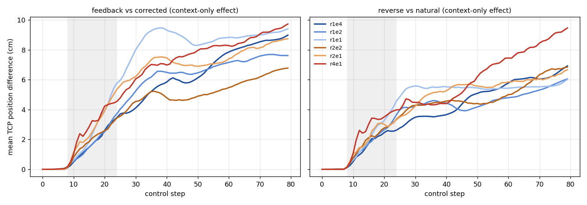

# 실험 35 결과: SpatialVLA feedback 보호 구조 ablation (재계획 간격 × ensemble)

- 사전 등록: `PROTOCOL.md`, commit 8fc20bf (본 실행 전).
- 분석 스크립트: `scripts/spatialvla_protection/analyze_protection.py` (결과를 보기 전 commit 44266eb).
- 원 데이터: `rollouts/` (seed 0–39, 2,080 에피소드), `rollouts_ext/` (사전 등록 seed 추가 규칙에 따른 seed 40–119, 1,280 에피소드).
- 분석 결과: seed 0–39 전체 설정은 `analysis.json`, `curves.json`, `error_curves.png`. r1e4·r4e1의 seed 0–119 합동은 `pooled_seed0_119/`.
- 실행 환경: RTX 5090만 사용. 실험 34 파일은 수정하지 않았습니다.

**판정: Partial support.**
- **궤적 수준:** 재계획 간격을 늘리면(r4e1) 문맥 feedback이 만든 궤적 오차가 더 크고 더 오래 남습니다. 이는 모든 궤적 지표에서 유의했습니다.
- **task 수준:** 사전 등록 기준 2가 충족되지 않았습니다. corrected가 feedback보다 성공률을 유의하게 회복시키는 효과는 어느 설정에서도 나타나지 않았고, 방향도 반대였습니다.
- **reverse:** reverse − natural의 실패 증가는 r4e1에서만 경계선으로 유의했습니다(+6.2%p, p = 0.04). 그러나 공식 설정과의 차이(상호작용)는 유의하지 않았습니다.
- **ensemble 제거:** 효과는 작고 일관되지 않았습니다.

## 실행 중 변경·이슈 (기록)

1. **seed 추가 규칙 발동과 에피소드 수 표기 오류**
   - seed 0–39에서 r4e1의 C − F와 N − R는 둘 다 +1.2%p(> 0)였고, 둘 다 p = 1이었습니다. 따라서 사전 등록 규칙에 따라 r1e4와 r4e1의 4조건을 seed 40–119로 확장했습니다.
   - PROTOCOL에는 "+640 에피소드"라고 적었지만, seed 80개 × 과제 2개 × 조건 8개 = **1,280 에피소드**가 맞습니다. 계산 표기 오류이며, 규칙이 정한 seed 범위는 그대로 따랐습니다.
   - natural_gen은 확장 대상이 아니라서 seed 0–39만 있습니다.
2. **분석 스크립트 수정 1건**
   - `A_vs_exp34` 비교(실험 34와 같은 seed끼리 비교하는 부분)가 seed ≥ 40에서 KeyError를 냈습니다. 실험 34 seed(0–39)로 한정하도록 고쳤습니다.
   - 통계 정의는 바뀌지 않았습니다.
3. **bootstrap 방식이 실험 34와 다름**
   - CI는 사전 등록대로 과제로 층화한 bootstrap입니다. 실험 34의 `analyze_svla.py`는 층화하지 않았으므로, 두 실험의 CI 계산 방식이 다릅니다.
4. **실험 34 문서 정정 (재기록)**
   - ensemble 가중치는 최신 예측이 가장 큽니다(PROTOCOL §0-1).
   - 실제 실행 기록(`ages`)으로 측정한 translation feedback 노출(실행 action 중 step ≥ 2 예측의 가중치):

     | 설정 | 노출 |
     |---|---|
     | r1e4 | 0.426 |
     | r1e2 | 0.31 |
     | r1e1 | 0 |
     | r2e1 | 0.50 |
     | r2e2 | 0.655 |
     | r4e1 | 0.75 |

## A. 기준 재현 (공식 r1e4 vs 실험 34, seed 0–39)

| 조건 | 실험 34 | 실험 35 r1e4 | 에피소드 일치 |
|---|---|---|---|
| natural | 85.0% | 86.25% | 88.75% |
| feedback | 65.0% | 65.0% | 85.0% |
| corrected | 63.75% | 70.0% | 91.25% |
| reverse | 83.75% | 86.25% | 92.5% |

- 방향은 같습니다. 실행된 교란은 성공률을 낮추고(N − F +21.2%p [+10.0, +32.5], p = 0.0009), 문맥 효과는 없습니다(C − F +5.0%p, p = 0.52; N − R 0.0%p, p = 1).
- 에피소드 단위로 완전히 같지 않은 이유: 실험 34는 batch 크기가 가변이었고, 이번 실험은 batch를 8행으로 고정했습니다.
- 수치 경로 재실행 noise (natural_gen):

  | 설정 | 성공 불일치 | 궤적 발산 | 평균 위치 오차 |
  |---|---|---|---|
  | r1e4 | 7.5% (+7.5%p, p = 0.031) | 0.160 m | 2.8 cm |
  | r4e1 | 12.5% (−2.5%p, p = 0.75) | 0.174 m | 2.5 cm |

## B–D. 성공률 (seed 0–39, 각 80 에피소드; CI = 과제 층화 paired bootstrap; p = exact McNemar; 보조 설정은 Holm 보정)

| 실행 구조 | 노출 | Natural | Feedback | Corrected | Reverse | Feedback − Corrected | Reverse − Natural |
|---|---:|---:|---:|---:|---:|---|---|
| 매 step 재계획 + ensemble-4 (r1e4, 공식) | 0.43 | 86.2 | 65.0 | 70.0 | 86.2 | −5.0 [−16.2, +6.2], p = 0.52 | 0.0 [−10.0, +8.8], p = 1 |
| 매 step + ensemble-2 (r1e2) | 0.31 | 85.0 | 70.0 | 68.8 | 86.2 | +1.2 [−10.0, +13.8], p = 1 (Holm 1) | +1.2 [−7.5, +10.0], p = 1 (Holm 1) |
| 매 step + ensemble 없음 (r1e1) | 0 | 85.0 | 67.5 | 68.8 | 80.0 | −1.2 [−13.8, +11.2], p = 1 (Holm 1) | −5.0 [−12.5, +2.5], p = 0.34 (Holm 1) |
| 2 step + ensemble-2 (r2e2) | 0.66 | 82.5 | 77.5 | 77.5 | 83.8 | 0.0 [−10.0, +10.0], p = 1 (Holm 1) | +1.2 [−10.0, +12.5], p = 1 (Holm 1) |
| 2 step + ensemble 없음 (r2e1) | 0.50 | 87.5 | 76.2 | 68.8 | 85.0 | +7.5 [−5.0, +18.8], p = 0.31 (Holm 1) | −2.5 [−11.2, +6.2], p = 0.79 (Holm 1) |
| 4 step + ensemble 없음 (r4e1 ≡ r4e4) | 0.75 | 82.5 | 73.8 | 75.0 | 81.2 | −1.2 [−12.5, +10.0], p = 1 | −1.2 [−11.2, +7.5], p = 1 |

- 부호 규칙: Feedback − Corrected < 0이면 교정이 성공률을 회복시킨다는 뜻(가설 방향)입니다. Reverse − Natural < 0이면 문맥 오차가 실패를 만든다는 뜻(가설 방향)입니다. analysis.json의 C − F, N − R는 이 표와 부호가 반대입니다.
- 실행된 교란 자체의 효과(N − F)는 r1 설정에서 +15.0 – +21.2%p(p ≤ 0.017)이고, r2e2 +5.0, r2e1 +11.2, r4e1 +8.8%p입니다. r4e1에서는 교란이 들어간 chunk가 4개뿐이라 이 효과가 작아집니다.

**주 분석 — seed 0–119 합동 (r1e4, r4e1; 각 240 에피소드)**

| 실행 구조 | Natural | Feedback | Corrected | Reverse | Feedback − Corrected | Reverse − Natural |
|---|---:|---:|---:|---:|---|---|
| r1e4 (공식) | 82.9 | 67.1 | 60.0 | 82.1 | **+7.1 [+0.4, +14.2], p = 0.060** (45 vs 28) | −0.8 [−6.2, +4.6], p = 0.88 |
| r4e1 | 81.7 | 69.6 | 65.0 | 75.4 | +4.6 [−2.5, +11.7], p = 0.22 | **−6.2 [−12.1, −1.2], p = 0.040** (16 vs 31) |
| r4e1 − r1e4 (상호작용) | | | | | −2.5 [−12.1, +7.1], sign-flip p = 0.66 | −5.4 [−13.3, +2.1], sign-flip p = 0.20 |

- **corrected가 feedback보다 성공률이 낮습니다(r1e4 +7.1%p, p = 0.06).** 가설과 반대 방향입니다.
  - 과제별로 보면 move_near −15.0%p, coke +0.8%p입니다.
  - 실행된 교란 p와 문맥 g가 어긋난 상태가 다음 step 계획에 불리할 수 있지만, 이 실험으로는 원인을 판별할 수 없습니다.
- **reverse − natural은 r4e1에서만 −6.2%p, p = 0.040입니다** (coke −5.8, move near −6.7%p).
  - 재계획 간격을 4 step으로 늘리면, 실행되지 않은 교란이 문맥에 남아 step 2–4로 실행되면서 작지만 유의한 task 실패가 생깁니다.
  - 다만 r1e4와의 차이(−5.4%p)는 유의하지 않습니다.
- 실패 유형(seed 0–39, 상세는 `analysis.json` `failure_types`): feedback의 추가 실패는 주로 coke의 never_grasped와 dropped입니다(r1e4: never_grasped 9건, dropped 8건 vs natural 각 1건).

## E. 오차 지속 (paired TCP 위치 차이; feedback 대 corrected, reverse 대 natural은 문맥만의 효과)

| 설정 (seed 0–39) | F 대 C 평균 오차 (cm) | F 대 C 궤적 발산 (m) | F 대 C 재정렬률 | R 대 N 평균 오차 (cm) | R 대 N 궤적 발산 (m) | R 대 N 재정렬률 |
|---|---|---|---|---|---|---|
| r1e4 | 5.51 [4.66, 6.42] | 0.302 | 42% | 4.16 [3.50, 4.89] | 0.241 | 41% |
| r1e2 | 5.49 | 0.282 | 34% | 4.03 | 0.200 | 34% |
| r1e1 | **7.27** [6.14, 8.42] | **0.420** | 35% | 4.73 | 0.190 | 34% |
| r2e2 | 4.50 | 0.243 | 32% | 4.30 | 0.293 | 36% |
| r2e1 | 6.28 | 0.380 | **20%** | 4.70 | 0.276 | 41% |
| r4e1 | 6.65 | 0.396 | **22%** | **5.57** | **0.344** | 34% |
| 재실행 noise (natural_gen, r1e4 / r4e1) | | | | 2.78 / 2.53 | 0.160 / 0.174 | 79% / 76% |

- 평균 오차는 t = 8–79 구간 평균입니다.
- 재정렬: t ≥ 24 이후 위치 오차 ≤ 2 cm가 4 step 연속 유지된 경우입니다.
- **반감기:** 모든 설정·대비에서 평균 오차 곡선이 t = 24 값의 절반 아래로 내려가지 않았습니다(반감기 없음). 교란 구간이 끝난 뒤에도 문맥이 만든 궤적 차이는 줄지 않고 커집니다. 공식 설정에서도 재정렬률은 41–42%에 그칩니다.

**보호 구조를 줄였을 때 r1e4 대비 차이** (paired, Wilcoxon; r4e1은 seed 0–119 합동, 나머지는 seed 0–39):

| 설정 | F 대 C 평균 오차 | F 대 C 재정렬 시점 | R 대 N 평균 오차 | R 대 N 궤적 발산 | R 대 N 최종 오차 | R 대 N 재정렬 시점 |
|---|---|---|---|---|---|---|
| **r4e1 (합동, n = 240)** | **+1.32 cm [+0.66, +1.92], p = 2e-4** | **+10.6 step [+6.7, +14.5], p = 3e-7** | **+1.84 cm [+1.26, +2.46], p = 1e-10** | **+0.116 m [+0.075, +0.155], p = 7e-11** | **+2.66 cm, p = 2e-6** | **+10.9 step, p = 1e-6** |
| r2e1 | +0.77 cm, p = 0.27 | **+13.3 step [+6.3, +20.1], p = 5e-4** | +0.54, p = 0.50 | +0.036, p = 0.058 | −0.25, p = 0.34 | +1.6, p = 0.75 |
| r1e1 | **+1.76 cm [+0.66, +2.88], p = 0.028** | +3.3, p = 0.25 | +0.57, p = 0.046 | −0.051, p = 0.29 | −0.91, p = 0.18 | +4.2, p = 0.17 |
| r1e2 | −0.02, p = 0.53 | +5.2, p = 0.062 | −0.13, p = 0.68 | −0.041, p = 0.20 | −0.87, p = 0.83 | +3.6, p = 0.20 |
| r2e2 | −1.01, p = 0.16 | +4.2, p = 0.38 | +0.14, p = 0.62 | +0.052, p = 0.063 | −0.08, p = 0.59 | +2.7, p = 0.48 |

- ensemble 분산(seed 0–39, ×10⁻⁴): r1e4 natural 2.08 → feedback 3.72. ensemble은 교란 chunk와 정상 chunk의 예측 불일치를 평균합니다.

## F. Fresh observation — 생략 (사전 등록 §3 그대로)

결정적 greedy 디코딩에서는 관측을 고정하고 재계획하면 같은 chunk가 다시 나옵니다. 그러면 정책이 action을 반복하게 되어 공식 정책의 의미를 깨뜨리므로 수행하지 않았습니다. 따라서 "sequence reset vs 새 visual evidence"는 분리하지 못했습니다(한계).

## 사전 등록 기준 판정

| 기준 | 결과 |
|---|---|
| 1. 공식 r1e4에서 corrected·reverse의 task 효과 없음 | **충족**: C − F p = 0.060, N − R p = 0.88 (합동). 단 C − F는 가설과 반대 방향의 경계 수준. |
| 2. 보호를 줄인 설정에서 Feedback − Corrected 효과가 유의하게 커짐 | **미충족**: 어느 설정도 유의하지 않음(Holm p = 1). r4e1 합동 p = 0.22, 방향도 반대. 상호작용 n.s. |
| 3. reverse가 natural보다 실패를 유의하게 늘림 | **r4e1에서만 충족**: −6.2%p, p = 0.040(합동, 주 검정). 상호작용(r1e4 대비)은 p = 0.20으로 n.s. |
| 4. 보호를 줄일수록 오차 지속 증가 | **충족 (재계획 축)**: r4e1에서 모든 궤적·재정렬 지표가 유의하게 악화(p ≤ 2e-4), r2e1 재정렬 +13 step. ensemble 축은 r1e1의 F 대 C만 유의(+1.8 cm). |

→ 기준 2가 미충족이므로 Strong은 아닙니다. 성공률은 대부분 그대로이고 기준 4는 명확히 성립하므로 **Partial support**입니다.

"protection mechanisms attenuate feedback propagation, but task-level robustness remains high."

다만 이 표현에는 단서가 필요합니다. reverse의 task 효과는 r4e1에서 작게(−6%p) 나타나기 시작했고, 이 기여의 대부분은 ensemble이 아니라 재계획 간격에서 옵니다.

## 최종 질문에 대한 답

1. **Temporal ensembling이 previous-action feedback을 억제하는가?**
   - 약하게, 그리고 일관되지 않게만 그렇습니다.
   - ensemble을 없앤 r1e1은 실행되는 문맥 노출이 0인데도, feedback 대 corrected의 궤적 차이가 오히려 커졌습니다(+1.8 cm, p = 0.03; step-1 rotation·gripper를 통한 같은 step 안의 feedback으로 보입니다).
   - ensemble-2와 ensemble-4는 차이가 없었습니다.
   - ensemble은 feedback의 영향을 받은 step 2–4를 실행에 노출하는 통로(0.43)이면서, 동시에 다른 chunk와 평균하는 장치입니다. 성공률 수준의 억제 효과는 측정되지 않았습니다.
2. **잦은 재계획이 feedback을 억제하는가?**
   - 궤적 수준에서는 그렇습니다. 4 step 재계획에서 문맥 오차가 더 크고 오래 남았습니다(R 대 N 평균 오차 +1.8 cm, p = 1e-10; 재정렬 +11 step, p = 1e-6).
   - task 수준에서는 reverse 효과가 r4e1에서만 −6.2%p(p = 0.04)로 나타났고, 공식 설정과의 차이는 유의하지 않았습니다.
3. **둘 중 어느 쪽이 더 기여하는가?**
   - 재계획 간격입니다. r4e1의 효과는 모든 지표에서 유의했고, ensemble 제거의 효과는 작고 지표마다 달랐습니다.
4. **보호를 제거하면 token 수준 feedback이 task 수준 실패 기전이 되는가?**
   - 부분적으로만 그렇습니다. 4 step 재계획에서 작은 reverse 효과(−6%p)가 생기지만, 교정이 실패를 회복시키는 효과는 없습니다(방향이 반대).
   - AutoVLA·Impromptu 수준(−40 ~ −62%p)의 증폭으로는 바뀌지 않습니다.
5. **AutoVLA·Impromptu와 SpatialVLA의 차이를 실행 구조로 설명할 수 있는가?**
   - 일부만 설명됩니다. 실행 구조(자기 생성 action이 실행에 노출되는 시간)는 궤적 지속을 일관되게 조절합니다. 노출 0.75인 r4e1에서 task 효과가 처음 나타난 것도 이 방향과 맞습니다.
   - 그러나 4-step chunk의 최대 노출로도 driving 모델의 대규모 실패는 재현되지 않았습니다. 남은 차이는 chunk 길이(4 vs 10 step), 평가 방식(closed loop의 새 관측 vs open-loop 5 s 계획), 과제와 실패 정의의 차이로 보이며, 이 실험으로는 분리할 수 없습니다.

검증하려던 claim("long-lived autoregressive action history promotes amplification, while frequent replanning and temporal ensembling can absorb it")에 대해:
- **재계획에 관한 부분은 궤적 수준에서 지지됩니다.**
- **ensemble에 관한 부분은 지지되지 않습니다.**
- **"catastrophic이 되는지가 실행 구조로 결정된다"는 이 실험만으로는 부분적으로만 지지됩니다.**

## 한계

- 에피소드 수: 과제 2개, seed 40개(r1e4·r4e1은 120개). 성공률 차이 약 7%p 미만은 검출이 어렵습니다(합동 CI 폭 ±6–7%p).
- 재계획 간격을 바꾸면 교란 chunk 수가 함께 바뀝니다(16 / 8 / 4개). 그래서 설정 간에는 설정 안의 대비만 비교했습니다.
- 보조 설정(r1e2, r1e1, r2e2, r2e1)은 seed 0–39만 있고, 다중 비교 보정 후 task 효과는 없습니다.
- F(관측 갱신 vs sequence reset)는 분리하지 못했습니다.
- corrected < feedback(r1e4 합동 p = 0.06)이라는 예상 밖 방향의 원인은 판별하지 못했습니다.
