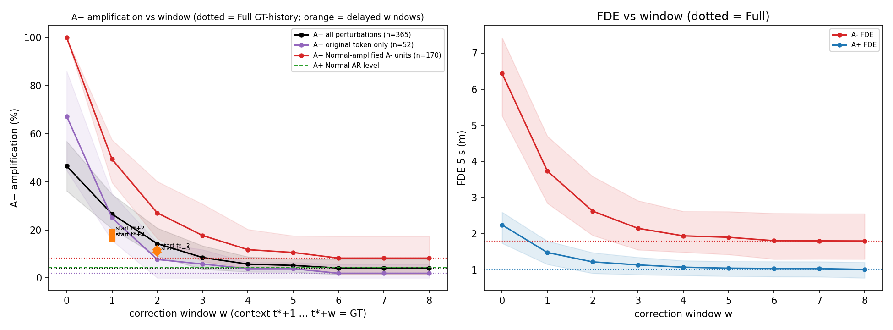
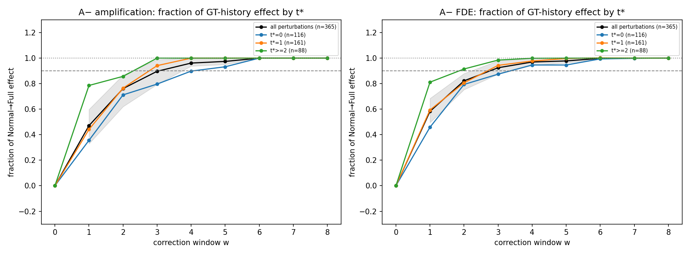
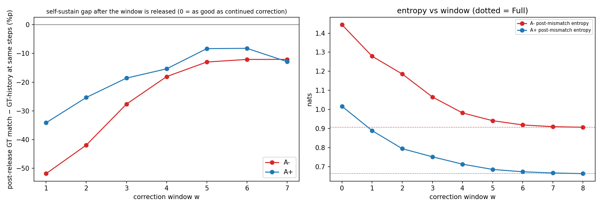

# AutoVLA Natural/Fast — Temporal Feedback Window

## 1. 결론

**답: 짧은 temporal window는 존재합니다. 다만 한 순간이 결정하는 구조가 아니라, 첫 mismatch 직후 약 3–4 step의 feedback이 누적으로 결정하는 구조입니다.**

- **감소 곡선 (A−, 365 단위)**: 증폭률은 Normal 46.6% → 1-step 26.6% → 2-step 14.2% → 3-step 8.5% → 4-step 5.8% → Full GT-history 4.1%입니다. FDE는 6.45 → 3.74 → 2.62 → 2.15 → 1.94 → 1.80 m입니다. step마다 추가 이득이 줄어듭니다(Δamp vs 직전 window: −20.0, −12.3, −5.8, −2.7, −0.5%p). 5-step부터는 추가 이득이 유의하지 않습니다(p = 0.5).
- **Full 효과의 90%를 회복하는 최소 window**:
  - 증폭: **4 step**(점 추정; bootstrap 3 또는 4가 각각 50%). 3-step에서 이미 90% [79, 99]입니다.
  - FDE: **3 step**(bootstrap 3이 84%).
  - downstream token error: 5 step.
  - Normal에서 실제로 증폭된 A− 단위(170개)도 같습니다: 100% → 49.4 / 27.1 / 17.6 / 11.8% (win1–4), Full 8.2%. 90%는 3–4 step에서 회복됩니다.
- **스스로 정상 rollout을 유지하는가**: 궤적 수준에서는 **대체로 예**입니다. 3–4 step만 교정하고 놓아도 증폭은 Full과 1–4%p 차이로 막힙니다(win4 vs Full: +1.6%p, p = 0.03). 토큰 수준에서는 **완전히는 아니오**입니다. 교정을 해제한 뒤의 GT 일치율은 계속 교정한 경우보다 4-step에서 18%p, 6-step에서도 12%p 낮습니다. 모델은 GT 토큰열로 돌아가지 않지만, 발산하지 않는 인접 궤적에 머뭅니다.
- **가장 이른 step이 특별한가: 아니오.** 끝 위치를 맞춘 쌍대 비교(A− 전체)에서 t*+1 교정 추가는 Δamp −4.9%p(p = 0.011), t*+2 교정 추가도 −4.9%p(p = 0.004)로 효과가 같습니다. 그 이후를 모두 교정한 상태에서는 첫 교정을 빼도 증폭은 유의하게 늘지 않습니다(+1.1%p, p = 0.22). 다만 FDE는 0.53 m 나빠집니다. 결정 요인은 '교정한 첫 몇 step의 누적량'이며, 특정 첫 step이 아닙니다.
- **A− vs A+**: 두 군 모두 자기 효과의 90%에 비슷한 window(FDE 3–4 step)에서 도달합니다. 효과의 크기만 A−에서 훨씬 큽니다(win4 Δamp 차이 −37.3%p, ΔFDE 차이 −3.33 m). window 길이는 실패 장면에만 특이한 성질이 아니라 모델의 AR feedback 시간척도로 보입니다. A−에서는 그 feedback이 실패로 이어질 때의 손실이 클 뿐입니다.
- **t*별 차이**:
  - t*=0: 느림. 증폭 90%에 5 step(bootstrap 2–6), FDE 4 step.
  - t*=1: 3 step(bootstrap 3에 97% 집중), FDE 3 step.
  - t* ≥ 2: 2–3 step. horizon이 짧아 교정 가능한 step 자체가 적습니다.
  첫 mismatch가 이를수록 더 긴 안정화가 필요합니다.
- **핵심 질문에 대한 답**: *Yes, qualified.* 첫 mismatch 뒤 약 3–4 step(1.5–2 s) 동안의 autoregressive feedback이 작은 action 편차의 회복 또는 궤적 실패를 대부분 결정합니다(Full 효과의 90–96%). 이 window는 누적형이며, 이른 mismatch에서 더 길고, token 수준의 완전한 재정렬까지 보장하지는 않습니다.

## 2. 실험 설정

- 모델/decoding: AutoVLA natural fast 경로. action_history_causal / prev_action_state_patching과 같은 harness를 씁니다(prefix KV cache + post-t* span 재계산, action 토큰만 T = 0.01 샘플링, seed = sha256(`0:token:perturbation:k`), 모든 조건 공통). GPU1(RTX 5090). 17개 조건을 한 batch로 계산합니다.
- 대상: equal-distance 실험의 A− unstable 장면 52개와, A− 장면당 **같은 첫 mismatch step**의 A+ 3개(156개). 단위는 (장면, perturbation)이고, t* 위치에 원래 토큰 또는 거리를 맞춘 대안 토큰을 강제합니다. 새 perturbation은 만들지 않았습니다.
- **교정 정의** (action_history의 GT-history와 같은 정의): step k의 context에서 위치 t*+o가 window [start, start+length) 안이면 GT 토큰, 밖이면 모델 자신의 출력입니다. **실행되는 action은 항상 모델의 샘플**이고, 조건화(previous-action feedback)만 교정합니다. window가 끝나면 다시 자기 출력으로 조건화하는 자유 AR입니다.
  - `winw` = t*+1 … t*+w 교정 (w = 1–8). `gt_history` = 전체 교정. w ≥ 8−t*이면 Full과 같습니다(1408/1408 확인).
  - 요청의 '1-step correction: t*+1만 교정'은 `win1`(context 위치 t*+1)입니다. a_{t*+1} 자체는 context가 perturbation뿐이라 어떤 조건에서도 바뀌지 않습니다(1408/1408). 따라서 교정이 처음 영향을 주는 출력은 a_{t*+2}입니다.
- 추가 조건(시점 검정): `delay{s}_len{l}`은 같은 길이의 교정을 t*+s부터 시작합니다. `skipfirst{s}_full`은 t*+s부터 끝까지 교정합니다(첫 s−1개 생략).
- 지표 정의는 action_history_causal과 같습니다(증폭 = A− ∧ FDE(5 s) > 3 m 등). 추가 지표: post-release GT match, self-sustain gap(해제 후 같은 step에서 Full 대비).
- critical window: f(w) = (Normal − win w) / (Normal − Full) ≥ 0.9인 최소 w. 불확실성은 log cluster bootstrap 재표본마다 구한 최소 w의 분포입니다.

- 단위: 장면 A− 52 / A+ 156 (A+는 A− 장면당 3개, 같은 첫 mismatch step), (장면, perturbation) 단위 A− 365 / A+ 1043. 실패 0.
- t* 분포: A− {0: 116, 1: 161, 2: 49, 3: 13, 4: 6, 5: 12, 6: 0, 7: 8, 8: 0, 9: 0}, A+ {0: 342, 1: 436, 2: 142, 3: 44, 4: 18, 5: 41, 6: 0, 7: 20, 8: 0, 9: 0}
- CI: log 단위 cluster bootstrap 95% (2000회). p: McNemar(이진) / Wilcoxon(연속), 모두 단위별 쌍대.

## 3. Window 길이별 결과 (전체 perturbation)

### A- (단위 365, 장면 52)

| 조건 | amplification | A+ recovery | ADE (m) | FDE (m) | downstream token error | GT re-alignment | entropy | error growth (m/step) | Full 효과 대비 (amp) | Full 효과 대비 (FDE) |
|---|---:|---:|---:|---:|---:|---:|---:|---:|---:|---:|
| normal | 46.6% [36.2, 56.9] | 45.5% [36.9, 53.8] | 2.43 [2.05, 2.73] | 6.45 [5.26, 7.43] | 91.8% [88.6, 94.3] | 8.2% [5.7, 11.4] | 1.444 [1.311, 1.610] | 0.782 [0.639, 0.905] | – | – |
| win1 | 26.6% [20.5, 34.8] | 64.1% [54.3, 70.3] | 1.42 [1.16, 1.72] | 3.74 [2.84, 4.70] | 74.0% [70.2, 79.6] | 26.0% [20.4, 29.8] | 1.279 [1.172, 1.438] | 0.417 [0.321, 0.531] | 47% [33, 60] | 58% [50, 68] |
| win2 | 14.2% [9.0, 20.7] | 78.1% [70.4, 84.4] | 1.09 [0.84, 1.41] | 2.62 [1.95, 3.59] | 61.5% [56.2, 69.2] | 38.5% [30.8, 43.8] | 1.186 [1.064, 1.377] | 0.280 [0.204, 0.393] | 76% [62, 87] | 82% [75, 88] |
| win3 | 8.5% [3.6, 13.4] | 87.1% [81.0, 92.5] | 0.98 [0.74, 1.30] | 2.15 [1.55, 2.91] | 49.5% [44.7, 56.7] | 50.5% [43.3, 55.3] | 1.066 [0.949, 1.246] | 0.226 [0.161, 0.313] | 90% [79, 99] | 92% [87, 98] |
| win4 | 5.8% [2.5, 8.8] | 90.4% [84.9, 94.5] | 0.93 [0.73, 1.22] | 1.94 [1.49, 2.62] | 43.0% [39.2, 49.0] | 57.0% [51.0, 60.8] | 0.982 [0.869, 1.162] | 0.205 [0.153, 0.286] | 96% [94, 100] | 97% [94, 100] |
| win5 | 5.2% [2.4, 7.9] | 90.7% [85.2, 94.6] | 0.93 [0.72, 1.22] | 1.90 [1.42, 2.61] | 39.8% [35.9, 46.0] | 60.2% [54.0, 64.1] | 0.942 [0.825, 1.134] | 0.201 [0.147, 0.285] | 97% [95, 100] | 98% [96, 100] |
| win6 | 4.1% [1.4, 7.7] | 93.2% [87.4, 97.2] | 0.91 [0.69, 1.22] | 1.80 [1.30, 2.56] | 38.0% [34.0, 44.2] | 62.0% [55.8, 66.0] | 0.919 [0.799, 1.115] | 0.193 [0.135, 0.282] | 100% [100, 100] | 100% [100, 100] |
| win7 | 4.1% [1.4, 7.7] | 93.2% [87.4, 97.2] | 0.91 [0.69, 1.21] | 1.80 [1.30, 2.55] | 36.7% [33.1, 42.3] | 63.3% [57.7, 66.9] | 0.910 [0.797, 1.095] | 0.193 [0.135, 0.281] | 100% [100, 100] | 100% [100, 100] |
| win8 | 4.1% [1.4, 7.7] | 93.2% [87.4, 97.2] | 0.91 [0.69, 1.21] | 1.80 [1.30, 2.55] | 36.2% [32.8, 41.8] | 63.8% [58.2, 67.2] | 0.907 [0.792, 1.093] | 0.193 [0.135, 0.281] | 100% [100, 100] | 100% [100, 100] |
| gt_history | 4.1% [1.4, 7.7] | 93.2% [87.4, 97.2] | 0.91 [0.69, 1.21] | 1.80 [1.30, 2.55] | 36.2% [32.8, 41.8] | 63.8% [58.2, 67.2] | 0.907 [0.792, 1.093] | 0.193 [0.135, 0.281] | – | – |
| delay2_len1 | 19.2% [13.9, 23.7] | 72.6% [66.6, 77.7] | 1.52 [1.20, 1.82] | 3.70 [2.72, 4.44] | 80.3% [74.8, 85.9] | 19.7% [14.1, 25.2] | 1.439 [1.290, 1.614] | 0.412 [0.303, 0.499] | 65% [54, 76] | 59% [53, 72] |
| delay3_len1 | 16.7% [11.5, 22.8] | 74.8% [64.1, 83.5] | 1.58 [1.28, 1.87] | 3.43 [2.69, 4.10] | 81.0% [77.3, 85.8] | 19.0% [14.2, 22.7] | 1.448 [1.292, 1.591] | 0.395 [0.309, 0.474] | 70% [52, 81] | 65% [61, 73] |
| delay4_len1 | 16.4% [12.0, 23.0] | 71.8% [61.1, 80.2] | 1.83 [1.51, 2.10] | 4.00 [3.22, 4.74] | 86.0% [83.3, 89.0] | 14.0% [11.0, 16.7] | 1.554 [1.422, 1.677] | 0.491 [0.393, 0.583] | 71% [53, 80] | 53% [48, 58] |
| delay2_len2 | 11.8% [6.2, 17.6] | 80.8% [73.0, 87.6] | 1.28 [1.01, 1.59] | 2.75 [2.12, 3.50] | 67.0% [60.6, 75.0] | 33.0% [25.0, 39.4] | 1.307 [1.156, 1.496] | 0.298 [0.227, 0.381] | 82% [67, 92] | 79% [73, 87] |
| delay3_len2 | 10.7% [5.7, 17.1] | 81.4% [71.0, 89.6] | 1.51 [1.22, 1.82] | 3.10 [2.43, 3.81] | 74.7% [70.5, 79.9] | 25.3% [20.1, 29.5] | 1.414 [1.271, 1.570] | 0.361 [0.283, 0.443] | 85% [68, 93] | 72% [70, 76] |
| skipfirst2_full | 5.2% [1.3, 10.1] | 91.8% [85.1, 96.4] | 1.19 [0.93, 1.51] | 2.33 [1.73, 3.07] | 48.6% [44.2, 54.5] | 51.4% [45.5, 55.8] | 1.101 [0.971, 1.268] | 0.258 [0.191, 0.339] | 97% [91, 101] | 89% [85, 94] |
| skipfirst3_full | 6.6% [2.7, 11.8] | 90.4% [82.6, 95.4] | 1.48 [1.19, 1.79] | 2.93 [2.26, 3.69] | 60.2% [56.1, 65.5] | 39.8% [34.5, 43.9] | 1.273 [1.126, 1.442] | 0.348 [0.270, 0.433] | 94% [86, 99] | 76% [73, 80] |

쌍대 비교: vs Normal, 그리고 직전 window 대비 추가 이득(w − (w−1)):

| 조건 | Δamp vs Normal | ΔFDE vs Normal | Δre-align vs Normal | Δentropy vs Normal | Δamp vs w−1 | ΔFDE vs w−1 | Δamp vs Full | ΔFDE vs Full |
|---|---|---|---|---|---|---|---|---|
| win1 | -20.0%p [-27.4, -12.3] p=2.3e-14 | -2.71 [-3.25, -2.02] p=1.5e-27 | +17.9%p [+11.8, +21.7] p=1.4e-24 | -0.165 [-0.252, -0.072] p=1.7e-07 | -20.0%p [-27.4, -12.3] p=2.3e-14 | -2.71 [-3.25, -2.02] p=1.5e-27 | +22.5%p [+14.8, +31.0] p=4.1e-25 | +1.94 [+1.27, +2.49] p=1.7e-38 |
| win2 | -32.3%p [-42.5, -20.5] p=9.2e-30 | -3.82 [-4.58, -2.91] p=3.7e-45 | +30.4%p [+23.1, +35.5] p=4.1e-40 | -0.258 [-0.323, -0.166] p=3.8e-16 | -12.3%p [-18.0, -6.2] p=5.7e-10 | -1.11 [-1.47, -0.67] p=1.5e-16 | +10.1%p [+5.3, +16.1] p=1.5e-11 | +0.83 [+0.50, +1.15] p=4.7e-21 |
| win3 | -38.1%p [-50.8, -24.8] p=1e-40 | -4.30 [-5.16, -3.30] p=8.1e-51 | +42.3%p [+34.7, +47.6] p=2.8e-51 | -0.378 [-0.452, -0.274] p=2.1e-29 | -5.8%p [-13.1, -2.0] p=9.5e-07 | -0.48 [-0.88, -0.24] p=1.8e-10 | +4.4%p [+0.5, +7.2] p=3.1e-05 | +0.35 [+0.09, +0.53] p=1e-07 |
| win4 | -40.8%p [-52.2, -29.2] p=1.1e-43 | -4.51 [-5.29, -3.51] p=8.4e-53 | +48.8%p [+41.5, +53.5] p=5.3e-56 | -0.462 [-0.538, -0.353] p=9e-40 | -2.7%p [-5.3, -0.5] p=0.002 | -0.21 [-0.43, -0.03] p=0.0031 | +1.6%p [+0.0, +2.7] p=0.031 | +0.14 [+0.00, +0.25] p=3.3e-05 |
| win5 | -41.4%p [-52.2, -30.6] p=2.7e-44 | -4.55 [-5.34, -3.55] p=2e-53 | +52.0%p [+44.8, +56.6] p=3.5e-58 | -0.502 [-0.577, -0.386] p=3e-46 | -0.5%p [-1.6, +0.0] p=0.5 | -0.04 [-0.09, +0.02] p=0.09 | +1.1%p [+0.0, +2.4] p=0.12 | +0.10 [+0.01, +0.17] p=4.3e-05 |
| win6 | -42.5%p [-53.4, -30.6] p=1.7e-45 | -4.64 [-5.45, -3.62] p=1.9e-55 | +53.9%p [+47.1, +58.1] p=2e-59 | -0.525 [-0.595, -0.409] p=1.6e-48 | -1.1%p [-2.4, +0.0] p=0.12 | -0.09 [-0.16, -0.01] p=0.00015 | +0.0%p [+0.0, +0.0] p=1 | +0.01 [-0.00, +0.02] p=0.11 |
| win7 | -42.5%p [-53.4, -30.6] p=1.7e-45 | -4.64 [-5.45, -3.63] p=2.1e-55 | +55.2%p [+49.1, +59.0] p=1.3e-59 | -0.534 [-0.597, -0.430] p=5.5e-50 | +0.0%p [+0.0, +0.0] p=1 | -0.00 [-0.02, +0.01] p=0.49 | +0.0%p [+0.0, +0.0] p=1 | +0.00 [-0.00, +0.01] p=0.019 |
| win8 | -42.5%p [-53.4, -30.6] p=1.7e-45 | -4.65 [-5.46, -3.63] p=2.1e-55 | +55.6%p [+49.4, +59.4] p=1.3e-59 | -0.537 [-0.600, -0.431] p=4.8e-50 | +0.0%p [+0.0, +0.0] p=1 | -0.00 [-0.01, +0.00] p=0.019 | +0.0%p [+0.0, +0.0] p=1 | +0.00 [+0.00, +0.00] p=1 |
| gt_history | -42.5%p [-53.4, -30.6] p=1.7e-45 | -4.65 [-5.46, -3.63] p=2.1e-55 | +55.6%p [+49.4, +59.4] p=1.3e-59 | -0.537 [-0.600, -0.431] p=4.8e-50 | – | – | – | – |
| delay2_len1 | -27.4%p [-36.5, -17.7] p=3.4e-26 | -2.75 [-3.26, -2.19] p=1.2e-32 | +11.6%p [+6.8, +15.5] p=5e-20 | -0.005 [-0.069, +0.049] p=0.54 | – | – | +15.1%p [+9.7, +19.7] p=8e-16 | +1.90 [+1.12, +2.37] p=2.1e-37 |
| delay3_len1 | -29.9%p [-41.6, -16.5] p=5.7e-28 | -3.02 [-3.58, -2.38] p=7.4e-43 | +10.8%p [+6.9, +14.2] p=1.6e-22 | +0.003 [-0.087, +0.058] p=0.78 | – | – | +12.6%p [+8.5, +17.4] p=1e-11 | +1.63 [+1.04, +1.97] p=2.1e-43 |
| delay4_len1 | -30.1%p [-40.8, -17.4] p=6.3e-30 | -2.44 [-2.83, -1.90] p=1.9e-41 | +5.8%p [+3.7, +7.5] p=1.4e-13 | +0.110 [+0.031, +0.170] p=4.5e-07 | – | – | +12.3%p [+9.2, +17.6] p=6.8e-13 | +2.21 [+1.63, +2.70] p=4.8e-48 |
| delay2_len2 | -34.8%p [-46.9, -21.1] p=6.3e-34 | -3.69 [-4.45, -2.79] p=1.5e-46 | +24.9%p [+17.4, +31.3] p=7.8e-40 | -0.138 [-0.193, -0.079] p=3.4e-08 | – | – | +7.7%p [+3.2, +11.5] p=5.8e-08 | +0.96 [+0.52, +1.17] p=1.2e-32 |
| delay3_len2 | -35.9%p [-48.6, -21.1] p=4.4e-35 | -3.35 [-3.92, -2.64] p=9.1e-49 | +17.1%p [+12.1, +21.6] p=1.6e-32 | -0.030 [-0.106, +0.019] p=0.086 | – | – | +6.6%p [+3.5, +11.0] p=8.4e-06 | +1.30 [+0.91, +1.55] p=9.8e-45 |
| skipfirst2_full | -41.4%p [-53.3, -28.4] p=7e-46 | -4.12 [-4.86, -3.23] p=3.8e-54 | +43.2%p [+37.4, +47.5] p=1.5e-57 | -0.343 [-0.380, -0.301] p=8.7e-35 | – | – | +1.1%p [-0.5, +2.9] p=0.22 | +0.53 [+0.24, +0.68] p=1.7e-25 |
| skipfirst3_full | -40.0%p [-51.4, -27.0] p=2.2e-44 | -3.52 [-4.13, -2.75] p=4.3e-54 | +31.6%p [+27.1, +35.4] p=9e-55 | -0.171 [-0.223, -0.140] p=5.4e-15 | – | – | +2.5%p [+0.7, +5.4] p=0.022 | +1.13 [+0.79, +1.36] p=6.3e-42 |

### A+ (단위 1043, 장면 156)

| 조건 | amplification | A+ recovery | ADE (m) | FDE (m) | downstream token error | GT re-alignment | entropy | error growth (m/step) | Full 효과 대비 (amp) | Full 효과 대비 (FDE) |
|---|---:|---:|---:|---:|---:|---:|---:|---:|---:|---:|
| normal | 4.2% [2.2, 6.0] | 94.3% [92.2, 96.8] | 0.96 [0.74, 1.13] | 2.24 [1.74, 2.60] | 71.2% [66.1, 75.5] | 28.8% [24.5, 33.9] | 1.017 [0.904, 1.101] | 0.269 [0.211, 0.309] | – | – |
| win1 | 1.8% [1.0, 3.0] | 96.5% [95.2, 97.9] | 0.65 [0.51, 0.79] | 1.48 [1.15, 1.80] | 53.7% [47.8, 59.6] | 46.3% [40.4, 52.2] | 0.890 [0.782, 0.983] | 0.166 [0.129, 0.203] | 66% [35, 112] | 62% [45, 73] |
| win2 | 1.0% [0.2, 1.9] | 97.7% [96.9, 98.7] | 0.56 [0.42, 0.68] | 1.22 [0.90, 1.48] | 44.0% [38.1, 49.8] | 56.0% [50.2, 61.9] | 0.795 [0.703, 0.881] | 0.131 [0.097, 0.159] | 89% [71, 136] | 83% [78, 89] |
| win3 | 1.2% [0.5, 2.3] | 97.6% [96.4, 98.6] | 0.53 [0.41, 0.64] | 1.13 [0.86, 1.35] | 37.8% [32.9, 42.9] | 62.2% [57.1, 67.1] | 0.753 [0.652, 0.836] | 0.119 [0.091, 0.141] | 82% [60, 100] | 90% [86, 94] |
| win4 | 0.7% [0.1, 1.7] | 98.1% [96.8, 99.0] | 0.52 [0.40, 0.62] | 1.07 [0.84, 1.25] | 34.2% [29.4, 39.5] | 65.8% [60.5, 70.6] | 0.714 [0.621, 0.790] | 0.112 [0.087, 0.132] | 97% [92, 100] | 95% [90, 98] |
| win5 | 0.6% [0.0, 1.6] | 98.3% [96.9, 99.2] | 0.52 [0.40, 0.62] | 1.04 [0.82, 1.23] | 30.9% [27.2, 35.4] | 69.1% [64.6, 72.8] | 0.686 [0.602, 0.758] | 0.110 [0.086, 0.131] | 100% [100, 100] | 97% [92, 99] |
| win6 | 0.6% [0.0, 1.6] | 98.4% [97.1, 99.3] | 0.51 [0.40, 0.62] | 1.04 [0.81, 1.23] | 29.9% [26.4, 34.5] | 70.1% [65.5, 73.6] | 0.674 [0.595, 0.748] | 0.109 [0.085, 0.130] | 100% [100, 100] | 98% [93, 100] |
| win7 | 0.6% [0.0, 1.6] | 98.4% [97.1, 99.3] | 0.51 [0.40, 0.62] | 1.03 [0.81, 1.23] | 29.3% [25.9, 33.8] | 70.7% [66.2, 74.1] | 0.668 [0.590, 0.742] | 0.109 [0.085, 0.130] | 100% [100, 100] | 98% [93, 100] |
| win8 | 0.6% [0.0, 1.6] | 98.4% [97.1, 99.3] | 0.51 [0.40, 0.62] | 1.01 [0.77, 1.21] | 28.8% [25.4, 33.3] | 71.2% [66.7, 74.6] | 0.665 [0.588, 0.738] | 0.108 [0.083, 0.129] | 100% [100, 100] | 100% [100, 100] |
| gt_history | 0.6% [0.0, 1.6] | 98.4% [97.1, 99.3] | 0.51 [0.40, 0.62] | 1.01 [0.77, 1.21] | 28.8% [25.4, 33.3] | 71.2% [66.7, 74.6] | 0.665 [0.588, 0.738] | 0.108 [0.083, 0.129] | – | – |
| delay2_len1 | 2.1% [0.7, 3.3] | 96.4% [94.8, 98.3] | 0.67 [0.51, 0.81] | 1.48 [1.11, 1.77] | 56.8% [50.5, 62.5] | 43.2% [37.5, 49.5] | 0.947 [0.845, 1.044] | 0.163 [0.125, 0.194] | 58% [18, 129] | 62% [56, 69] |
| delay3_len1 | 2.3% [1.2, 3.2] | 95.9% [94.6, 97.3] | 0.74 [0.57, 0.87] | 1.57 [1.22, 1.83] | 61.5% [55.8, 67.1] | 38.5% [32.9, 44.2] | 0.987 [0.876, 1.080] | 0.175 [0.135, 0.205] | 53% [36, 77] | 55% [48, 61] |
| delay4_len1 | 1.4% [0.6, 2.2] | 96.7% [95.6, 98.3] | 0.78 [0.61, 0.91] | 1.56 [1.20, 1.79] | 64.2% [58.5, 68.9] | 35.8% [31.1, 41.5] | 1.032 [0.908, 1.116] | 0.185 [0.145, 0.213] | 76% [55, 155] | 56% [49, 61] |
| delay2_len2 | 1.5% [0.8, 2.0] | 97.2% [96.1, 98.3] | 0.62 [0.48, 0.73] | 1.28 [1.00, 1.50] | 50.1% [44.5, 55.9] | 49.9% [44.1, 55.5] | 0.884 [0.782, 0.981] | 0.139 [0.110, 0.163] | 74% [56, 108] | 78% [74, 82] |
| delay3_len2 | 1.5% [0.7, 2.3] | 96.7% [95.5, 98.0] | 0.70 [0.55, 0.82] | 1.39 [1.10, 1.60] | 55.6% [50.3, 60.7] | 44.4% [39.3, 49.7] | 0.947 [0.838, 1.033] | 0.156 [0.125, 0.180] | 74% [55, 100] | 69% [63, 74] |
| skipfirst2_full | 1.0% [0.3, 1.9] | 98.3% [96.9, 99.1] | 0.60 [0.47, 0.71] | 1.15 [0.92, 1.34] | 37.7% [34.2, 41.9] | 62.3% [58.1, 65.8] | 0.778 [0.699, 0.854] | 0.126 [0.102, 0.148] | 89% [71, 106] | 89% [85, 92] |
| skipfirst3_full | 1.2% [0.4, 2.1] | 98.2% [97.4, 99.0] | 0.70 [0.54, 0.82] | 1.33 [1.04, 1.54] | 46.5% [42.5, 51.2] | 53.5% [48.8, 57.5] | 0.876 [0.781, 0.954] | 0.153 [0.122, 0.177] | 82% [58, 100] | 74% [70, 78] |

쌍대 비교: vs Normal, 그리고 직전 window 대비 추가 이득(w − (w−1)):

| 조건 | Δamp vs Normal | ΔFDE vs Normal | Δre-align vs Normal | Δentropy vs Normal | Δamp vs w−1 | ΔFDE vs w−1 | Δamp vs Full | ΔFDE vs Full |
|---|---|---|---|---|---|---|---|---|
| win1 | -2.4%p [-3.5, -0.7] p=7e-05 | -0.77 [-0.97, -0.44] p=5.5e-38 | +17.5%p [+13.5, +21.3] p=9.2e-53 | -0.127 [-0.154, -0.093] p=1e-23 | -2.4%p [-3.5, -0.7] p=7e-05 | -0.77 [-0.97, -0.44] p=5.5e-38 | +1.2%p [-0.2, +2.6] p=0.0072 | +0.47 [+0.30, +0.64] p=3e-36 |
| win2 | -3.3%p [-4.8, -1.4] p=3.1e-07 | -1.03 [-1.21, -0.75] p=6.1e-59 | +27.3%p [+23.3, +30.9] p=1.9e-89 | -0.222 [-0.246, -0.187] p=8.2e-59 | -0.9%p [-2.0, +0.0] p=0.064 | -0.26 [-0.39, -0.16] p=1.5e-14 | +0.4%p [-0.5, +1.4] p=0.29 | +0.21 [+0.12, +0.28] p=1.2e-21 |
| win3 | -3.0%p [-4.8, -0.7] p=1.5e-05 | -1.11 [-1.33, -0.79] p=2.7e-66 | +33.4%p [+29.6, +36.9] p=2.3e-114 | -0.264 [-0.286, -0.236] p=4.1e-76 | +0.3%p [-0.2, +0.9] p=0.55 | -0.08 [-0.15, -0.00] p=2.1e-05 | +0.7%p [+0.0, +1.4] p=0.016 | +0.13 [+0.07, +0.17] p=2.6e-14 |
| win4 | -3.5%p [-5.5, -1.1] p=2.5e-08 | -1.17 [-1.41, -0.82] p=1e-77 | +37.0%p [+32.6, +40.7] p=1.1e-125 | -0.303 [-0.326, -0.268] p=5.7e-93 | -0.6%p [-1.1, +0.0] p=0.031 | -0.06 [-0.10, -0.02] p=1.6e-06 | +0.1%p [+0.0, +0.3] p=1 | +0.06 [+0.02, +0.11] p=1.7e-08 |
| win5 | -3.6%p [-5.7, -1.1] p=5.1e-09 | -1.20 [-1.44, -0.85] p=1.5e-83 | +40.3%p [+36.0, +43.6] p=2.2e-134 | -0.331 [-0.354, -0.295] p=7e-110 | -0.1%p [-0.3, +0.0] p=1 | -0.03 [-0.05, -0.00] p=0.0052 | +0.0%p [+0.0, +0.0] p=1 | +0.04 [+0.01, +0.09] p=9.2e-08 |
| win6 | -3.6%p [-5.7, -1.1] p=5.1e-09 | -1.21 [-1.44, -0.86] p=6.6e-86 | +41.3%p [+37.0, +44.4] p=1.4e-136 | -0.343 [-0.368, -0.304] p=1.3e-115 | +0.0%p [+0.0, +0.0] p=1 | -0.01 [-0.02, -0.00] p=0.0039 | +0.0%p [+0.0, +0.0] p=1 | +0.03 [+0.00, +0.08] p=1.1e-05 |
| win7 | -3.6%p [-5.7, -1.1] p=5.1e-09 | -1.21 [-1.45, -0.86] p=2.1e-86 | +41.9%p [+37.8, +45.0] p=1e-137 | -0.349 [-0.375, -0.308] p=1.1e-117 | +0.0%p [+0.0, +0.0] p=1 | -0.00 [-0.01, +0.00] p=0.059 | +0.0%p [+0.0, +0.0] p=1 | +0.02 [+0.00, +0.08] p=2.1e-05 |
| win8 | -3.6%p [-5.7, -1.1] p=5.1e-09 | -1.24 [-1.46, -0.90] p=1.1e-87 | +42.4%p [+38.2, +45.5] p=3.3e-138 | -0.352 [-0.379, -0.311] p=3.8e-119 | +0.0%p [+0.0, +0.0] p=1 | -0.02 [-0.08, -0.00] p=2.1e-05 | +0.0%p [+0.0, +0.0] p=1 | +0.00 [+0.00, +0.00] p=1 |
| gt_history | -3.6%p [-5.7, -1.1] p=5.1e-09 | -1.24 [-1.46, -0.90] p=1.1e-87 | +42.4%p [+38.2, +45.5] p=3.3e-138 | -0.352 [-0.379, -0.311] p=3.8e-119 | – | – | – | – |
| delay2_len1 | -2.1%p [-4.4, -0.5] p=0.0013 | -0.77 [-0.91, -0.57] p=1.8e-42 | +14.5%p [+12.2, +16.8] p=4e-57 | -0.070 [-0.096, -0.032] p=3.6e-10 | – | – | +1.5%p [-0.4, +3.0] p=0.00086 | +0.47 [+0.30, +0.59] p=4.1e-49 |
| delay3_len1 | -1.9%p [-3.4, -0.5] p=0.0017 | -0.67 [-0.84, -0.47] p=1.1e-41 | +9.7%p [+7.8, +11.3] p=2.7e-46 | -0.030 [-0.050, +0.001] p=0.0093 | – | – | +1.7%p [+0.4, +2.7] p=0.00012 | +0.56 [+0.40, +0.67] p=7.4e-61 |
| delay4_len1 | -2.8%p [-4.4, -1.3] p=1.3e-07 | -0.69 [-0.84, -0.49] p=4.4e-54 | +7.1%p [+5.8, +8.4] p=1.4e-37 | +0.015 [-0.013, +0.037] p=0.035 | – | – | +0.9%p [-0.8, +1.9] p=0.064 | +0.55 [+0.39, +0.65] p=1.2e-55 |
| delay2_len2 | -2.7%p [-4.6, -1.0] p=1.5e-05 | -0.96 [-1.14, -0.69] p=1.5e-60 | +21.1%p [+18.4, +23.3] p=4.1e-89 | -0.133 [-0.158, -0.098] p=4.8e-30 | – | – | +1.0%p [-0.1, +1.7] p=0.013 | +0.28 [+0.19, +0.34] p=5.7e-33 |
| delay3_len2 | -2.7%p [-4.4, -0.8] p=1.5e-05 | -0.86 [-1.05, -0.58] p=1.1e-66 | +15.7%p [+13.7, +17.3] p=9.2e-78 | -0.070 [-0.092, -0.047] p=4.8e-13 | – | – | +1.0%p [+0.0, +1.7] p=0.021 | +0.38 [+0.29, +0.44] p=1.6e-44 |
| skipfirst2_full | -3.3%p [-5.4, -1.0] p=5.7e-08 | -1.10 [-1.31, -0.78] p=3.3e-83 | +33.5%p [+30.4, +35.7] p=3.7e-132 | -0.239 [-0.267, -0.201] p=2.2e-80 | – | – | +0.4%p [-0.2, +0.8] p=0.22 | +0.14 [+0.10, +0.18] p=7.1e-18 |
| skipfirst3_full | -3.0%p [-5.1, -0.8] p=3.4e-07 | -0.92 [-1.10, -0.65] p=1e-76 | +24.7%p [+22.0, +26.7] p=1.2e-121 | -0.141 [-0.168, -0.108] p=6.1e-42 | – | – | +0.7%p [+0.0, +1.2] p=0.065 | +0.32 [+0.23, +0.38] p=2.7e-39 |

## 4. Critical window: Full GT-history 효과의 50 / 80 / 90%에 도달하는 최소 w

점 추정 = 전체 표본에서 f(w) ≥ 기준을 만족하는 최소 w. bootstrap = log 재표본마다 최소 w를 구한 분포(9 = w ≤ 8에서 도달 못함).

| subset | group | 지표 | 50% | 80% | 90% (점 추정, bootstrap 중앙값 [95%]) | 90% bootstrap 분포 |
|---|---|---|---|---|---|---|
| all perturbations (n=365) | A- | amplification | 2 (med 2 [1, 2]) | 3 (med 3 [2, 4]) | 4 (med 4 [3, 4]) | 3:50%, 4:50% |
| all perturbations (n=365) | A- | fde5 | 1 (med 1 [1, 2]) | 2 (med 2 [2, 3]) | 3 (med 3 [3, 4]) | 3:84%, 4:16% |
| all perturbations (n=365) | A- | downstream_err | 2 (med 2 [2, 3]) | 4 (med 4 [3, 4]) | 5 (med 5 [4, 6]) | 4:16%, 5:80%, 6:4% |
| all perturbations (n=1043) | A+ | fde5 | 1 (med 1 [1, 2]) | 2 (med 2 [2, 3]) | 4 (med 4 [3, 5]) | 3:45%, 4:52% |
| all perturbations (n=1043) | A+ | downstream_err | 2 (med 2 [2, 2]) | 4 (med 4 [3, 4]) | 5 (med 5 [4, 5]) | 4:11%, 5:89% |
| all perturbations (n=1043) | A+ | recovery | 1 (med 3 [1, 3]) | 2 (med 3 [1, 3]) | 4 (med 3 [1, 3]) | 1:12%, 3:88% |
| all perturbations (n=1043) | A+ | amplification | 1 (med 1 [1, 2]) | 2 (med 2 [1, 4]) | 4 (med 2 [1, 4]) | 1:7%, 2:46%, 4:46% |
| original token only (n=52) | A- | amplification | 1 (med 1 [1, 2]) | 2 (med 2 [2, 2]) | 2 (med 2 [2, 4]) | 2:63%, 3:27%, 4:10% |
| original token only (n=52) | A- | fde5 | 1 (med 1 [1, 1]) | 2 (med 2 [1, 2]) | 2 (med 2 [2, 3]) | 2:84%, 3:16% |
| original token only (n=52) | A- | downstream_err | 2 (med 2 [1, 2]) | 3 (med 3 [2, 4]) | 5 (med 5 [4, 6]) | 4:13%, 5:76%, 6:10% |
| original token only (n=156) | A+ | fde5 | 1 (med 1 [1, 1]) | 3 (med 3 [1, 4]) | 4 (med 4 [3, 4]) | 3:23%, 4:74% |
| original token only (n=156) | A+ | downstream_err | 1 (med 1 [1, 2]) | 3 (med 3 [3, 4]) | 5 (med 5 [4, 5]) | 4:45%, 5:55% |
| original token only (n=156) | A+ | recovery | 5 (bootstrap 불가: Normal−Full 간격 ≤ 0) | 5 (bootstrap 불가: Normal−Full 간격 ≤ 0) | 5 (bootstrap 불가: Normal−Full 간격 ≤ 0) | – |
| original token only (n=156) | A+ | amplification | 없음 (bootstrap 불가: Normal−Full 간격 ≤ 0) | 없음 (bootstrap 불가: Normal−Full 간격 ≤ 0) | 없음 (bootstrap 불가: Normal−Full 간격 ≤ 0) | – |
| t*=0 (n=116) | A- | amplification | 2 (med 2 [1, 3]) | 4 (med 3 [2, 4]) | 5 (med 4 [2, 6]) | 2:7%, 3:18%, 4:26%, 5:26%, 6:22% |
| t*=0 (n=116) | A- | fde5 | 2 (med 2 [1, 2]) | 3 (med 3 [2, 4]) | 4 (med 4 [3, 4]) | 3:36%, 4:62% |
| t*=0 (n=116) | A- | downstream_err | 3 (med 3 [2, 4]) | 5 (med 5 [4, 6]) | 6 (med 6 [6, 7]) | 6:79%, 7:20% |
| t*=0 (n=342) | A+ | fde5 | 1 (med 1 [1, 1]) | 2 (med 2 [2, 5]) | 5 (med 5 [2, 8]) | 2:12%, 3:13%, 4:24%, 5:32%, 8:15% |
| t*=0 (n=342) | A+ | downstream_err | 2 (med 2 [2, 3]) | 4 (med 4 [3, 5]) | 5 (med 5 [5, 6]) | 5:82%, 6:17% |
| t*=0 (n=342) | A+ | recovery | 1 (med 3 [2, 3]) | 4 (med 3 [2, 3]) | 5 (med 3 [2, 3]) | 2:13%, 3:86% |
| t*=0 (n=342) | A+ | amplification | 1 (med 1 [1, 2]) | 4 (med 4 [1, 4]) | 4 (med 4 [1, 5]) | 1:20%, 2:12%, 4:53%, 5:14% |
| t*=1 (n=161) | A- | amplification | 2 (med 2 [1, 2]) | 3 (med 3 [2, 3]) | 3 (med 3 [3, 4]) | 3:97%, 4:3% |
| t*=1 (n=161) | A- | fde5 | 1 (med 1 [1, 2]) | 2 (med 2 [2, 3]) | 3 (med 3 [3, 3]) | 3:98% |
| t*=1 (n=161) | A- | downstream_err | 2 (med 2 [1, 3]) | 3 (med 3 [3, 4]) | 4 (med 4 [4, 5]) | 4:72%, 5:27% |
| t*=1 (n=436) | A+ | fde5 | 1 (med 1 [1, 2]) | 2 (med 2 [2, 3]) | 4 (med 4 [2, 4]) | 2:7%, 3:39%, 4:53% |
| t*=1 (n=436) | A+ | downstream_err | 2 (med 2 [1, 2]) | 4 (med 4 [3, 4]) | 5 (med 5 [4, 5]) | 4:47%, 5:52% |
| t*=1 (n=436) | A+ | recovery | 1 (med 2 [1, 2]) | 2 (med 2 [1, 2]) | 2 (med 2 [1, 2]) | 1:33%, 2:67% |
| t*=1 (n=436) | A+ | amplification | 1 (med 1 [1, 2]) | 2 (med 2 [1, 2]) | 2 (med 2 [1, 2]) | 1:4%, 2:96% |
| t*>=2 (n=88) | A- | amplification | 1 (med 1 [1, 1]) | 2 (med 2 [1, 3]) | 3 (med 3 [1, 3]) | 1:22%, 2:13%, 3:64% |
| t*>=2 (n=88) | A- | fde5 | 1 (med 1 [1, 1]) | 1 (med 1 [1, 2]) | 2 (med 2 [1, 3]) | 1:14%, 2:51%, 3:35% |
| t*>=2 (n=88) | A- | downstream_err | 2 (med 2 [1, 2]) | 3 (med 3 [2, 4]) | 4 (med 4 [3, 4]) | 3:39%, 4:61% |
| t*>=2 (n=265) | A+ | fde5 | 1 (med 1 [1, 1]) | 2 (med 2 [1, 2]) | 2 (med 2 [2, 3]) | 2:63%, 3:36% |
| t*>=2 (n=265) | A+ | downstream_err | 2 (med 2 [1, 2]) | 3 (med 3 [3, 3]) | 4 (med 4 [3, 5]) | 3:37%, 4:40%, 5:23% |
| t*>=2 (n=265) | A+ | recovery | 1 (bootstrap 불가: Normal−Full 간격 ≤ 0) | 2 (bootstrap 불가: Normal−Full 간격 ≤ 0) | 2 (bootstrap 불가: Normal−Full 간격 ≤ 0) | – |
| t*>=2 (n=265) | A+ | amplification | 1 (med 1 [1, 1]) | 2 (med 2 [1, 2]) | 2 (med 2 [1, 2]) | 1:3%, 2:97% |
| Normal-amplified A- units (n=170) | A- | amplification | 1 (med 1 [1, 2]) | 3 (med 2 [2, 3]) | 4 (med 3 [2, 4]) | 2:3%, 3:50%, 4:48% |
| Normal-amplified A- units (n=170) | A- | fde5 | 1 (med 1 [1, 1]) | 2 (med 2 [2, 3]) | 3 (med 3 [2, 4]) | 2:4%, 3:76%, 4:20% |
| Normal-amplified A- units (n=170) | A- | downstream_err | 2 (med 2 [2, 3]) | 4 (med 4 [3, 4]) | 5 (med 5 [4, 6]) | 4:8%, 5:89%, 6:3% |

## 5. 첫 mismatch 위치(t*)별

window 길이는 horizon에 의해 잘립니다: t*에서 교정 가능한 context 위치는 t*+1..8 (최대 8−t*개).

### A-

| t* | n | Normal amp | win1 | win2 | win3 | win4 | Full | Normal FDE | win1 | win2 | win3 | win4 | Full |
|---|---:|---|---|---|---|---|---|---|---|---|---|---|---|
| t*=0 | 116 | 59.5% [41.4, 71.7] | 41.4% [24.2, 54.9] | 23.3% [6.1, 45.4] | 19.0% [3.7, 39.8] | 13.8% [3.7, 25.4] | 8.6% [0.7, 19.2] | 8.65 [5.65, 11.26] | 6.08 [3.48, 8.31] | 4.21 [2.08, 6.67] | 3.76 [1.84, 6.16] | 3.35 [1.81, 5.12] | 3.05 [1.44, 4.98] |
| t*=1 | 161 | 42.2% [21.6, 59.5] | 23.6% [12.0, 42.1] | 9.9% [5.0, 19.3] | 2.5% [0.0, 5.0] | 0.0% [0.0, 0.0] | 0.0% [0.0, 0.0] | 5.80 [3.59, 7.52] | 3.11 [1.92, 4.55] | 2.15 [1.34, 3.12] | 1.53 [1.07, 2.04] | 1.37 [1.04, 1.79] | 1.27 [0.92, 1.74] |
| t*>=2 | 88 | 37.5% [22.1, 57.1] | 12.5% [4.8, 23.8] | 10.2% [1.8, 22.7] | 5.7% [0.0, 13.3] | 5.7% [0.0, 13.3] | 5.7% [0.0, 13.3] | 4.72 [3.18, 6.25] | 1.79 [1.20, 2.43] | 1.42 [0.95, 1.91] | 1.16 [0.82, 1.60] | 1.11 [0.74, 1.60] | 1.11 [0.74, 1.60] |

Full 효과 대비 비율 (amplification / FDE):

| t* | win1 | win2 | win3 | win4 |
|---|---|---|---|---|
| all perturbations | 47% [33, 60] / 58% [50, 68] | 76% [62, 87] / 82% [75, 88] | 90% [79, 99] / 92% [87, 98] | 96% [94, 100] / 97% [94, 100] |
| t*=0 | 36% [24, 54] / 46% [36, 59] | 71% [44, 100] / 79% [70, 88] | 80% [52, 100] / 87% [77, 97] | 90% [83, 100] / 95% [90, 100] |
| t*=1 | 44% [8, 60] / 59% [39, 71] | 76% [56, 84] / 81% [67, 88] | 94% [89, 100] / 94% [91, 98] | 100% [100, 100] / 98% [92, 100] |
| t*>=2 | 79% [52, 100] / 81% [66, 96] | 86% [56, 100] / 91% [82, 100] | 100% [100, 100] / 98% [96, 100] | 100% [100, 100] / 100% [100, 100] |

### A+

| t* | n | Normal amp | win1 | win2 | win3 | win4 | Full | Normal FDE | win1 | win2 | win3 | win4 | Full |
|---|---:|---|---|---|---|---|---|---|---|---|---|---|---|
| t*=0 | 342 | 6.1% [3.4, 10.0] | 3.2% [1.5, 5.8] | 2.9% [0.9, 5.8] | 3.8% [1.4, 7.7] | 2.0% [0.3, 6.0] | 1.8% [0.0, 5.9] | 2.89 [2.22, 3.51] | 1.90 [1.36, 2.38] | 1.61 [1.09, 2.03] | 1.54 [1.08, 2.05] | 1.48 [1.05, 2.00] | 1.31 [0.91, 1.78] |
| t*=1 | 436 | 2.8% [0.3, 4.9] | 1.1% [0.2, 2.5] | 0.0% [0.0, 0.0] | 0.0% [0.0, 0.0] | 0.0% [0.0, 0.0] | 0.0% [0.0, 0.0] | 1.98 [1.41, 2.39] | 1.35 [0.97, 1.70] | 1.06 [0.74, 1.37] | 0.96 [0.68, 1.17] | 0.86 [0.65, 1.01] | 0.84 [0.63, 1.00] |
| t*>=2 | 265 | 4.2% [1.9, 5.9] | 1.1% [0.0, 2.1] | 0.0% [0.0, 0.0] | 0.0% [0.0, 0.0] | 0.0% [0.0, 0.0] | 0.0% [0.0, 0.0] | 1.85 [1.27, 2.44] | 1.15 [0.76, 1.66] | 0.98 [0.66, 1.31] | 0.90 [0.61, 1.23] | 0.89 [0.59, 1.22] | 0.89 [0.59, 1.22] |

Full 효과 대비 비율 (amplification / FDE):

| t* | win1 | win2 | win3 | win4 |
|---|---|---|---|---|
| all perturbations | 66% [35, 112] / 62% [45, 73] | 89% [71, 136] / 83% [78, 89] | 82% [60, 100] / 90% [86, 94] | 97% [92, 100] / 95% [90, 98] |
| t*=0 | 67% [-56, 267] / 62% [50, 77] | 73% [20, 200] / 81% [69, 96] | 53% [-71, 100] / 85% [68, 94] | 93% [75, 100] / 89% [71, 98] |
| t*=1 | 58% [-100, 92] / 55% [14, 75] | 100% [100, 100] / 81% [67, 92] | 100% [100, 100] / 90% [86, 97] | 100% [100, 100] / 99% [97, 100] |
| t*>=2 | 73% [60, 100] / 73% [55, 88] | 100% [100, 100] / 91% [84, 98] | 100% [100, 100] / 99% [97, 100] | 100% [100, 100] / 100% [100, 101] |

## 6. Window 해제 후 자기 유지 여부

post-release GT match = window가 끝난 뒤(context에 window 이후 자기 생성 토큰이 들어간 step) 실행 토큰의 GT 일치율. self-sustain gap = 같은 step에서 GT-history(교정을 계속한 경우)와의 차이 (0이면 교정을 멈춰도 계속 교정한 것과 같음).

### A-

| window | post-release GT match | GT-history 대비 gap | post-release entropy |
|---|---|---|---|
| normal | 7.6% [5.4, 10.5] | -64.3% [-68.4, -57.7] | 1.389 [1.259, 1.547] |
| win1 | 25.8% [19.1, 30.4] | -51.8% [-57.0, -46.8] | 1.140 [1.028, 1.276] |
| win2 | 40.5% [30.8, 47.3] | -41.9% [-48.3, -37.0] | 1.015 [0.895, 1.199] |
| win3 | 57.8% [49.9, 64.1] | -27.6% [-33.8, -23.0] | 0.847 [0.736, 0.990] |
| win4 | 69.1% [62.6, 77.5] | -18.1% [-24.0, -11.4] | 0.599 [0.466, 0.722] |
| win5 | 73.0% [64.6, 81.7] | -13.0% [-19.9, -7.1] | 0.528 [0.386, 0.676] |
| win6 | 67.5% [53.1, 83.1] | -12.1% [-18.4, -5.9] | 0.589 [0.411, 0.778] |
| delay2_len1 | 20.2% [12.6, 26.4] | -62.2% [-68.3, -55.4] | 1.312 [1.152, 1.470] |
| delay3_len1 | 22.7% [15.8, 28.4] | -62.7% [-70.5, -56.2] | 1.221 [1.063, 1.330] |
| delay4_len1 | 16.4% [11.3, 20.3] | -70.8% [-76.7, -66.9] | 1.399 [1.255, 1.493] |
| delay2_len2 | 40.0% [29.6, 49.0] | -45.4% [-55.9, -36.5] | 1.051 [0.924, 1.225] |
| delay3_len2 | 34.6% [24.3, 43.0] | -52.6% [-63.4, -44.9] | 1.126 [0.992, 1.266] |

### A+

| window | post-release GT match | GT-history 대비 gap | post-release entropy |
|---|---|---|---|
| normal | 28.7% [24.4, 34.1] | -49.0% [-52.6, -44.2] | 0.987 [0.875, 1.072] |
| win1 | 47.5% [40.5, 54.6] | -34.1% [-37.5, -29.8] | 0.819 [0.714, 0.916] |
| win2 | 59.4% [52.3, 66.8] | -25.3% [-30.0, -19.9] | 0.667 [0.572, 0.755] |
| win3 | 67.6% [61.6, 74.8] | -18.6% [-21.5, -13.9] | 0.605 [0.495, 0.692] |
| win4 | 73.0% [66.9, 79.4] | -15.4% [-20.3, -10.3] | 0.531 [0.437, 0.597] |
| win5 | 78.6% [72.1, 83.5] | -8.3% [-11.1, -6.1] | 0.474 [0.387, 0.541] |
| win6 | 78.1% [69.9, 84.3] | -8.2% [-11.5, -5.8] | 0.463 [0.340, 0.544] |
| delay2_len1 | 46.9% [39.2, 54.6] | -37.9% [-42.5, -32.1] | 0.841 [0.728, 0.954] |
| delay3_len1 | 43.3% [36.3, 50.8] | -42.8% [-47.4, -37.2] | 0.873 [0.749, 0.981] |
| delay4_len1 | 42.7% [36.7, 51.2] | -45.7% [-51.1, -37.6] | 0.911 [0.737, 1.021] |
| delay2_len2 | 55.3% [47.2, 63.6] | -30.9% [-35.9, -25.3] | 0.734 [0.622, 0.838] |
| delay3_len2 | 54.5% [48.3, 62.0] | -33.9% [-39.4, -27.4] | 0.755 [0.627, 0.853] |

## 7. 교정 시점: 지연 window와 첫 교정 생략

같은 길이의 교정을 늦게 시작하면(t*+2, t*+3, t*+4) 효과가 유지되는지, 첫 교정만 빼고 나머지를 모두 교정하면(skipfirst) 어떤지.

### A-

| 조건 | 교정 context 위치 | amplification | FDE | Δamp vs 같은 길이 win (시작 t*+1) | ΔFDE vs 같은 길이 win |
|---|---|---|---|---|---|
| delay2_len1 | t*+2…t*+2 | 19.2% [13.9, 23.7] | 3.70 [2.72, 4.44] | -7.4%p [-13.6, -2.3] p=0.0024 | -0.04 [-0.58, +0.29] p=0.76 |
| delay3_len1 | t*+3…t*+3 | 16.7% [11.5, 22.8] | 3.43 [2.69, 4.10] | -9.9%p [-18.0, -1.2] p=4.4e-05 | -0.31 [-0.83, +0.07] p=0.17 |
| delay4_len1 | t*+4…t*+4 | 16.4% [12.0, 23.0] | 4.00 [3.22, 4.74] | -10.1%p [-18.9, +0.0] p=3.8e-05 | +0.27 [-0.26, +0.79] p=0.49 |
| delay2_len2 | t*+2…t*+3 | 11.8% [6.2, 17.6] | 2.75 [2.12, 3.50] | -2.5%p [-7.5, +1.3] p=0.16 | +0.13 [-0.23, +0.31] p=0.0039 |
| delay3_len2 | t*+3…t*+4 | 10.7% [5.7, 17.1] | 3.10 [2.43, 3.81] | -3.6%p [-9.9, +3.0] p=0.079 | +0.47 [+0.06, +0.79] p=1.1e-06 |
| skipfirst2_full | t*+2…end | 5.2% [1.3, 10.1] | 2.33 [1.73, 3.07] | +1.1%p [-0.5, +2.9] p=0.22 | +0.53 [+0.25, +0.68] p=1.7e-25 |
| skipfirst3_full | t*+3…end | 6.6% [2.7, 11.8] | 2.93 [2.26, 3.69] | +2.5%p [+0.5, +5.3] p=0.022 | +1.13 [+0.79, +1.37] p=6.3e-42 |
| win1 | t*+1…t*+1 | 26.6% [20.5, 34.8] | 3.74 [2.84, 4.70] | (기준) | (기준) |
| win2 | t*+1…t*+2 | 14.2% [9.0, 20.7] | 2.62 [1.95, 3.59] | (기준) | (기준) |
| gt_history | t*+1…end | 4.1% [1.4, 7.7] | 1.80 [1.30, 2.55] | (기준) | (기준) |

### A+

| 조건 | 교정 context 위치 | amplification | FDE | Δamp vs 같은 길이 win (시작 t*+1) | ΔFDE vs 같은 길이 win |
|---|---|---|---|---|---|
| delay2_len1 | t*+2…t*+2 | 2.1% [0.7, 3.3] | 1.48 [1.11, 1.77] | +0.3%p [-1.8, +1.9] p=0.69 | -0.00 [-0.19, +0.12] p=0.032 |
| delay3_len1 | t*+3…t*+3 | 2.3% [1.2, 3.2] | 1.57 [1.22, 1.83] | +0.5%p [-0.9, +1.4] p=0.47 | +0.09 [-0.10, +0.23] p=3.7e-05 |
| delay4_len1 | t*+4…t*+4 | 1.4% [0.6, 2.2] | 1.56 [1.20, 1.79] | -0.4%p [-1.7, +0.6] p=0.54 | +0.08 [-0.15, +0.24] p=0.00037 |
| delay2_len2 | t*+2…t*+3 | 1.5% [0.8, 2.0] | 1.28 [1.00, 1.50] | +0.6%p [-0.6, +1.2] p=0.26 | +0.07 [-0.00, +0.13] p=2.2e-05 |
| delay3_len2 | t*+3…t*+4 | 1.5% [0.7, 2.3] | 1.39 [1.10, 1.60] | +0.6%p [-0.1, +1.2] p=0.29 | +0.17 [+0.08, +0.26] p=7.7e-11 |
| skipfirst2_full | t*+2…end | 1.0% [0.3, 1.9] | 1.15 [0.92, 1.34] | +0.4%p [-0.2, +0.8] p=0.22 | +0.14 [+0.10, +0.18] p=7.1e-18 |
| skipfirst3_full | t*+3…end | 1.2% [0.4, 2.1] | 1.33 [1.04, 1.54] | +0.7%p [+0.0, +1.2] p=0.065 | +0.32 [+0.24, +0.38] p=2.7e-39 |
| win1 | t*+1…t*+1 | 1.8% [1.0, 3.0] | 1.48 [1.15, 1.80] | (기준) | (기준) |
| win2 | t*+1…t*+2 | 1.0% [0.2, 1.9] | 1.22 [0.90, 1.48] | (기준) | (기준) |
| gt_history | t*+1…end | 0.6% [0.0, 1.6] | 1.01 [0.77, 1.21] | (기준) | (기준) |

## 8. A− vs A+ 차이

[조건 − Normal](A−) − [조건 − Normal](A+), log 공동 재표본 bootstrap.

| 조건 | Δamplification 차이 | Δrecovery 차이 | ΔFDE 차이 (m) | Δdownstream error 차이 | Δre-alignment 차이 |
|---|---|---|---|---|---|
| win1 | -17.6%p [-26.2, -9.2] | +16.4%p [+7.2, +24.5] | -1.94 [-2.51, -1.31] | -0.4%p [-5.0, +6.5] | +0.4%p [-6.5, +5.0] |
| win2 | -29.1%p [-40.9, -17.2] | +29.2%p [+17.5, +40.5] | -2.80 [-3.55, -1.91] | -3.1%p [-8.5, +5.2] | +3.1%p [-5.2, +8.5] |
| win3 | -35.1%p [-48.7, -21.7] | +38.4%p [+27.2, +49.5] | -3.19 [-4.08, -2.18] | -8.9%p [-14.5, -0.7] | +8.9%p [+0.7, +14.5] |
| win4 | -37.3%p [-49.8, -25.1] | +41.2%p [+31.2, +51.6] | -3.33 [-4.14, -2.35] | -11.8%p [-16.3, -5.5] | +11.8%p [+5.5, +16.3] |
| win5 | -37.7%p [-49.8, -26.1] | +41.3%p [+31.3, +51.6] | -3.34 [-4.15, -2.37] | -11.6%p [-16.5, -4.8] | +11.6%p [+4.8, +16.5] |
| win6 | -38.8%p [-51.6, -26.3] | +43.6%p [+32.4, +55.0] | -3.43 [-4.26, -2.43] | -12.6%p [-17.1, -6.3] | +12.6%p [+6.3, +17.1] |
| gt_history | -38.8%p [-51.6, -26.3] | +43.6%p [+32.4, +55.0] | -3.41 [-4.24, -2.41] | -13.2%p [-17.5, -7.5] | +13.2%p [+7.5, +17.5] |

## 9. 부분집합 (original token only / Normal에서 증폭된 A− 단위)

### original token only — A- (n=52, 장면 52)

| 조건 | amplification | recovery | FDE (m) | re-align | Full 효과 대비 (amp) | Full 효과 대비 (FDE) |
|---|---:|---:|---:|---:|---:|---:|
| normal | 67.3% [44.7, 86.0] | 19.2% [5.9, 36.8] | 8.38 [6.43, 9.87] | 5.0% [1.1, 10.8] | – | – |
| win1 | 25.0% [15.6, 35.1] | 63.5% [49.3, 77.8] | 3.64 [2.37, 4.57] | 34.5% [25.2, 42.7] | 65% [42, 79] | 70% [62, 83] |
| win2 | 7.7% [0.0, 14.6] | 88.5% [77.8, 97.2] | 2.05 [1.24, 3.19] | 52.6% [38.9, 62.6] | 91% [80, 100] | 94% [85, 98] |
| win3 | 5.8% [0.0, 11.8] | 92.3% [85.1, 100.0] | 1.81 [1.01, 2.70] | 57.0% [46.1, 64.3] | 94% [86, 100] | 97% [92, 103] |
| win4 | 3.8% [0.0, 6.5] | 92.3% [85.1, 100.0] | 1.71 [1.03, 2.46] | 60.2% [51.7, 66.5] | 97% [95, 100] | 99% [97, 101] |
| win5 | 3.8% [0.0, 6.5] | 92.3% [85.1, 100.0] | 1.71 [1.06, 2.47] | 63.8% [56.2, 69.2] | 97% [95, 100] | 99% [98, 100] |
| win6 | 1.9% [0.0, 5.7] | 94.2% [85.4, 100.0] | 1.63 [0.97, 2.46] | 66.2% [58.5, 71.7] | 100% [100, 100] | 100% [100, 100] |
| gt_history | 1.9% [0.0, 5.7] | 94.2% [85.4, 100.0] | 1.63 [0.97, 2.46] | 67.9% [61.0, 72.7] | – | – |

### original token only — A+ (n=156, 장면 156)

| 조건 | amplification | recovery | FDE (m) | re-align | Full 효과 대비 (amp) | Full 효과 대비 (FDE) |
|---|---:|---:|---:|---:|---:|---:|
| normal | 0.0% [0.0, 0.0] | 99.4% [97.7, 100.0] | 1.77 [1.25, 2.14] | 29.1% [23.3, 36.6] | – | – |
| win1 | 1.3% [0.0, 3.3] | 98.7% [96.7, 100.0] | 1.01 [0.65, 1.29] | 53.6% [47.6, 59.9] | – | 78% [59, 89] |
| win2 | 1.3% [0.0, 4.5] | 98.7% [95.5, 100.0] | 1.00 [0.65, 1.24] | 60.8% [54.9, 66.4] | – | 79% [67, 86] |
| win3 | 1.3% [0.0, 4.5] | 98.7% [95.5, 100.0] | 0.93 [0.57, 1.17] | 66.3% [60.5, 71.3] | – | 87% [76, 96] |
| win4 | 0.6% [0.0, 2.3] | 99.4% [97.7, 100.0] | 0.84 [0.55, 1.04] | 69.3% [63.9, 73.8] | – | 96% [90, 99] |
| win5 | 0.0% [0.0, 0.0] | 100.0% [100.0, 100.0] | 0.81 [0.52, 1.01] | 72.4% [67.5, 76.1] | – | 99% [96, 100] |
| win6 | 0.0% [0.0, 0.0] | 100.0% [100.0, 100.0] | 0.81 [0.51, 1.00] | 72.9% [68.3, 76.4] | – | 99% [97, 100] |
| gt_history | 0.0% [0.0, 0.0] | 100.0% [100.0, 100.0] | 0.80 [0.50, 0.99] | 74.0% [69.7, 77.4] | – | – |

### Normal-amplified A- units — A- (n=170, 장면 42)

| 조건 | amplification | recovery | FDE (m) | re-align | Full 효과 대비 (amp) | Full 효과 대비 (FDE) |
|---|---:|---:|---:|---:|---:|---:|
| normal | 100.0% [100.0, 100.0] | 0.0% [0.0, 0.0] | 10.32 [9.06, 11.47] | 2.2% [1.0, 4.0] | – | – |
| win1 | 49.4% [39.7, 57.4] | 45.9% [38.3, 53.6] | 5.70 [4.09, 7.18] | 19.8% [10.9, 27.3] | 55% [46, 68] | 60% [53, 76] |
| win2 | 27.1% [16.3, 40.1] | 68.2% [55.6, 78.1] | 3.89 [2.70, 5.49] | 33.2% [21.7, 41.4] | 79% [69, 90] | 84% [78, 91] |
| win3 | 17.6% [6.8, 30.7] | 78.2% [63.4, 89.7] | 3.25 [2.10, 4.85] | 45.6% [34.8, 53.2] | 90% [81, 99] | 92% [86, 99] |
| win4 | 11.8% [4.1, 20.2] | 84.7% [74.0, 93.1] | 2.84 [1.95, 4.14] | 54.2% [47.3, 59.9] | 96% [94, 100] | 98% [96, 100] |
| win5 | 10.6% [4.1, 17.5] | 85.3% [75.2, 93.1] | 2.78 [1.86, 4.14] | 58.2% [51.5, 63.1] | 97% [95, 100] | 98% [97, 100] |
| win6 | 8.2% [1.6, 17.4] | 88.2% [75.7, 96.8] | 2.68 [1.73, 4.14] | 60.1% [52.9, 65.2] | 100% [100, 100] | 100% [99, 100] |
| gt_history | 8.2% [1.6, 17.4] | 88.2% [75.7, 96.8] | 2.65 [1.72, 4.10] | 62.3% [56.3, 66.3] | – | – |

## 10. Sanity checks

| 검사 | 결과 |
|---|---|
| 첫 mismatch(t* 포함)까지 모든 조건 토큰 동일 | 100.0% |
| a_{t*+1}은 모든 조건에서 동일 (context가 perturbation뿐이므로 교정 불가) | 100.0% |
| w ≥ 8−t*인 window = GT-history (토큰 완전 일치) | 100.0% |
| 마지막 step에서 GT로 교정된 context 위치 수 = min(w, 8−t*) | 100.0% |
| Normal AR에는 GT context 없음 | 100.0% |
| 이전 action_history Normal AR 토큰 재현율 (batch 수치차) | 89.2% |
| 이전 action_history GT-history 토큰 재현율 | 94.0% |

## 11. 해석과 한계

### 끝 위치를 맞춘 쌍대 비교: 어느 교정 step이 기여하는가

`early_step_contribution.json`. 두 조건은 교정이 끝나는 위치가 같고, 한 step의 교정 여부만 다릅니다. 따라서 해제 후 남은 자유 step 수(horizon)가 같습니다.

| 비교 (A− 전체, n=365) | Δamplification | ΔFDE (m) | Δre-alignment |
|---|---|---|---|
| win2 − delay2_len1 (t*+1 추가, 끝 t*+2) | −4.9%p [−8.2, −0.9] p=0.011 | −1.07 [−1.49, −0.48] | +18.8%p |
| win3 − delay2_len2 (t*+1 추가, 끝 t*+3) | −3.3%p [−6.4, −1.2] p=0.012 | −0.60 [−0.78, −0.37] | +17.5%p |
| delay2_len2 − delay3_len1 (t*+2 추가, 끝 t*+3) | −4.9%p [−9.2, −2.5] p=0.004 | −0.67 [−0.93, −0.39] | +14.1%p |
| gt_history − skipfirst2_full (t*+1 추가, 끝 전체) | −1.1%p [−2.9, +0.5] p=0.22 | −0.53 [−0.69, −0.25] | +12.4%p |
| skipfirst2_full − skipfirst3_full (t*+2 추가, 끝 전체) | −1.4%p [−3.5, −0.3] p=0.18 | −0.60 [−0.77, −0.42] | +11.6%p |

### 해석

1. **누적형 window.** 각 교정 step은 비슷한 크기로 기여합니다. 가장 이른 t*+1도 t*+2보다 특별히 크지 않습니다. 이미 교정된 step이 많을수록 증폭에 대한 한계 효과는 줄지만, FDE와 re-alignment 이득은 계속 남습니다. 이는 '첫 step에서 운명이 정해진다'는 모델이 아닙니다. 매 step 직전 자기 토큰이 다음 토큰을 조건화하는 **1-step feedback이 몇 번 연속으로 안정되면 궤적이 발산 경로를 벗어나는** 모델에 부합합니다. prev_action_state_patching에서 확인한 기전(직전 토큰 identity가 residual로 다음 action을 조건화)과 일치합니다.
2. **Window 해제 후 유지.** 3–4 step 교정 후 해제한 rollout은 증폭 기준으로 거의 Full과 같습니다. 그러나 GT 토큰 일치율은 계속 교정한 경우보다 낮게 유지됩니다(gap −18%p at w=4). 해제 후 entropy도 Full보다 높습니다. 모델은 '발산하지 않는 인접 궤적'이라는 끌개(attractor)에 들어가지만 GT 토큰열 자체로 수렴하지는 않습니다. 증폭은 막히되 오차가 0으로 돌아가지는 않습니다.
3. **A−와 A+.** 두 군의 window 길이는 비슷하고(FDE 90% 3–4 step), 효과 크기만 다릅니다. A−가 특별히 긴 안정화를 요구하는 것이 아니라, 같은 시간척도의 feedback이 A− 장면에서는 실패로 증폭될 여지가 크다는 뜻입니다. 이는 이전 equal-distance 결과(장면이 거리보다 결과를 더 잘 설명함)와 부합합니다.
4. **t* 의존성.** t*=0에서 window가 가장 깁니다(증폭 90%에 5 step, bootstrap 2–6). 궤적 초기의 오차는 이후 모든 pose에 누적되고 자유 step도 많아, 더 오래 안정화해야 합니다.

### 한계와 대안 설명

- **Horizon 교란.** action은 10개(5 s)뿐이라 긴 window는 곧 짧은 자유 구간을 뜻합니다(t*=1, w=4이면 해제 후 3 step). 긴 window의 효과 일부는 '다시 발산할 시간이 부족함'일 수 있습니다. 이를 줄이려고 (a) 끝 위치를 맞춘 비교(위 표), (b) 자유 구간이 가장 긴 t*=0 층화를 함께 보고합니다. t*=0에서도 90%는 4–5 step에서 도달하고 해제 후 3–4 step이 남으므로, window 효과가 horizon만으로 설명되지는 않습니다. 단, 5 s 이후의 장기 유지는 이 설계로 검증할 수 없습니다.
- **지연 window의 증폭률이 win1보다 낮게 보이는 현상**(delay2_len1 19.2% vs win1 26.6%)은 교정이 끝나는 위치가 더 늦어 남은 자유 step이 적은 탓으로 보입니다. FDE는 같고(3.70 vs 3.74 m), re-alignment는 더 나쁩니다. 그래서 '늦게 교정하는 것이 더 좋다'로 해석하지 않았고, 시점 결론은 끝 위치를 맞춘 비교에만 근거합니다.
- **self-sustain gap의 단위 구성이 w마다 다릅니다.** 해제 후 step이 존재하는 단위만 포함되므로(w가 클수록 t*가 작은 단위 위주), w 간 비교는 근사입니다.
- **교정 정의.** 조건화만 GT로 바꾸고 실행 action은 모델 출력입니다(GT-history와 같은 정의). 실행 action까지 GT로 강제하면 FDE가 기계적으로 좋아지므로 채택하지 않았습니다. 따라서 이 결과는 '실제 주행 궤적을 교정했을 때'가 아니라 '모델이 보는 이전 action 문맥을 교정했을 때'의 window입니다.
- **A+ 증폭률 분수의 불안정성.** A+의 Normal−Full 증폭 간격이 3.6%p로 작아, 증폭·recovery 기준 critical window는 불안정합니다(일부 부분집합은 간격 ≤ 0으로 bootstrap 불가). A+는 FDE와 downstream error 기준 window를 우선 해석해야 합니다.
- **수치 재현성.** batch 17 forward는 이전 실험(batch 1)과 수치 경로가 달라, 이전 Normal / GT-history 토큰 재현율이 89.2 / 94.0%입니다. 모든 비교는 같은 batch 안의 쌍대 비교이고, 기준값도 이전 결과와 일치합니다(Normal 46.6 vs 47.4%, GT-history 4.1 vs 4.1%).
- **범위.** 단일 seed(T = 0.01), natural/fast 경로, equal-distance perturbation 집합(A− 장면 52개)으로 한정됩니다. log cluster CI는 보수적이지만 A− 장면 수가 적어, t* ≥ 2 층(n=88)의 window 추정은 넓습니다.
